# 需求分析和系统详细设计书


[TOC]


## 1.系统需求

### 1.1 功能需求

#### 1.1.1 系统角色及其功能

根据对现代个人通讯与社交场景的深入分析，本系统将聚焦于服务广大个人用户及线上社群。经过仔细梳理，系统面向的用户角色主要分为以下三种，具体如图1.1所示。 

1. **普通用户 (Regular User)** 

   普通用户是系统的核心，是所有通讯、社交和娱乐功能的直接使用者。他们期望获得高效、稳定且富有乐趣的沟通体验。 

2. **群组管理员 (Group Admin)** 

   群组管理员是拥有特定群组管理权限的普通用户。此角色旨在为线上社群的组织者和维护者提供必要的管理工具。 

3. **系统管理员 (System Admin)** 

   系统管理员是平台的后台运营和维护者，负责保障系统稳定运行，处理用户申诉和维护平台内容生态的健康。

<div align="middle">
    <br>
    <span>图1.1</span>
</div>

#### 1.1.2 用户需求规定
| 用户群                 | 角色           | 需求                                                         |
| :--------------------- | :------------- | :----------------------------------------------------------- |
| 个人用户、<br>社群成员 | **普通用户**   | **多维沟通体验**<br>- 丰富消息类型: 除基础文本、图片、文件外，支持发送富文本、GIF、语音/视频消息。<br>- 消息交互: 支持消息的已读状态、引用回复、编辑、撤回、转发。<br>- 趣味互动: 支持发送“全屏特效消息”（如生日快乐、烟花）；在群聊中可发起投票。<br>- 话题讨论: 在聊天中可针对单条消息开启一个“话题串(Thread)”，避免信息刷屏。<br>- 草稿同步: 支持待发出消息在预览框中的跨平台同步。<br>- 消息提示: 可设置群聊与特定用户的消息不提醒。<br><br>**高清音视频通话**<br>- 基础通话: 发起稳定、清晰的一对一或多人音视频通话。<br>- 通话功能: 通话中支持摄像头切换、静音和屏幕共享。<br><br>**社交与分享**<br>- 朋友圈/动态: 发布图文或短视频动态，精细控制每条动态的可见范围。<br>- 好友互动: 浏览、点赞、评论好友的动态，并可进行私密回复。<br><br>**高度个性化**<br>- 主题与外观: 可自定义App的主题颜色、聊天背景和字体大小。<br>- 自定义状态: 可设置带有Emoji的个性化状态，向朋友展示当前活动。<br>- 自定义主页: 可以查看并编辑自己的个人资料页面。<br>- 提示音: 可为不同联系人或群组设置专属的消息提示音。<br><br>**便捷管理与发现**<br>- 跨平台同步: 在手机、电脑、平板等多设备间无缝同步聊天记录和文件。<br>- 媒体库: 在每个聊天中提供一个独立的媒体库，集中浏览所有收发的图片、视频和文件。<br>- 全局搜索: 强大的全局搜索功能，可快速查找联系人、聊天记录和文件。<br>- 添加好友: 支持通过扫一扫个人二维码、搜索ID等多种方式添加好友。 |
| 社群组织者             | **群组管理员** | **基础权限**: 继承普通用户的全部功能。<br><br>**成员管理**<br>- 准入: 设置入群审批，处理用户的入群申请。<br>- 权限: 任命/撤销其他管理员；对成员进行禁言。<br>- 移除: 将成员移出群聊。<br><br>**内容与氛围**<br>- 公告: 发布可置顶的群公告。<br>- 治理: 撤回任意成员的不当消息；开启反垃圾功能。 |
| 平台运营方             | **系统管理员** | **平台监控与运维**<br>- 系统监控: 通过仪表盘监控服务器状态、API延迟等指标。<br>- 服务管理: 负责数据库、缓存等基础服务的维护和备份。<br>- 故障响应: 配置告警系统，及时响应和处理服务异常。<br><br>**用户与内容治理**<br>- 后台管理: 查询、冻结、解封平台用户账户和群组。<br>- 内容审核: 处理用户举报，审核并清理违规内容。<br><br>**运营与分析**<br>- 数据洞察: 统计分析用户增长、活跃度等关键数据。<br>- 平台公告: 向指定用户群体推送系统通知或活动信息。 |


### 1.2 非功能性需求

| 类别                 | 详细需求                                                     |
| :------------------- | :----------------------------------------------------------- |
| **性能与可靠性**     | • **实时性:** 核心消息端到端延迟应尽可能低。<br>• **响应速度:** 应用冷启动应尽可能快，所有UI交互应有即时的视觉反馈。<br>• **可靠性:** 消息投递成功率需高于99.999%，客户端会话崩溃率需低于0.1%。<br>• **数据一致性:** 多设备间的消息、已读状态、联系人等数据需在短时间内完成同步。<br>• **可用性与伸缩性:** 核心服务可用性需达到99.9%，且架构能平滑支持百万级用户和千人级大群。 |
| **安全性**           | • **传输与存储安全:** 客户端与服务器间必须加密；用户密码等敏感信息在服务端和客户端都必须加密存储。<br>• **账户与隐私:** 提供二次验证(2FA)选项和异常登录警报机制；用户可精细化控制个人隐私权限。 |
| **用户体验与兼容性** | • **易用性:** 界面设计简洁直观，新用户可快速掌握核心功能；操作的反馈必须及时明确。<br>• **设计规范:** UI/UX需遵循Android平台的官方设计指南和现代网页设计，保证体验的一致性。<br>• **兼容性:** 需支持最新版本的Android系统与主流浏览器；能自适应屏幕尺寸；在弱网环境下能自动降级，保证核心功能可用。 |
| **可维护性与扩展性** | • **模块化架构:** 客户端和后端都必须采用高内聚、低耦合的模块化设计，便于独立开发、测试和维护。<br>• **代码质量:** 必须建立并遵循统一的编码规范、命名约定和必要的代码注释。<br>• **开发运维:** 所有代码使用Git进行版本控制；核心模块和API需有清晰的文档；鼓励采用CI/CD流程。<br>• **易于扩展:** 架构设计必须易于扩展，未来增加新功能时，应能以模块化的方式平滑引入，不影响现有核心业务。 |

### 1.3 系统功能分析

#### 1.3.1 认证模块

这是系统的基石，所有功能都依赖于此。主要涉及用户账户的创建、验证、资料和个性化配置。


##### **1.3.1.1 邮箱注册**：

​	新用户可以通过输入电子邮件地址、接收并填写验证码，并设置初始登录密码来完成账户创建。

| **用例名称**       | UC_邮箱注册                                                  |
| :----------------- | :----------------------------------------------------------- |
| **实现名称**       | UCR_email_registration                                       |
| **用例描述**       | 新用户通过提供电子邮件、验证码和密码来创建系统账户。         |
| **参与者**         | 未注册用户                                                   |
| **前置条件**       | 1. 用户已访问系统的注册界面。<br>2. 用户拥有一个有效的、可以接收验证码的电子邮箱。 |
| **后置条件**       | 1. 系统数据库中创建了新的用户账户记录。<br>2. 系统将用户重定向至登录页面或直接登录成功。 |
| **主事件流**       | 1. 用户在注册页面输入邮箱地址和密码。<br>2. 系统前端验证邮箱格式和密码强度。<br>3. 用户点击“获取验证码”按钮。<br>4. 系统向该邮箱发送一封包含验证码的邮件。<br>5. 用户查收邮件，并在页面上输入收到的验证码。<br>6. 用户点击“注册”按钮。<br>7. 系统验证邮箱是否已存在、验证码是否正确且未过期。<br>8. 系统验证通过，创建用户账户，对密码进行加密存储。<br>9. 系统提示注册成功，用例结束。 |
| **备选事件流**     | 2.a 邮箱格式不正确或密码强度不足。<br>　1. 系统在页面上给出明确的错误提示，要求用户重新输入。<br>4.a 邮箱地址已被注册。<br>　1. 系统提示“该邮箱已被注册”，并引导用户直接登录或找回密码，用例结束。<br>7.a 验证码错误或已过期。<br>　1. 系统提示“验证码错误或已失效”，允许用户重新获取验证码，流程返回主事件流步骤3。 |
| **业务规则**       | 1. 邮箱地址在系统中必须是全局唯一的。<br>2. 密码必须满足预设的复杂度要求（例如：长度、字符类型组合）。<br>3. 邮箱验证码在一定时间内有效（例如：5分钟）。 |
| **涉及的业务实体** | BE_用户账户, BE_邮箱验证                                     |
| **非功能性需求**   | 1. 密码必须经过加盐哈希后才能存储。<br>2. 邮件发送服务需保证高可用和高送达率。<br>3. 注册接口需要能抵御恶意的并发请求。 |

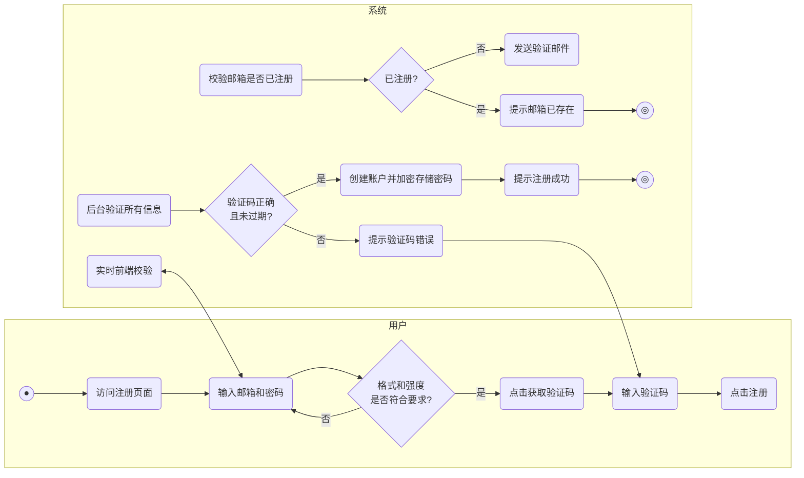


##### **1.3.1.2 密码登录**：

​	已注册用户可以通过输入其账号（邮件地址/ID）和密码进行登录。

| 用例名称**         | UC_密码登录                                                  |
| :----------------- | :----------------------------------------------------------- |
| **实现名称**       | UCR_password_login                                           |
| **用例描述**       | 已注册用户通过其账号（邮箱/ID）和密码登录系统。              |
| **参与者**         | 普通用户                                                     |
| **前置条件**       | 1. 用户已访问系统的登录界面。<br>2. 用户已拥有一个通过密码注册的账户。 |
| **后置条件**       | 1. 系统验证用户身份，创建会话（Session）。<br>2. 用户成功登录，并跳转到系统主界面。<br>3. 系统记录一次登录行为到设备管理列表。 |
| **主事件流**       | 1. 用户在登录页面输入账号和密码。<br>2. 用户点击“登录”按钮。<br>3. 系统将提交的密码经过同样的加密算法处理。<br>4. 系统查询数据库，比对账号是否存在以及加密后的密码是否匹配。<br>5. 验证通过，系统执行后置条件，用例结束。 |
| **备选事件流**     | 4.a 账号不存在或密码错误。<br>　1. 系统提示“账号或密码错误”，不允许登录，并清空密码输入框。<br>4.b 用户账户被冻结。<br>　1. 系统提示“账户已被冻结”，不允许登录。 |
| **业务规则**       | 1. 在一定时间内，连续输错密码达到一定次数后，账户将被临时锁定。 |
| **涉及的业务实体** | BE_用户账户, BE_登录设备                                     |
| **非功能性需求**   | 1. 登录过程必须通过HTTPS进行加密传输。<br>2. 登录接口响应时间应小于500ms。 |

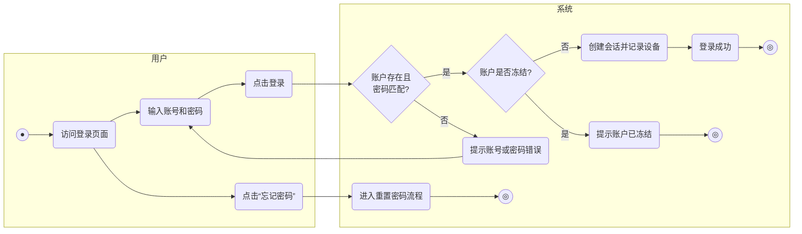


##### **1.3.1.3 验证码登录**：

​	已注册用户可以通过输入电子邮件地址，接收并填写验证码来进行快捷登录。

| **用例名称**       | UC_验证码登录                                                |
| :----------------- | :----------------------------------------------------------- |
| **实现名称**       | UCR_verification_code_login                                  |
| **用例描述**       | 已注册用户通过接收邮箱验证码的方式快速登录系统。             |
| **参与者**         | 普通用户                                                     |
| **前置条件**       | 1. 用户已访问系统的登录界面。<br>2. 用户的账户已绑定电子邮箱。 |
| **后置条件**       | 1. 系统验证用户身份，创建会话。<br>2. 用户成功登录，并跳转到系统主界面。<br>3. 系统记录一次登录行为到设备管理列表。 |
| **主事件流**       | 1. 用户在登录页面输入邮箱地址。<br>2. 用户点击“获取验证码”按钮。<br>3. 系统校验邮箱是否存在，若存在则向该邮箱发送登录验证码。<br>4. 用户查收并输入验证码。<br>5. 用户点击“登录”按钮。<br>6. 系统验证验证码的正确性和时效性。<br>7. 验证通过，系统执行后置条件，用例结束。 |
| **备选事件流**     | 3.a 邮箱地址未注册。<br>　1. 系统提示“该邮箱未注册”，用例结束。<br>6.a 验证码错误或已过期。<br>　1. 系统提示“验证码错误或已失效”，允许用户重新获取，流程返回步骤2。 |
| **业务规则**       | 1. 登录验证码一次性有效。<br>2. 验证码在一定时间内有效（例如：5分钟）。 |
| **涉及的业务实体** | BE_用户账户, BE_邮箱验证, BE_登录设备                        |
| **非功能性需求**   | 1. 需有机制防止验证码接口被恶意攻击（如：IP限流、滑块验证）。 |

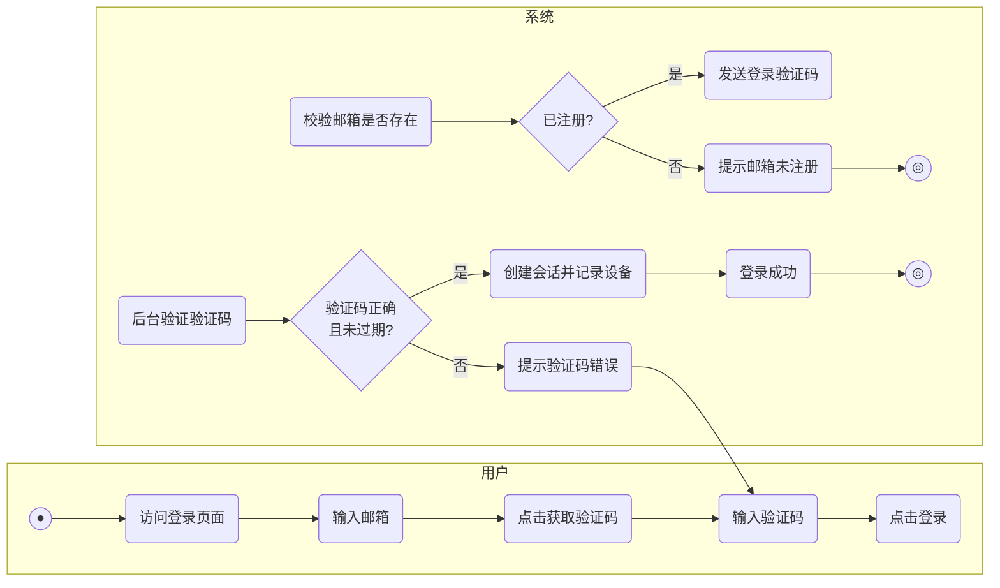


##### **1.3.1.4 验证器登录**：

​	已注册用户可以绑定验证器，通过一次性密码来进行快捷登录。

| **用例名称**       | UC_验证器登录                                                |
| :----------------- | :----------------------------------------------------------- |
| **实现名称**       | UCR_authenticator_login                                      |
| **用例描述**       | 用户在输入账号密码后，通过绑定在手机上的验证器应用生成的一次性密码（TOTP）进行二次验证登录。 |
| **参与者**         | 普通用户                                                     |
| **前置条件**       | 1. 用户已成功完成账号和密码的基础验证。<br> 2. 用户的账户已提前绑定了验证器应用（如Google Authenticator）。 |
| **后置条件**       | 1. 系统验证用户身份，创建会话。<br> 2. 用户成功登录，并跳转到系统主界面。<br> 3. 系统记录一次登录行为到设备管理列表。 |
| **主事件流**       | 1. 用户在二次验证页面打开手机验证器应用。<br> 2. 用户查看当前生成的一次性密码（通常为6位数字）。<br> 3. 用户在页面上输入该密码。<br> 4. 用户点击“确认”或“登录”按钮。<br> 5. 系统根据共享密钥和当前时间戳验证一次性密码的有效性。<br> 6. 验证通过，系统执行后置条件，用例结束。 |
| **备选事件流**     | 一次性密码错误或已过期：<br>      系统提示“验证码错误”，要求用户重新输入。 |
| **业务规则**       | 1. 一次性密码（TOTP）通常每30秒更新一次。 <br>2. 为容忍时间误差，服务器端校验时通常会接受前后一个时间窗口内的密码。 |
| **涉及的业务实体** | BE\_用户账户, BE\_二次验证设置, BE_登录设备                  |
| **非功能性需求**   | 1. 绑定验证器时生成的共享密钥必须安全存储。<br> 2. 服务器时间必须与标准时间保持同步，以确保TOTP算法的准确性。 |

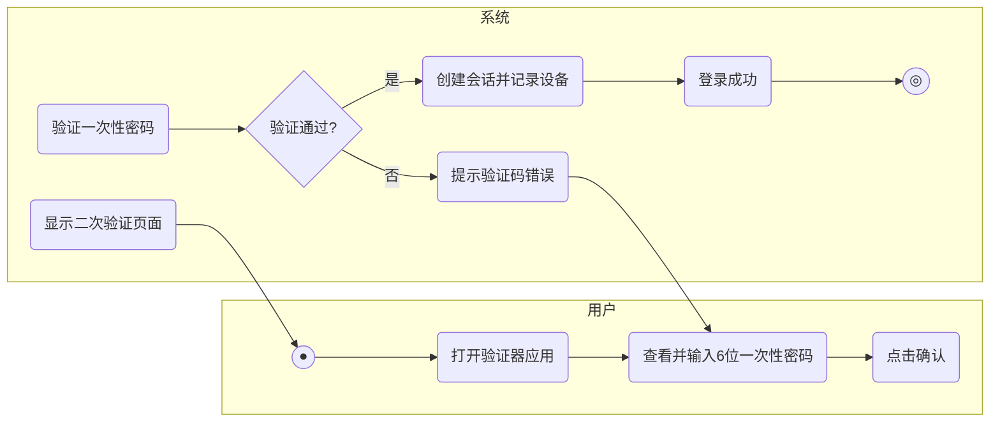


##### **1.3.1.5 密码管理**：

​	用户可以在设置中修改当前登录密码，或在忘记密码时通过验证码进行重置。

| **用例名称**       | UC_密码管理                                                  |
| :----------------- | :----------------------------------------------------------- |
| **实现名称**       | UCR_password_management                                      |
| **用例描述**       | 用户在登录状态下修改密码，或在忘记密码时通过邮箱验证重置密码。 |
| **参与者**         | 普通用户                                                     |
| **前置条件**       | 1. (修改密码) 用户已登录系统。<br>2. (重置密码) 用户未登录系统，但记得自己的邮箱账号。 |
| **后置条件**       | 1. 用户账户的密码被更新为新密码。<br>2. (修改密码) 用户可能被要求使用新密码重新登录。 |
| **主事件流**       | **流A：修改密码**<br>1. 用户进入“账户与安全”设置页面，选择“修改密码”。<br>2. 系统要求用户输入当前使用的旧密码。<br>3. 用户输入新密码并再次确认新密码。<br>4. 用户点击“确认修改”。<br>5. 系统验证旧密码是否正确，并校验新密码是否符合强度要求。<br>6. 验证通过，系统更新数据库中的密码，用例结束。<br><br>**流B：重置密码（忘记密码）**<br>1. 用户在登录页面点击“忘记密码”链接。<br>2. 系统要求用户输入其注册时使用的邮箱地址。<br>3. 用户点击“发送验证码”。<br>4. 系统向该邮箱发送重置密码的验证码。<br>5. 用户输入收到的验证码。<br>6. 用户设置新的密码并确认。<br>7. 用户点击“确认重置”。<br>8. 系统验证通过后，更新数据库中的密码，用例结束。 |
| **备选事件流**     | A5.a 旧密码输入错误。<br>　1. 系统提示“旧密码不正确”，流程返回A2。<br>A5.b 新密码不符合强度要求。<br>　1. 系统提示密码要求，流程返回A3。<br>B2.a 邮箱未注册。<br>　1. 系统提示“该邮箱未注册”，用例结束。<br>B5.a 验证码错误或过期。<br>　1. 系统提示错误，允许用户重新获取验证码，流程返回B3。 |
| **业务规则**       | 1. 新密码不能与旧密码或近期使用过的密码相同。<br>2. 密码重置链接或验证码在短期内有效。 |
| **涉及的业务实体** | BE_用户账户, BE_邮箱验证, BE_密码加密                        |
| **非功能性需求**   | 1. 所有密码修改和重置操作都应记录日志。<br>2. 重置密码成功后，应通知用户，并可选择性地将其他已登录设备强制下线。 |

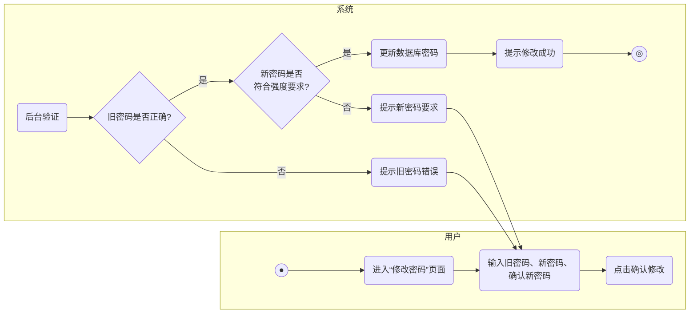

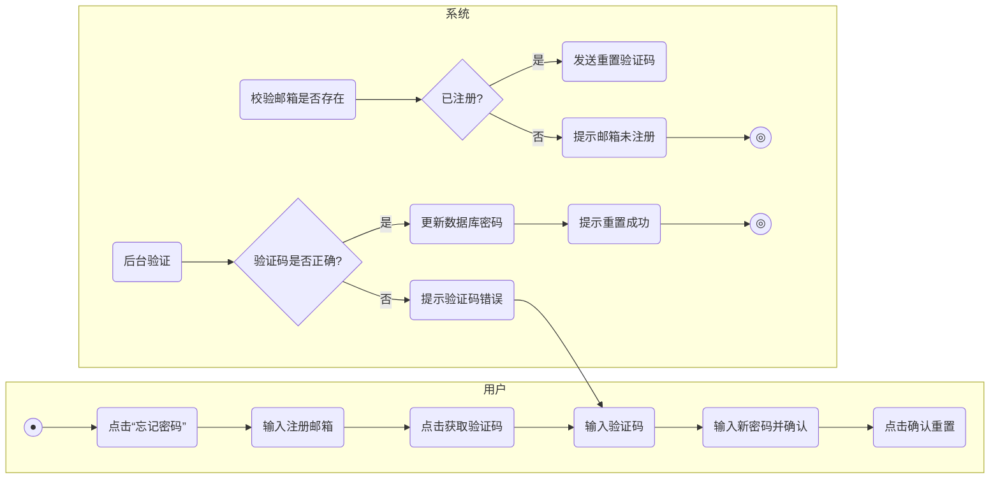


#### 1.3.2 消息模块

构建一对一和群组聊天的核心能力，是后续所有聊天功能的基础。


##### 1.3.2.1 **发送文本与富文本**：

​	在输入框中输入文字、富文本和系统内置的Emoji表情并发送。

| **用例名称**       | UC_发送文本与富文本                                          |
| :----------------- | :----------------------------------------------------------- |
| **实现名称**       | UCR_send_text_message                                        |
| **用例描述**       | 用户在聊天会话中，输入并发送包含文字、富文本格式和系统内置Emoji表情的消息。 |
| **参与者**         | 普通用户                                                     |
| **前置条件**       | 1. 用户已登录系统。<br>2. 用户已进入一个有效的一对一或群组聊天会话。 |
| **后置条件**       | 1. 消息被成功发送至服务器。<br>2. 消息显示在发送方的聊天界面中。<br>3. 接收方收到新消息通知。 |
| **主事件流**       | 1. 用户在聊天界面的输入框中输入文本内容。<br>2. 用户可以从表情面板选择并插入Emoji。<br>3. 用户点击“发送”按钮。<br>4. 系统将消息内容打包，通过网络发送至服务器。<br>5. 服务器处理并转发消息给接收方。<br>6. 系统在发送方界面上更新消息状态为“已发送”，用例结束。 |
| **备选事件流**     | 4.a 网络连接中断。<br>　1. 系统将消息标记为“发送失败”。<br>　2. 系统提供手动重发选项。<br>　3. 网络恢复后，系统可自动尝试重发。 |
| **业务规则**       | 1. 单条文本消息长度有上限（如：5000字符）。<br>2. 支持系统预定义的Emoji表情集。 |
| **涉及的业务实体** | BE_消息, BE_会话, BE_用户账户                                |
| **非功能性需求**   | 1. 消息端到端延迟应小于100ms。<br>2. 输入框应支持多行文本输入。 |

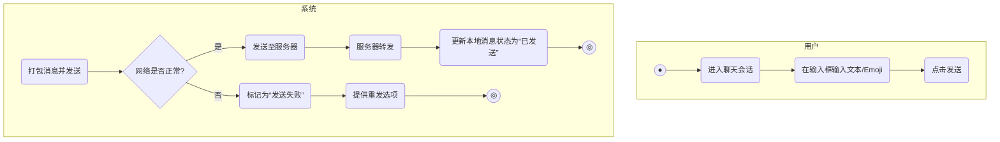


##### 1.3.2.2 **发送图片与视频消息**：

​	从设备相册选择图片或短视频，或直接使用相机拍摄后发送。

| **用例名称**       | UC_发送图片与视频消息                                        |
| :----------------- | :----------------------------------------------------------- |
| **实现名称**       | UCR_send_media_message                                       |
| **用例描述**       | 用户从设备相册选择或直接拍摄图片/视频后，将其作为消息发送。  |
| **参与者**         | 普通用户                                                     |
| **前置条件**       | 1. 用户已登录系统。<br>2. 用户已进入一个有效的聊天会话。<br>3. 应用已获得相册和相机访问权限。 |
| **后置条件**       | 1. 媒体文件成功上传至服务器。<br>2. 包含媒体文件的消息被成功发送。<br>3. 接收方收到新消息。 |
| **主事件流**       | 1. 用户点击输入框旁的“+”号或图片按钮。<br>2. 系统显示媒体选择菜单（相册/拍摄）。<br>3. 用户选择“相册”，系统打开设备相册。<br>4. 用户选择一张或多张图片/一个视频后，点击确认。<br>5. 系统在发送前提供预览和编辑界面。<br>6. 用户点击“发送”。<br>7. 系统开始上传媒体文件，并显示上传进度。<br>8. 上传完成后，系统将包含媒体链接的消息发送至服务器，用例结束。 |
| **备选事件流**     | 3.a 用户选择“拍摄”。<br>　1. 系统打开相机应用。<br>　2. 用户拍摄照片或录制视频后，流程返回主事件流步骤5。<br>7.a 上传过程中网络中断。<br>　1. 系统暂停上传，并提示网络错误。<br>　2. 网络恢复后，支持断点续传。 |
| **业务规则**       | 1. 一次最多可选择9张图片。<br>2. 视频文件大小和时长有上限。  |
| **涉及的业务实体** | BE_消息, BE_媒体文件, BE_文件存储, BE_会话                   |
| **非功能性需求**   | 1. 上传时应对图片进行适当压缩以节省流量和时间。<br>2. 视频应进行转码以适应不同网络环境播放。<br>3. 清晰地显示上传进度。 |

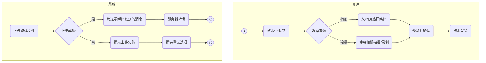


##### 1.3.2.3 **发送文件**：

​	从设备的文件系统中选择并发送各类格式的文档、压缩包等。

| **用例名称**       | UC_发送文件                                                  |
| :----------------- | :----------------------------------------------------------- |
| **实现名称**       | UCR_send_file_message                                        |
| **用例描述**       | 用户从设备的文件系统中选择文档、压缩包等各类文件并发送。     |
| **参与者**         | 普通用户                                                     |
| **前置条件**       | 1. 用户已登录系统。<br>2. 用户已进入一个有效的聊天会话。<br>3. 应用已获得文件访问权限。 |
| **后置条件**       | 1. 文件成功上传至服务器。<br>2. 包含文件的消息被成功发送。<br>3. 接收方收到新消息。 |
| **主事件流**       | 1. 用户点击输入框旁的“+”号，选择“文件”选项。<br>2. 系统打开设备的文件管理器。<br>3. 用户选择一个或多个文件后，点击确认。<br>4. 系统显示待发送文件的列表和总大小。<br>5. 用户点击“发送”。<br>6. 系统开始上传文件，并显示上传进度。<br>7. 上传完成后，系统将包含文件链接的消息发送至服务器，用例结束。 |
| **备选事件流**     | 3.a 选择的文件过大。<br>　1. 系统提示“文件大小超出限制”，并阻止选择。<br>6.a 上传过程中网络中断。<br>　1. 系统暂停上传，并提示网络错误。<br>　2. 网络恢复后，支持断点续传。 |
| **业务规则**       | 1. 单个文件大小有上限。                                      |
| **涉及的业务实体** | BE_消息, BE_媒体文件, BE_文件存储, BE_会话                   |
| **非功能性需求**   | 1. 支持常见文件类型的图标预览。<br>2. 应支持后台上传，用户在上传时可以切换到其他应用。 |

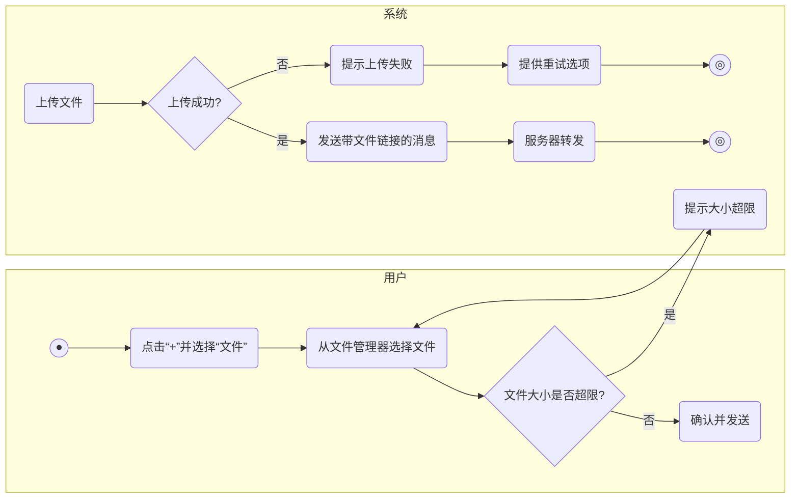


##### 1.3.2.4 **转发消息**：

​	可以将一条或多条消息合并转发给其他个人或群组。

| **用例名称**       | UC_转发消息                                                  |
| :----------------- | :----------------------------------------------------------- |
| **实现名称**       | UCR_forward_message                                          |
| **用例描述**       | 用户将一条或多条消息合并转发给其他个人或群组。               |
| **参与者**         | 普通用户                                                     |
| **前置条件**       | 1. 用户已登录系统。<br>2. 存在可被转发的消息。               |
| **后置条件**       | 1. 目标会话收到被转发的消息。<br>2. 消息会标记为“转发”来源。 |
| **主事件流**       | 1. 用户长按一条消息，或点击“选择”进入多选模式。<br>2. 用户选择一条或多条希望转发的消息。<br>3. 用户点击“转发”按钮。<br>4. 系统显示最近联系人和群组列表，供用户选择转发目标。<br>5. 用户选择一个或多个目标后，点击“发送”。<br>6. 系统将选中的消息逐条或合并后发送给目标，用例结束。 |
| **备选事件流**     | 4.a 目标不在最近列表中。<br>　1. 用户可通过搜索找到更多联系人或群组。<br>5.a 用户在发送前添加留言。<br>　1. 系统提供输入框让用户添加额外文字说明，随转发消息一同发送。 |
| **业务规则**       | 1. 转发操作会保留原始发送者的部分信息（可选）。<br>2. 某些特殊消息类型（如投票、红包）可能不支持转发。 |
| **涉及的业务实体** | BE_消息, BE_会话, BE_用户账户                                |
| **非功能性需求**   | 1. 合并转发时，应以清晰的格式展示多条消息。<br>2. 转发流程应尽可能简化，减少用户操作步骤。 |

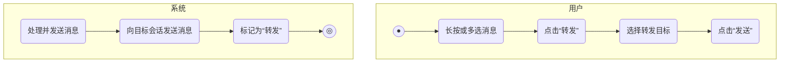


##### 1.3.2.5 **消息已读状态**：

​	支持显示消息的已读或未读状态。

| **用例名称**       | UC_消息已读状态                                              |
| :----------------- | :----------------------------------------------------------- |
| **实现名称**       | UCR_message_read_status                                      |
| **用例描述**       | 系统支持显示消息的已读或未读状态，帮助用户了解信息触达情况。 |
| **参与者**         | 普通用户, 系统                                               |
| **前置条件**       | 1. 用户已登录系统。<br>2. 存在一个聊天会话。                 |
| **后置条件**       | 1. 发送方能看到自己发送消息的已读状态。<br>2. 会话列表的未读角标更新。 |
| **主事件流**       | **流A：接收方**<br>1. 用户进入一个有未读消息的会话。<br>2. 系统检测到会话被打开，将可视范围内的未读消息标记为已读。<br>3. 系统向服务器发送“已读回执”，报告哪些消息已被读取。<br><br>**流B：发送方**<br>1. 系统从服务器接收到“已读回执”。<br>2. 系统更新对应消息的界面状态，从未读变为已读（如：双勾变蓝）。 |
| **备选事件流**     | A2.a 用户在通知栏直接回复或标记为已读。<br>　1. 系统同样发送“已读回执”至服务器。<br>B2.a 在群聊中。<br>　1. 系统可显示“x人已读”，点击可查看具体已读成员列表。 |
| **业务规则**       | 1. 用户可以在隐私设置中关闭“已读回执”功能。<br>2. 已读状态需在多设备间同步。 |
| **涉及的业务实体** | BE_消息, BE_会话, BE_已读回执                                |
| **非功能性需求**   | 1. 已读状态的同步应接近实时。<br>2. 群聊已读状态的获取应进行性能优化，避免请求风暴。 |

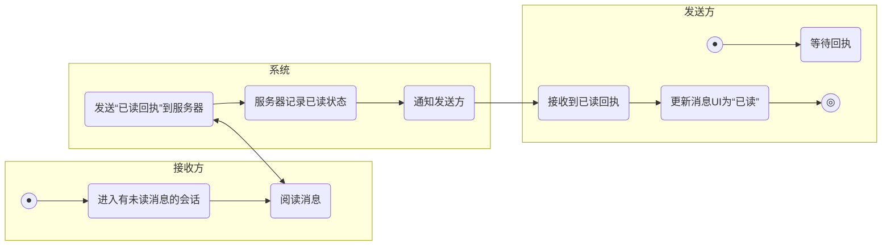


##### 1.3.2.6 **消息撤回**：

​	在规定时间内，用户可以撤回自己已发送的消息。

| **用例名称**       | UC_消息撤回                                                  |
| :----------------- | :----------------------------------------------------------- |
| **实现名称**       | UCR_recall_message                                           |
| **用例描述**       | 在规定时间内，用户可以撤回自己已发送的消息。                 |
| **参与者**         | 普通用户                                                     |
| **前置条件**       | 1. 用户已登录系统。<br>2. 存在一条由自己发送且未超过撤回时限的消息。 |
| **后置条件**       | 1. 消息在所有参与方的设备上被替换为“xxx撤回了一条消息”。<br>2. 消息的原始内容被删除。 |
| **主事件流**       | 1. 用户长按自己发送的一条消息。<br>2. 在弹出的菜单中选择“撤回”。<br>3. 系统检查该消息是否在可撤回的时间范围内。<br>4. 检查通过，系统向服务器发送撤回指令。<br>5. 服务器验证权限和时间，然后向该会话所有成员广播撤回通知。<br>6. 所有客户端收到通知后，将本地对应的消息替换为提示信息，用例结束。 |
| **备选事件流**     | 3.a 消息已超过可撤回时间。<br>　1. 系统提示“消息已超过可撤回时间”，操作失败，用例结束。 |
| **业务规则**       | 1. 默认可撤回时间为2分钟。                                   |
| **涉及的业务实体** | BE_消息, BE_会话, BE_操作指令                                |
| **非功能性需求**   | 1. 撤回操作应尽快同步到所有客户端。                          |

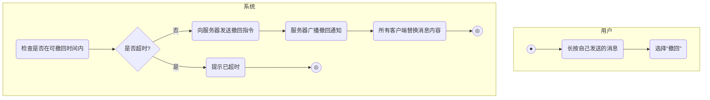


##### 1.3.2.7 **消息编辑**：

​	对于已发送的文本消息，在规定时间内支持进行编辑修改。

| **用例名称**       | UC_消息编辑                                                  |
| :----------------- | :----------------------------------------------------------- |
| **实现名称**       | UCR_edit_message                                             |
| **用例描述**       | 对于已发送的文本消息，在规定时间内支持进行编辑修改。         |
| **参与者**         | 普通用户                                                     |
| **前置条件**       | 1. 用户已登录系统。<br>2. 存在一条由自己发送、未超过编辑时限的文本消息。 |
| **后置条件**       | 1. 消息内容在所有设备上被更新。<br>2. 消息旁会显示“已编辑”标记。 |
| **主事件流**       | 1. 用户长按自己发送的一条文本消息。<br>2. 在弹出的菜单中选择“编辑”。<br>3. 系统将消息内容加载到输入框中，供用户修改。<br>4. 用户修改完毕后，点击“发送”或“确认”。<br>5. 系统向服务器发送编辑指令，包含新的消息内容。<br>6. 服务器验证并向会话所有成员广播更新通知。<br>7. 所有客户端收到通知后，更新本地消息内容并添加“已编辑”标记，用例结束。 |
| **备选事件流**     | 2.a 消息已超过可编辑时间或非文本消息。<br>　1. 菜单中不显示“编辑”选项。 |
| **业务规则**       | 1. 仅文本消息支持编辑。<br>2. 默认可编辑时间为5分钟。        |
| **涉及的业务实体** | BE_消息, BE_会话, BE_操作指令                                |
| **非功能性需求**   | 1. 编辑历史可追溯（可选功能）。                              |

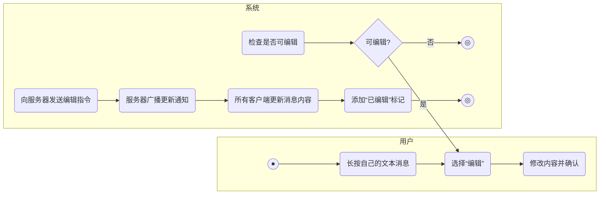


##### 1.3.2.8 **草稿同步**：

​	支持待发出消息在预览框中的跨平台同步。

| **用例名称**       | UC_草稿同步                                                  |
| :----------------- | :----------------------------------------------------------- |
| **实现名称**       | UCR_draft_sync                                               |
| **用例描述**       | 用户在一个设备上输入但未发送的消息（草稿），可以在其他登录的设备上继续编辑。 |
| **参与者**         | 普通用户, 系统                                               |
| **前置条件**       | 1. 用户在多个设备上登录了同一账户。                          |
| **后置条件**       | 1. 草稿内容在不同设备间保持同步。                            |
| **主事件流**       | 1. 用户在设备A的某个会话输入框中输入了文字，但未发送就切换到其他会话或关闭应用。<br>2. 系统检测到输入框内容变化，在延迟一小段时间后，将草稿内容上传至服务器。<br>3. 用户在设备B上打开同一个会话。<br>4. 设备B的客户端向服务器请求该会话的最新信息，服务器返回草稿内容。<br>5. 设备B将草稿内容填充到输入框中，用例结束。 |
| **备选事件流**     | 1.a 用户在设备A上发送或清空了草稿。<br>　1. 系统向服务器发送空的草稿内容，以清除服务器上的草稿。 |
| **业务规则**       | 1. 草稿仅对用户本人可见。<br>2. 草稿同步有一定的延迟，以避免频繁的网络请求。 |
| **涉及的业务实体** | BE_草稿, BE_会话, BE_用户账户                                |
| **非功能性需求**   | 1. 同步机制应轻量，不应消耗过多流量和电量。                  |

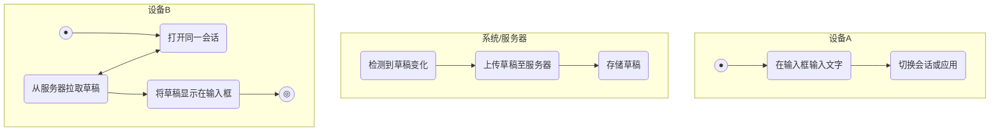


##### 1.3.2.9 **消息数据模型**：

​	设计并实现本地与服务器端的消息存储结构，包含发送者、接收者、内容、时间戳、状态等字段。

| **用例名称**                | UC_消息数据模型                                              |
| :-------------------------- | :----------------------------------------------------------- |
| **实现名称**                | UCR_define_message_model                                     |
| **用例描述**                | 为所有聊天功能定义一个标准的数据结构，确保每一条消息都能被正确地记录、发送、接收和显示。 |
| **参与者**                  | 系统                                                         |
| **前置条件**                | 系统功能已规划。                                             |
| **后置条件**                | 一个清晰、可扩展的消息数据结构（Schema）被定义。             |
| **核心字段定义 (主事件流)** | 一个标准的消息对象，必须包含以下核心字段：<br>1. **消息ID (Message ID)**: 每条消息的唯一身份证号。 <br>2. **会话ID (Session ID)**: 标记这条消息属于哪个聊天（与张三的聊天，或“家庭”群聊）。 <br>3. **发送者ID (Sender ID)**: 记录这条消息是谁发送的。 <br>4. **消息类型 (Message Type)**: 区分消息是普通文字、图片、文件，还是系统通知等。 <br>5. **消息内容 (Content)**: 消息的真正内容。可以是文字字符串，也可以是描述图片、文件的链接和大小等信息的结构体。 <br>6. **时间戳 (Timestamp)**: 记录消息的发送时间，用于排序。 <br>7. **状态 (Status)**: 追踪消息的投递状态，如“已发送”、“对方已读”、“发送失败”等。 |
| **业务规则**                | 1. **唯一性**: 消息ID在整个系统中必须是独一无二的。 <br>2. **原子性**: 消息的发送和状态更新应被视为一个整体操作。 |
| **涉及的业务实体**          | BE_消息                                                      |
| **非功能性需求**            | 1. **可扩展**: 模型应易于增加新的消息类型，如未来的“投票”、“位置”等。 <br>2. **高性能**: 围绕常用查询字段（如会话ID）设计索引，保证快速拉取聊天记录。 |

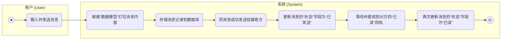


##### 1.3.2.10 **会话内搜索**：

​	在聊天窗口内，提供搜索功能，仅查找当前会话的聊天记录。

| **用例名称**       | UC_会话内搜索                                                |
| :----------------- | :----------------------------------------------------------- |
| **实现名称**       | UCR_in_session_search                                        |
| **用例描述**       | 在当前的聊天窗口内，根据关键词快速查找聊天记录。             |
| **参与者**         | 普通用户                                                     |
| **前置条件**       | 1. 用户已登录系统。<br>2. 用户已进入一个存在聊天记录的会话。 |
| **后置条件**       | 1. 显示匹配的聊天记录列表。<br>2. 用户可以跳转到任意一条搜索结果的上下文。 |
| **主事件流**       | 1. 用户在聊天界面点击“搜索”图标或菜单项。<br>2. 界面顶部出现搜索框。<br>3. 用户输入关键词。<br>4. 系统在当前会话的本地消息数据库中进行搜索。<br>5. 系统高亮显示匹配的关键词，并展示结果数量和上下文切换按钮（上一条/下一条）。<br>6. 用户点击切换按钮，界面滚动到对应的消息位置，用例结束。 |
| **备选事件流**     | 4.a 本地聊天记录不完整。<br>　1. 系统可提示用户是否从服务器加载更多历史记录进行搜索。 |
| **业务规则**       | 1. 搜索范围仅限于当前打开的会话。                            |
| **涉及的业务实体** | BE_消息, BE_本地数据库                                       |
| **非功能性需求**   | 1. 搜索应在本地完成，响应速度快。<br>2. 对本地消息记录建立索引以提高搜索性能。 |

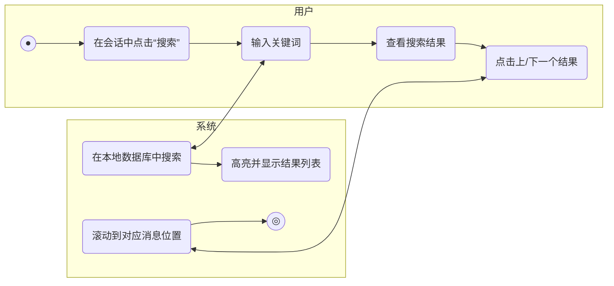

##### 1.3.2.11 **媒体库**：

​	提供独立的媒体库，集中管理所有收发的图片、视频和文件。

| **用例名称**       | UC_媒体库                                                    |
| :----------------- | :----------------------------------------------------------- |
| **实现名称**       | UCR_media_library                                            |
| **用例描述**       | 系统提供一个集中的媒体库，方便用户浏览、管理和搜索所有聊天中收发过的图片、视频和文件。 |
| **参与者**         | 普通用户                                                     |
| **前置条件**       | 1. 用户已登录系统。                                          |
| **后置条件**       | 1. 用户查看到聚合后的媒体文件。                              |
| **主事件流**       | 1. 用户通过“设置”或个人主页进入“媒体库”。 <br>2. 系统默认显示一个聚合视图，包含所有聊天中的图片和视频。 <br>3. 用户可以切换标签页，分别查看“文件”、“链接”等其他类型的媒体。 <br>4. 用户可以点击任何一个媒体文件进行预览、转发或保存到本地，用例结束。 |
| **备选事件流**     | 2.a 用户在某个特定聊天中进入媒体库。 <br>　1. 系统将只显示该特定聊天中的媒体文件。 |
| **业务规则**       | 1. 媒体库显示的文件是本地缓存，或按需从服务器拉取。          |
| **涉及的业务实体** | BE_媒体文件, BE_消息                                         |
| **非功能性需求**   | 1. 媒体文件应使用缩略图进行懒加载，以提升加载速度。 <br>2. 媒体库应支持按发送者或日期进行筛选和排序。 |

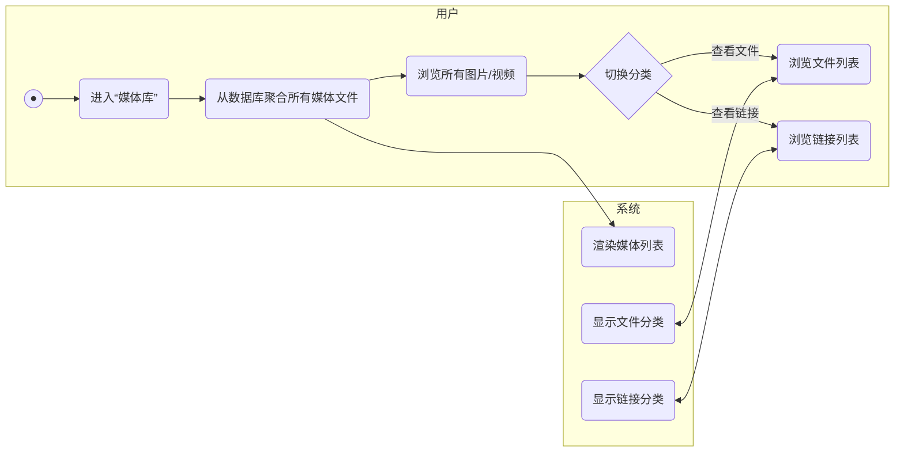

##### 1.3.2.12 **会话列表**：

​	在主界面展示所有一对一和群组聊天会话的列表，包含对方头像、昵称、最后一条消息和时间。

| **用例名称**       | UC_会话列表                                                  |
| :----------------- | :----------------------------------------------------------- |
| **实现名称**       | UCR_session_list                                             |
| **用例描述**       | 在应用的主界面，系统需要展示一个包含所有一对一和群组聊天会话的列表，并清晰地显示每个会话的关键信息，如对方头像、昵称、最后一条消息和时间。 |
| **参与者**         | 普通用户, 系统                                               |
| **前置条件**       | 1. 用户已登录系统。                                          |
| **后置条件**       | 1. 用户可以在主界面看到自己所有的聊天会话。                  |
| **主事件流**       | 1. 用户打开应用并进入主界面。 <br>2. 系统从本地数据库加载用户的会话列表。 <br>3. 对于每个会话，系统获取并展示其关联的头像、昵称（或群名称）、最后一条消息的摘要以及该消息的发送时间。 <br>4. 列表默认按最后一条消息的时间倒序排列。 <br>5. 当用户收到新消息时，系统会实时更新对应的会话条目，并将其移动到列表顶部（如果未置顶），用例持续。 |
| **备选事件流**     | 2.a 本地数据库为空或需要同步。 <br>　1. 系统会向服务器请求最新的会话列表数据。 <br>5.a 新消息来自一个已归档的会话。 <br>　1. 该会话不会出现在主列表中，但“已归档”入口会显示未读提示。 |
| **业务规则**       | 1. 未读消息数应以角标的形式清晰地显示在每个会话上。          |
| **涉及的业务实体** | BE_会话, BE_消息, BE_用户账户, BE_群组                       |
| **非功能性需求**   | 1. 会话列表的加载必须非常迅速。 <br>2. 列表滚动必须平滑，即使有大量的会话。 |

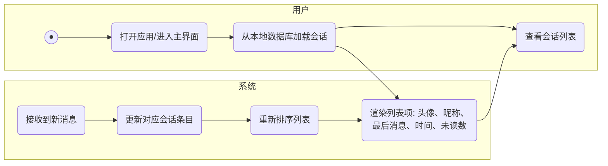

##### 1.3.2.13 **置顶会话**：

​	用户可以将重要的聊天会话在列表顶部进行固定显示。

| **用例名称**       | UC_置顶会话                                                  |
| :----------------- | :----------------------------------------------------------- |
| **实现名称**       | UCR_pin_session                                              |
| **用例描述**       | 用户可以将重要的聊天会话固定在列表的最顶部，方便快速访问。   |
| **参与者**         | 普通用户                                                     |
| **前置条件**       | 1. 用户在会话列表界面。                                      |
| **后置条件**       | 1. 目标会话被移动到列表顶部，并带有“置顶”标记。              |
| **主事件流**       | 1. 用户在会话列表上，长按一个想要置顶的会话。 <br>2. 系统弹出上下文菜单。 <br>3. 用户选择“置顶聊天”选项。 <br>4. 系统更新该会话的置顶状态，并将其重新排序到列表顶部，用例结束。 |
| **备选事件流**     | 3.a 用户对已置顶的会话重复操作。 <br>　1. 菜单项变为“取消置顶”，选择后该会话恢复到按时间排序的正常位置。 |
| **业务规则**       | 1. 置顶会话的排序优先于按时间排序。 <br>2. 多个置顶会话之间，依然按最后消息时间排序。 |
| **涉及的业务实体** | BE_会话, BE_用户设置                                         |
| **非功能性需求**   | 1. 操作应有平滑的动画效果。                                  |

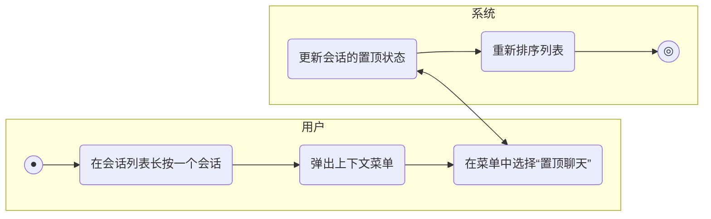

##### 1.3.2.14 **归档会话**：

​	可以暂时将不常用的会话进行归档，使其在主列表隐藏。

| **用例名称**       | UC_归档会话                                                  |
| :----------------- | :----------------------------------------------------------- |
| **实现名称**       | UCR_archive_session                                          |
| **用例描述**       | 用户可以将不常用但不想删除的会话进行归档，使其在主会话列表中被隐藏，保持列表整洁。 |
| **参与者**         | 普通用户                                                     |
| **前置条件**       | 1. 用户在会话列表界面。                                      |
| **后置条件**       | 1. 目标会话从主列表消失，并被移动到“已归档会话”列表中。      |
| **主事件流**       | 1. 用户在会话列表上，长按或左滑一个会话。 <br>2. 在弹出的操作选项中选择“归档”。 <br>3. 系统将该会话移出主列表。 <br>4. 用户可以在列表顶部或设置中找到“已归档会话”的入口来查看这些会话，用例结束。 |
| **备选事件流**     | 4.a 已归档的会话收到新消息。 <br>　1. 根据用户设置，该会话可以自动取消归档并返回主列表。 |
| **业务规则**       | 1. 归档的会话依然可以接收消息。                              |
| **涉及的业务实体** | BE_会话, BE_用户设置                                         |
| **非功能性需求**   | 1. 应提供批量归档的功能。                                    |

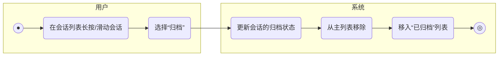

##### 1.3.2.15 **会话免打扰**：

​	可以对某个会话设置消息免打扰，也可以针对特定用户设置消息不提醒。

| **用例名称**       | UC_会话免打扰                                                |
| :----------------- | :----------------------------------------------------------- |
| **实现名称**       | UCR_set_dnd_for_session                                      |
| **用例描述**       | 用户可以对某个聊天会话（个人或群组）设置消息免打扰，开启后将不会收到该会话新消息的推送通知。 |
| **参与者**         | 普通用户                                                     |
| **前置条件**       | 1. 用户已登录系统。 <br>2. 存在一个有效的聊天会话。          |
| **后置条件**       | 1. 该会话的免打扰状态被更新。                                |
| **主事件流**       | 1. 用户在会话列表长按一个会话，或进入会话的设置页面。 <br>2. 用户找到“消息免打扰”或类似名称的开关。 <br>3. 用户点击开关以开启或关闭此功能。 <br>4. 系统立即保存设置，并更新会话列表中的图标（如显示一个被划掉的铃铛），用例结束。 |
| **备选事件流**     | 3.a 用户开启免打扰。<br>　1. 该会话的新消息将不再触发声音、震动或锁屏通知。<br>3.b 用户关闭免打扰。<br>　1. 该会话的新消息将恢复正常通知。 |
| **业务规则**       | 1. 免打扰设置仅对当前设备有效，或可选择多设备同步。          |
| **涉及的业务实体** | BE_会话, BE_用户设置                                         |
| **非功能性需求**   | 1. 设置应立即生效，无需等待。                                |

```mermaid
graph LR
    subgraph 用户
        A((●)) --> B(进入会话设置页面);
        B --> C(点击“消息免打扰”开关);
    end

    subgraph 系统
        C --> C_SYS(更新会话的免打扰状态);
        C_SYS --> D(保存设置);
        D --> E(更新会话列表UI);
        E --> F_END((◎));
    end
```


##### 1.3.2.16 **自定义提示音**：

​	用户可以为特定的联系人或群组设置专属的消息提示音。

| **用例名称**       | UC_自定义提示音                                              |
| :----------------- | :----------------------------------------------------------- |
| **实现名称**       | UCR_set_custom_notification_sound                            |
| **用例描述**       | 用户可以为特定的联系人或群组设置专属的消息提示音，以便在不看手机的情况下识别消息来源。 |
| **参与者**         | 普通用户                                                     |
| **前置条件**       | 1. 用户已登录系统。 <br>2. 存在一个有效的聊天会话。          |
| **后置条件**       | 1. 指定会话的提示音设置被更新。                              |
| **主事件流**       | 1. 用户进入特定联系人或群组的聊天设置页面。 <br>2. 用户点击“提示音”选项。 <br>3. 系统显示一个声音选择列表，包含系统预置音效和“跟随系统”选项。 <br>4. 用户选择一个心仪的提示音。 <br>5. 用户确认选择。 <br>6. 系统保存该会话的专属提示音设置，用例结束。 |
| **备选事件流**     | 3.a 系统支持选择本地音频文件。 <br>　1. 用户可从设备文件系统中选择一个音频文件作为提示音。 |
| **业务规则**       | 1. 如果未做特殊设置，所有会话默认使用全局提示音。            |
| **涉及的业务实体** | BE_会话, BE_用户设置                                         |
| **非功能性需求**   | 1. 提示音列表应提供试听功能。                                |

```mermaid
graph LR
    subgraph 用户
        A((●)) --> B(进入会话设置页面);
        B --> C(点击“提示音”);
        C --> D(从列表中选择一个声音);
        D --> E(确认选择);
    end

    subgraph 系统
        D_SYS(提供声音列表并支持试听) <--> D;
        E --> E_SYS(保存该会话的提示音设置);
        E_SYS --> F_END((◎));
    end
```


##### 1.3.2.17 **全局搜索**：

​	在主界面提供一个搜索入口，用户可以通过关键词快速查找联系人、聊天记录和文件。

| **用例名称**       | UC_全局搜索                                                  |
| :----------------- | :----------------------------------------------------------- |
| **实现名称**       | UCR_global_search                                            |
| **用例描述**       | 用户可以通过主界面的搜索入口，使用关键词一次性快速查找所有模块的内容，包括联系人、群组、聊天记录、文件等。 |
| **参与者**         | 普通用户                                                     |
| **前置条件**       | 1. 用户在应用主界面。                                        |
| **后置条件**       | 1. 界面上展示与关键词匹配的搜索结果。                        |
| **主事件流**       | 1. 用户点击主界面顶部的搜索框。 <br>2. 用户输入关键词。 <br>3. 系统实时地在本地数据库和索引中进行搜索。 <br>4. 系统将搜索结果分类展示，如“联系人”、“群组”、“聊天记录”、“文件”等。 <br>5. 用户可以点击某条结果，直接跳转到对应的聊天位置或文件详情，用例结束。 |
| **备选事件流**     | 4.a 搜索结果过多。 <br>　1. 每个分类下只显示几条最相关的结果，并提供“查看更多”的选项。 |
| **业务规则**       | 1. 聊天记录的搜索可以依赖本地的全文检索引擎。                |
| **涉及的业务实体** | BE_用户账户, BE_群组, BE_消息, BE_媒体文件                   |
| **非功能性需求**   | 1. 搜索响应必须非常快，应在用户输入时即时反馈结果。 <br>2. 搜索结果的排序算法应将最相关的内容排在前面。 |

```mermaid
graph LR
    subgraph 用户
        A((●)) --> B(点击主搜索框);
        B --> C(输入关键词);
        C_SYS --> D(查看分类的搜索结果);
        D --> E(点击一条结果);
    end

    subgraph 系统
        C --> C_SYS(在多个数据源中并行搜索);
        C_SYS --> D_SHOW(聚合并渲染结果列表);
        E_SYS(跳转到目标页面) <--> E;
        E_SYS --> F_END((◎));
    end
```


#### 1.3.3 关系模块

建立用户的社交图谱，是发起聊天的前提。


##### 1.3.3.1 **搜索添加好友**：

​	用户可通过搜索对方的ID来查找并发送好友请求。

| **用例名称**       | UC_搜索添加好友                                              |
| :----------------- | :----------------------------------------------------------- |
| **实现名称**       | UCR_search_add_friend                                        |
| **用例描述**       | 用户通过精确搜索对方的用户ID，找到目标用户并发起好友请求。   |
| **参与者**         | 普通用户                                                     |
| **前置条件**       | 1. 用户已登录系统。 <br>2. 用户知道目标用户的ID。            |
| **后置条件**       | 1. 向目标用户发送一条好友请求。 <br>2. 双方关系在数据库中标记为“请求中”。 |
| **主事件流**       | 1. 用户进入添加好友界面。 <br>2. 用户在搜索框中输入目标用户的ID。 <br>3. 用户点击“搜索”。 <br>4. 系统根据ID查找用户并显示其个人资料。 <br>5. 用户点击“添加好友”按钮。 <br>6. 用户可选择性地输入验证信息。 <br>7. 系统将好友请求发送给目标用户，用例结束。 |
| **备选事件流**     | 4.a 未找到该ID对应的用户。 <br>　1. 系统提示“用户不存在”，流程返回步骤2。 <br>4.b 目标用户设置了隐私，不允许被搜索。 <br>　1. 系统同样提示“用户不存在”。 <br>7.a 对方已是好友或已在黑名单中。 <br>　1. 系统提示相应信息，用例结束。 |
| **业务规则**       | 1. ID是全局唯一的。 <br>2. 好友请求在一定时间内有效（如：7天）。 |
| **涉及的业务实体** | BE_用户账户, BE_好友关系, BE_好友请求, BE_隐私设置           |
| **非功能性需求**   | 1. 搜索响应时间应小于1秒。                                   |

```mermaid
graph LR
    subgraph 用户
        A((●)) --> B(进入添加好友页面);
        B --> C(输入目标用户ID);
        C --> D(点击搜索);
        D_SYS -- 找到用户 --> E(查看用户资料);
        E --> F(点击“添加好友”);
        F --> G(输入验证信息);
        G --> H(确认发送);
    end

    subgraph 系统
        D --> D_SYS{按ID搜索用户};
        D_SYS -- 未找到 --> D_ERR(提示用户不存在);
        D_ERR --> C;
        
        H --> H_SYS(发送好友请求);
        H_SYS --> I_END((◎));
    end
```


##### 1.3.3.2 **扫码添加好友**：

​	用户可通过扫描对方的二维码名片来发送好友请求。

| **用例名称**       | UC_扫码添加好友                                              |
| :----------------- | :----------------------------------------------------------- |
| **实现名称**       | UCR_scan_qr_to_add                                           |
| **用例描述**       | 用户通过扫描对方的二维码名片，快速识别用户并发起好友请求。   |
| **参与者**         | 普通用户                                                     |
| **前置条件**       | 1. 用户已登录系统。 <br>2. 应用已获得相机使用权限。          |
| **后置条件**       | 1. 向目标用户发送一条好友请求。                              |
| **主事件流**       | 1. 用户进入“扫一扫”功能界面。 <br>2. 系统启动相机，界面出现扫描框。 <br>3. 用户将对方的二维码置于扫描框内。 <br>4. 系统识别二维码内容，解析出用户ID。 <br>5. 系统自动根据ID查找并显示目标用户的个人资料。 <br>6. 流程跳转至“搜索添加好友”用例的主事件流步骤5。 |
| **备选事件流**     | 4.a 二维码无法识别或已失效。 <br>　1. 系统提示“二维码无效”，流程返回步骤3。 <br>4.b 二维码为非用户ID的其他内容。 <br>　1. 系统根据内容类型进行相应处理（如打开链接）。 |
| **业务规则**       | 1. 每个用户的二维码是专属且唯一的。                          |
| **涉及的业务实体** | BE_用户账户, BE_二维码, BE_好友请求                          |
| **非功能性需求**   | 1. 二维码扫描识别速度快，准确率高。                          |

```mermaid
graph LR
    subgraph 用户
        A((●)) --> B(进入“扫一扫”);
        B --> C(将他人二维码放入扫描框);
    end

    subgraph 系统
        B_SYS(启动相机) <--> B;
        C --> C_SYS{识别二维码};
        C_SYS -- 成功解析ID --> D(获取用户信息并显示);
        D --> E(后续流程同“搜索添加好友”);
        E --> F_END((◎));
        
        C_SYS -- 识别失败 --> C_ERR(提示二维码无效);
        C_ERR --> C;
    end
```


##### 1.3.3.3 **设置好友备注**：

​	用户可以为好友设置一个仅自己可见的备注名。

| **用例名称**       | UC_设置好友备注                                              |
| :----------------- | :----------------------------------------------------------- |
| **实现名称**       | UCR_set_friend_alias                                         |
| **用例描述**       | 用户可以为好友设置一个仅自己可见的备注名，方便识别和查找。   |
| **参与者**         | 普通用户                                                     |
| **前置条件**       | 1. 用户已登录系统。 <br>2. 目标用户已是自己的好友。          |
| **后置条件**       | 1. 在数据库中保存好友的备注名。 <br>2. 所有界面上该好友的名称都将显示为备注名。 |
| **主事件流**       | 1. 用户进入目标好友的个人资料页面。 <br>2. 用户点击“设置备注”或类似入口。 <br>3. 系统显示备注输入框。 <br>4. 用户输入新的备注名。 <br>5. 用户点击“保存”。 <br>6. 系统将该备注信息与好友关系进行绑定并存储，用例结束。 |
| **备选事件流**     | 4.a 用户清空了备注名。 <br>　1. 点击保存后，系统将清除备注，该好友恢复显示其原始昵称。 |
| **业务规则**       | 1. 备注名仅对设置方可见。 <br>2. 备注名长度有一定限制。      |
| **涉及的业务实体** | BE_好友关系, BE_用户账户                                     |
| **非功能性需求**   | 1. 备注设置后应在所有设备上实时同步生效。                    |

```mermaid
graph LR
    subgraph 用户
        A((●)) --> B(进入好友资料页面);
        B --> C(点击“设置备注”);
        C --> D(输入或修改备注名);
        D --> E(点击“保存”);
    end

    subgraph 系统
        E_SYS(存储备注信息) <--> E;
        E_SYS --> F(在各界面更新好友显示名称);
        F --> G_END((◎));
    end
```


##### 1.3.3.4 **管理好友标签**：

​	用户可以创建标签（如“同事”、“家人”），并将好友归入不同标签以便分类管理。

| **用例名称**       | UC_管理好友标签                                              |
| :----------------- | :----------------------------------------------------------- |
| **实现名称**       | UCR_manage_friend_tags                                       |
| **用例描述**       | 用户可以创建不同的标签，并将好友归入不同标签，以便进行分类管理和消息群发。 |
| **参与者**         | 普通用户                                                     |
| **前置条件**       | 1. 用户已登录系统。                                          |
| **后置条件**       | 1. 创建/更新/删除标签记录。 <br>2. 更新好友与标签的关联关系。 |
| **主事件流**       | 1. 用户进入联系人列表或好友资料页面，选择“标签”管理。 <br>2. 系统显示已有的标签列表。 <br>3. 用户选择一个好友，点击“编辑标签”。 <br>4. 系统显示标签选择器，用户可以为该好友勾选一个或多个已有标签，或创建一个新标签。 <br>5. 用户点击“保存”。 <br>6. 系统更新该好友与标签的关联关系，用例结束。 |
| **备选事件流**     | 4.a 用户选择创建新标签。 <br>　1. 系统弹出新标签命名框。 <br>　2. 用户输入名称后确认，新标签被创建并自动选中。 |
| **业务规则**       | 1. 标签名称不能重复。 <br>2. 一个好友可以属于多个标签。      |
| **涉及的业务实体** | BE_好友关系, BE_标签                                         |
| **非功能性需求**   | 1. 标签管理操作应简单直观。                                  |

```mermaid
graph LR
    subgraph 用户
        A((●)) --> B(进入标签管理);
        B --> C(选择一个好友);
        C --> D(点击“编辑标签”);
        D --> E{选择操作};
        E -- 勾选已有标签 --> F(保存);
        E -- 创建新标签 --> G(输入新标签名);
        G --> H(创建并勾选新标签);
        H --> F;
    end

    subgraph 系统
        F --> F_SYS(更新好友与标签的关联);
        F_SYS --> I_END((◎));
    end
```


##### 1.3.3.5 **屏蔽联系人**：

​	用户可以将某个联系人加入黑名单，之后将不再接收到对方的任何消息。

| **用例名称**       | UC_屏蔽联系人                                                |
| :----------------- | :----------------------------------------------------------- |
| **实现名称**       | UCR_block_contact                                            |
| **用例描述**       | 用户可以将某个联系人加入黑名单，之后将不再接收到对方的任何消息和好友动态。 |
| **参与者**         | 普通用户                                                     |
| **前置条件**       | 1. 用户已登录系统。 <br>2. 目标用户是自己的好友。            |
| **后置条件**       | 1. 更新好友关系为“已屏蔽”。                                  |
| **主事件流**       | 1. 用户进入目标好友的个人资料页面。 <br>2. 用户打开更多选项菜单，选择“屏蔽”或“加入黑名单”。 <br>3. 系统弹出确认对话框，告知屏蔽的后果。 <br>4. 用户点击“确认”。 <br>5. 系统更新双方的好友关系状态，将对方加入自己的黑名单中，用例结束。 |
| **备选事件流**     | 5.a 解除屏蔽。 <br>　1. 用户可以在“设置-隐私-黑名单”中找到被屏蔽的用户。 <br>　2. 选择“解除屏蔽”后，双方恢复正常好友关系。 |
| **业务规则**       | 1. 屏蔽操作是单向的，对方不会收到通知。 <br>2. 屏蔽后，双方的好友关系依然存在，只是消息被拦截。 |
| **涉及的业务实体** | BE_好友关系, BE_用户账户, BE_隐私设置                        |
| **非功能性需求**   | 1. 屏蔽应立即生效。                                          |

```mermaid
graph LR
    subgraph 用户
        A((●)) --> B(进入好友资料页面);
        B --> C(点击“屏蔽”);
        C --> D{确认屏蔽?};
        D -- 是 --> E(确认);
        D -- 否 --> F_END((◎));
    end

    subgraph 系统
        C_SYS(弹出确认对话框) <--> C;
        E --> E_SYS(更新好友关系为“已屏蔽”);
        E_SYS --> G_END((◎));
    end
```


#### 1.3.4 群组模块

实现多人沟通场景，这是社区功能的基石。


##### 1.3.4.1 **创建群组**：

​	任何用户都可以从联系人列表中选择一批好友，快速创建新的群组。

| **用例名称**       | UC_创建群组                                                  |
| :----------------- | :----------------------------------------------------------- |
| **实现名称**       | UCR_create_group                                             |
| **用例描述**       | 任何用户都可以从自己的联系人列表中选择一批好友，快速创建一个新的群聊会话。 |
| **参与者**         | 普通用户                                                     |
| **前置条件**       | 1. 用户已登录系统。 <br>2. 用户的联系人列表不为空。          |
| **后置条件**       | 1. 一个新的群组被创建。 <br>2. 创建者成为该群组的群主。 <br>3. 所有被选中的好友成为群组成员。 |
| **主事件流**       | 1. 用户在主界面点击“发起群聊”或类似按钮。 <br>2. 系统显示用户的联系人列表。 <br>3. 用户勾选一个或多个希望邀请的好友。 <br>4. 用户点击“确定”或“创建”。 <br>5. 系统创建一个新的群组和对应的聊天会话，并将所有选中的人加入群聊，用例结束。 |
| **备选事件流**     | 3.a 用户未选择任何人。 <br>　1. 系统提示“至少需要选择一位好友”，创建按钮置灰。 |
| **业务规则**       | 1. 群组初始名称可以自动生成（如：张三、李四、王五的群聊）。 <br>2. 新创建的群组，默认所有人都可以邀请新成员。 |
| **涉及的业务实体** | BE_群组, BE_群成员, BE_会话, BE_用户账户                     |
| **非功能性需求**   | 1. 创建过程应快速完成，用户无明显等待感。                    |

```mermaid
graph LR
    subgraph 用户
        A((●)) --> B(点击“发起群聊”);
        B_SYS --> C(从联系人列表选择成员);
        C --> D{至少选择一人?};
        D -- 是 --> E(点击“创建”);
    end

    subgraph 系统
        B --> B_SYS(显示联系人列表);
        D -- 否 --> C;
        E_SYS(创建群组记录) <--> E;
        E_SYS --> F(添加群主和成员);
        F --> G(创建群聊会话);
        G --> H_END((◎));
    end
```


##### 1.3.4.2 **通过链接/二维码入群**：

​	群组管理员可以生成邀请链接或二维码，他人通过此途径可申请加入群组。

| **用例名称**       | UC_通过链接或二维码入群                                      |
| :----------------- | :----------------------------------------------------------- |
| **实现名称**       | UCR_join_group_via_invite                                    |
| **用例描述**       | 群管理员可以生成一个专属的邀请链接或二维码，其他用户通过此途径可以申请或直接加入群组。 |
| **参与者**         | 群组管理员, 普通用户                                         |
| **前置条件**       | 1. 用户已登录系统。 <br>2. 存在一个群组。                    |
| **后置条件**       | 1. (对管理员) 成功生成并分享邀请。 <br>2. (对加入者) 成功加入群组或发送了入群申请。 |
| **主事件流**       | **流A：管理员生成邀请** <br>1. 群管理员进入群设置，选择“群邀请”。 <br>2. 系统生成一个有时效性的邀请链接和二维码。 <br>3. 管理员通过“分享”功能将其发送给他人。<br><br>**流B：用户通过邀请加入** <br>1. 用户点击邀请链接或扫描邀请二维码。 <br>2. 系统显示该群组的基本信息（名称、头像）。 <br>3. 用户点击“申请加入”。 <br>4. 系统判断该群是否需要审批。若无需审批，则直接将用户加入群聊；若需要，则向管理员发送一条入群申请，用例结束。 |
| **备选事件流**     | B1.a 邀请已过期或被重置。 <br>　1. 系统提示“邀请已失效”。    |
| **业务规则**       | 1. 邀请链接和二维码可以由管理员随时重置，重置后旧的立即失效。 |
| **涉及的业务实体** | BE_群组, BE_邀请链接, BE_入群申请, BE_群成员                 |
| **非功能性需求**   | 1. 邀请链接应足够复杂以防被猜测。                            |

```mermaid
graph LR
    subgraph "流A: 管理员"
        A1((●)) --> B1(进入群设置);
        B1 --> C1(生成邀请链接/二维码);
        C1 --> D1(分享给他人);
        D1 --> E1_END((◎));
    end

    subgraph "流B: 加入者"
        A2((●)) --> B2(点击链接/扫描二维码);
        B2_SYS --> C2(查看群信息);
        C2 --> D2(点击“申请加入”);
    end
    
    subgraph "系统"
        B2 --> B2_SYS{解析邀请};
        B2_SYS -- 成功 --> C2;
        B2_SYS -- 失效 --> B2_ERR(提示邀请无效);
        B2_ERR --> F_END((◎));
        
        D2_SYS(处理加入请求) <--> D2;
        D2_SYS --> D2_DEC{是否需要审批?};
        D2_DEC -- 否 --> E2(直接加入群组);
        E2 --> G_END((◎));
        D2_DEC -- 是 --> F2(发送入群申请);
        F2 --> H_END((◎));
    end
```


##### 1.3.4.3 **修改群资料**：

​	群组管理员可以修改群名称、群头像、群介绍等基础信息。

| **用例名称**       | UC_修改群资料                                                |
| :----------------- | :----------------------------------------------------------- |
| **实现名称**       | UCR_edit_group_profile                                       |
| **用例描述**       | 群组管理员可以修改群名称、群头像、群介绍等基础信息。         |
| **参与者**         | 群组管理员                                                   |
| **前置条件**       | 1. 用户是目标群组的管理员。                                  |
| **后置条件**       | 1. 群组的资料在数据库中被更新。 <br>2. 所有群成员看到的群资料同步更新。 |
| **主事件流**       | 1. 群管理员进入群聊设置页面。 <br>2. 点击需要修改的项目（如群名称）。 <br>3. 系统弹出编辑界面。 <br>4. 管理员输入新内容或选择新图片。 <br>5. 管理员点击“保存”。 <br>6. 系统将更新后的资料保存至数据库，并通知所有群成员更新信息，用例结束。 |
| **备选事件流**     | 4.a 输入内容不合规（如含敏感词）。 <br>　1. 系统提示错误，不允许保存。 |
| **业务规则**       | 1. 仅群管理员及以上角色可修改群资料。                        |
| **涉及的业务实体** | BE_群组                                                      |
| **非功能性需求**   | 1. 群头像上传应支持裁剪。 <br>2. 资料更新应被所有成员实时感知。 |

```mermaid
graph LR
    subgraph 群组管理员
        A((●)) --> B(进入群聊设置);
        B --> C(点击修改项，如群名称);
        C --> D(输入新内容/选择图片);
        D --> E(点击“保存”);
    end

    subgraph 系统
        E_SYS{内容校验};
        E --> E_SYS;
        E_SYS -- 通过 --> F(更新数据库);
        F --> G(通知所有群成员更新UI);
        G --> H_END((◎));
        
        E_SYS -- 不通过 --> E_ERR(提示错误);
        E_ERR --> D;
    end
```


#####  1.3.4.4 **发布群公告**：

​	群组管理员可以发布群公告，并可将某条公告在群聊顶部进行置顶。

| **用例名称**       | UC_发布群公告                                                |
| :----------------- | :----------------------------------------------------------- |
| **实现名称**       | UCR_publish_group_announcement                               |
| **用例描述**       | 群组管理员可以发布群公告，所有成员可见，并可选择是否在聊天顶部置顶。 |
| **参与者**         | 群组管理员                                                   |
| **前置条件**       | 1. 用户是目标群组的管理员。                                  |
| **后置条件**       | 1. 一条新的群公告被创建。                                    |
| **主事件流**       | 1. 群管理员进入群聊设置，选择“群公告”。 <br>2. 点击“新建公告”。 <br>3. 在编辑页面输入公告标题和正文。 <br>4. 管理员点击“发布”。 <br>5. 系统向所有群成员发送一条特殊类型的“群公告”消息。 <br>6. 管理员可以选择将该公告置顶，用例结束。 |
| **备选事件流**     | 6.a 管理员选择置顶公告。 <br>　1. 系统在所有成员的该群聊天界面顶部显示该公告的标题。 |
| **业务规则**       | 1. 一个群只能置顶一条公告。                                  |
| **涉及的业务实体** | BE_群组, BE_群公告, BE_消息                                  |
| **非功能性需求**   | 1. 公告内容应支持富文本格式。                                |

```mermaid
graph LR
    subgraph 群组管理员
        A((●)) --> B(进入“群公告”);
        B --> C(新建并编辑公告内容);
        C --> D(点击“发布”);
        D_SYS --> E{是否置顶?};
        E -- 是 --> F(选择置顶);
        E -- 否 --> G_END((◎));
    end

    subgraph 系统
        D --> D_SYS(保存公告并通知所有成员);
        F --> F_SYS(在聊天顶部固定显示);
        F_SYS --> H_END((◎));
    end
```


##### 1.3.4.5 **审批入群申请**：

​	当群组设置为“需审批”时，群组管理员会收到新成员的入群申请，并可选择同意或拒绝。

| **用例名称**       | UC_审批入群申请                                              |
| :----------------- | :----------------------------------------------------------- |
| **实现名称**       | UCR_approve_join_request                                     |
| **用例描述**       | 当群组开启“入群需审批”后，群管理员可以审核并处理新用户提交的入群申请。 |
| **参与者**         | 群组管理员                                                   |
| **前置条件**       | 1. 群组已设置为“需审批才能加入”。 <br>2. 存在待处理的入群申请。 |
| **后置条件**       | 1. 申请者被加入群组，或申请被拒绝。 <br>2. 待处理的申请记录被移除。 |
| **主事件流**       | 1. 管理员收到新成员入群申请的通知。 <br>2. 管理员进入申请列表页面。 <br>3. 系统显示所有待审批的申请，包含申请人的昵称、头像和验证信息。 <br>4. 管理员针对某条申请，点击“同意”或“拒绝”。 <br>5. 系统处理请求，用例结束。 |
| **备选事件流**     | 4.a 管理员点击“同意”。 <br>　1. 系统将被申请人添加为群成员，并通知其已成功入群。 <br>4.b 管理员点击“拒绝”。 <br>　1. 系统删除该条申请记录，并可选择性地通知申请人被拒。 |
| **业务规则**       | 1. 所有管理员都有权限审批。                                  |
| **涉及的业务实体** | BE_入群申请, BE_群成员, BE_群组                              |
| **非功能性需求**   | 1. 审批结果应及时通知到申请人。                              |

```mermaid
graph TD
    subgraph 群组管理员
        A((●)) --> B(收到通知并进入申请列表);
        B_SYS --> C(查看申请人信息);
        C --> D{选择操作};
        D -- 同意 --> E(点击“同意”);
        D -- 拒绝 --> F(点击“拒绝”);
    end

    subgraph 系统
        A_SYS(有新用户提交申请) --> A;
        B --> B_SYS(显示待审批列表);
        
        E_SYS(将申请人添加为群成员) <--> E;
        E_SYS --> G(通知申请人成功入群);
        G --> I_END((◎));
        
        F_SYS(删除申请记录) <--> F;
        F_SYS --> H(通知申请人被拒绝);
        H --> J_END((◎));
    end
```


##### 1.3.4.6 **移出成员**：

​	群组管理员可以将任何非群主的成员移出群聊。

| **用例名称**       | UC_移出成员                                                  |
| :----------------- | :----------------------------------------------------------- |
| **实现名称**       | UCR_remove_group_member                                      |
| **用例描述**       | 群组管理员可以将任何非群主的成员从群聊中移除。               |
| **参与者**         | 群组管理员                                                   |
| **前置条件**       | 1. 用户是目标群组的管理员。 <br>2. 目标用户是该群组的一个非群主成员。 |
| **后置条件**       | 1. 目标用户不再是该群组的成员。 <br>2. 群聊中出现一条“xxx已被移出群聊”的系统提示。 |
| **主事件流**       | 1. 群管理员进入群成员列表。 <br>2. 点击目标成员的头像或名称。 <br>3. 在弹出的操作菜单中选择“移出群聊”。 <br>4. 系统弹出确认对话框。 <br>5. 管理员点击“确认”。 <br>6. 系统将该成员从群组中删除，并发送一条系统通知，用例结束。 |
| **备选事件流**     | 3.a 目标用户是群主。 <br>　1. 操作菜单中不显示“移出群聊”选项。 |
| **业务规则**       | 1. 只有群管理员及以上角色有权移出成员。 <br>2. 群主不能被移出，只能通过转让群主或解散群组的方式离开。 |
| **涉及的业务实体** | BE_群成员, BE_群组                                           |
| **非功能性需求**   | 1. 操作应实时生效。                                          |

```mermaid
graph LR
    subgraph 群组管理员
        A((●)) --> B(进入群成员列表);
        B --> C(选择一个成员);
        C --> D(点击“移出群聊”);
        D_SYS --> E{确认移出?};
        E -- 是 --> F(确认);
        E -- 否 --> G_END((◎));
    end

    subgraph 系统
        D --> D_SYS(弹出确认对话框);
        F_SYS(将成员从群组移除) <--> F;
        F_SYS --> G(在群聊中发送系统通知);
        G --> H_END((◎));
    end
```


##### 1.3.4.7 **设置/撤销管理员**：

​	群主可以将群内其他成员任命为管理员，也可以撤销其管理员身份。

| **用例名称**       | UC_设置或撤销管理员                                          |
| :----------------- | :----------------------------------------------------------- |
| **实现名称**       | UCR_manage_group_admin                                       |
| **用例描述**       | 群主可以将群内其他成员任命为管理员，以协助管理群组；也可以撤销其管理员身份。 |
| **参与者**         | 群主                                                         |
| **前置条件**       | 1. 用户是目标群组的群主。                                    |
| **后置条件**       | 1. 目标成员的角色（普通成员/管理员）发生改变。               |
| **主事件流**       | 1. 群主进入群成员列表。 <br>2. 点击目标成员。 <br>3. 在弹出的操作菜单中选择“设为管理员”或“撤销管理员”。 <br>4. 系统弹出确认对话框。 <br>5. 群主点击“确认”。 <br>6. 系统更新该成员在群内的角色，并发送一条系统通知，用例结束。 |
| **备选事件流**     | 3.a 目标成员已经是管理员。 <br>　1. 菜单显示“撤销管理员”。 <br>3.b 目标成员是普通成员。 <br>　1. 菜单显示“设为管理员”。 |
| **业务规则**       | 1. 只有群主拥有设置和撤销管理员的权限。 <br>2. 一个群可以有多名管理员。 |
| **涉及的业务实体** | BE_群成员                                                    |
| **非功能性需求**   | 1. 权限变更应实时生效。                                      |

```mermaid
graph LR
    subgraph 群主
        A((●)) --> B(进入群成员列表);
        B --> C(选择一个成员);
        C --> D{选择操作};
        D -- 设为管理员 --> E(确认);
        D -- 撤销管理员 --> E;
    end

    subgraph 系统
        E_SYS(更新成员角色) <--> E;
        E_SYS --> F(在群聊中发送系统通知);
        F --> G_END((◎));
    end
```


##### 1.3.4.8 **成员禁言**：

​	群组管理员可以对某个成员设置临时禁言，也可以开启全体禁言模式。

| **用例名称**       | UC_成员禁言                                                  |
| :----------------- | :----------------------------------------------------------- |
| **实现名称**       | UCR_mute_group_member                                        |
| **用例描述**       | 群组管理员可以对某个成员设置临时禁言，也可以开启全体禁言模式，以维持群内秩序。 |
| **参与者**         | 群组管理员                                                   |
| **前置条件**       | 1. 用户是目标群组的管理员。                                  |
| **后置条件**       | 1. 目标成员或全体成员在一段时间内无法发送消息。              |
| **主事件流**       | **流A：单个禁言** <br>1. 管理员在群成员列表选择一个成员。 <br>2. 点击“禁言”选项。 <br>3. 系统提供禁言时长选项（如10分钟、1小时、1天等）。 <br>4. 管理员选择时长并确认。 <br>5. 系统更新该成员的发言权限，并设置解禁时间。<br><br>**流B：全体禁言** <br>1. 管理员进入群聊设置。 <br>2. 找到并开启“全体禁言”开关。 <br>3. 系统禁止除管理员外的所有成员发言。 |
| **备选事件流**     | B2.a 管理员关闭“全体禁言”。 <br>　1. 系统恢复所有成员的发言权限。 |
| **业务规则**       | 1. 管理员不能被禁言。 <br>2. 全体禁言开启后，管理员依然可以发言。 |
| **涉及的业务实体** | BE_群成员, BE_群组                                           |
| **非功能性需求**   | 1. 禁言状态应清晰地在用户界面上有所提示。                    |

```mermaid
graph LR
    subgraph 群组管理员
        A((●)) --> B{选择禁言模式};
        B -- 单个禁言 --> C1(选择一个成员);
        C1 --> D1(选择禁言时长);
        D1 --> E1(确认);
        
        B -- 全体禁言 --> C2(进入群设置);
        C2 --> D2(开启/关闭“全体禁言”开关);
    end

    subgraph 系统
        E1_SYS(更新成员权限和解禁时间) <--> E1;
        E1_SYS --> F1_END((◎));
        
        D2_SYS(更新群组禁言状态) <--> D2;
        D2_SYS --> F2_END((◎));
    end
```


##### 1.3.4.9 **创建与查看话题串**：

​	在群聊中，可以针对某一条消息开启一个独立的话题串（Thread），避免信息刷屏。

| **用例名称**       | UC_创建与查看话题串                                          |
| :----------------- | :----------------------------------------------------------- |
| **实现名称**       | UCR_manage_threads                                           |
| **用例描述**       | 在群聊中，任何成员都可以针对某一条消息开启一个独立的话题串（Thread），以进行聚焦讨论，避免信息刷屏。 |
| **参与者**         | 普通用户                                                     |
| **前置条件**       | 1. 用户在群聊会话中。 <br>2. 存在可以开启话题的消息。        |
| **后置条件**       | 1. 一条新的话题串被创建，并关联到父消息。 <br>2. 用户可以在话题串中发送和查看回复。 |
| **主事件流**       | 1. 用户长按某条消息。 <br>2. 在弹出的菜单中选择“开启话题串”。 <br>3. 系统在界面右侧或下方打开一个新的讨论区域，此即为话题串。 <br>4. 用户可以在话题串的专属输入框中进行回复。 <br>5. 原父消息下方会出现“x条回复”的标记，点击可直接进入话题串。 |
| **备选事件流**     | 5.a 话题串已有回复。 <br>　1. 其他用户点击“x条回复”标记，同样可以进入该话题串参与讨论。 |
| **业务规则**       | 1. 话题串内的消息不会出现在主聊天流中。                      |
| **涉及的业务实体** | BE_消息, BE_话题串                                           |
| **非功能性需求**   | 1. 话题串的UI应与主聊天流有明显区分，但又保持关联。          |

```mermaid
graph TD
    subgraph 用户
        A((●)) --> B(长按一条消息);
        B --> C(选择“开启话题串”);
        C_SYS --> D(在话题串区域内回复);
        
        E((●)) --> F(在主聊天流看到“x条回复”);
        F --> G(点击标记);
        G --> D;
    end

    subgraph 系统
        C --> C_SYS(打开一个新的话题串视图);
        D_SYS(将回复保存在话题串内) <--> D;
        D_SYS --> H_END((◎));
    end
```


##### 1.3.4.10 **发起群投票**：

​	在群聊中，可以创建包含标题、选项和单选/多选设置的投票。

| **用例名称**       | UC_发起群投票                                                |
| :----------------- | :----------------------------------------------------------- |
| **实现名称**       | UCR_create_group_poll                                        |
| **用例描述**       | 在群聊中，任何成员都可以创建包含标题、选项和单选/多选设置的投票，以方便地收集群内意见。 |
| **参与者**         | 普通用户                                                     |
| **前置条件**       | 1. 用户在群聊会话中。                                        |
| **后置条件**       | 1. 群聊中出现一条可交互的投票消息。 <br>2. 群成员可以参与投票。 |
| **主事件流**       | 1. 用户点击“+”号菜单，选择“投票”。 <br>2. 系统弹出投票创建界面。 <br>3. 用户输入投票的标题（问题）、至少两个选项。 <br>4. 用户设置投票模式（单选或多选）。 <br>5. 用户点击“发布”。 <br>6. 系统在群聊中发送一条投票卡片消息。 <br>7. 其他成员点击选项即可投票，卡片实时更新票数和百分比。 |
| **备选事件流**     | 4.a 用户设置匿名投票。 <br>　1. 投票结果将不显示投票者的具体身份。 |
| **业务规则**       | 1. 每个用户对一个投票只能投一次（即使是多选）。              |
| **涉及的业务实体** | BE_投票, BE_消息, BE_群组                                    |
| **非功能性需求**   | 1. 投票卡片的交互应流畅，结果更新及时。                      |

```mermaid
graph LR
    subgraph "发起者"
        A((●)) --> B(点击“+”并选择“投票”);
        B --> C(填写投票问题和选项);
        C --> D(设置单选/多选等);
        D --> E(点击“发布”);
    end

    subgraph "系统"
        E_SYS(创建投票卡片消息) <--> E;
        E_SYS --> F(发送到群聊);
    end
    
    subgraph "参与者"
        F --> G(在群聊中看到投票);
        G --> H(点击选项进行投票);
        H_SYS(接收投票并实时更新卡片) <--> H;
        H_SYS --> I_END((◎));
    end
```


#### 1.3.5 动态模块

一个相对独立的社交模块，用于分享生活动态。


##### 1.3.5.1 **发布图文动态**：

​	用户可以选择多张图片，配上一段文字，发布到自己的“朋友圈”。

| **用例名称**       | UC_发布图文动态                                              |
| :----------------- | :----------------------------------------------------------- |
| **实现名称**       | UCR_post_image_moment                                        |
| **用例描述**       | 用户可以选择多张图片，配上一段文字，并设置可见范围后，发布到自己的“朋友圈”。 |
| **参与者**         | 普通用户                                                     |
| **前置条件**       | 1. 用户已登录系统。                                          |
| **后置条件**       | 1. 一条新的图文动态被创建。 <br>2. 动态对指定的受众可见。    |
| **主事件流**       | 1. 用户在“朋友圈”页面点击“发布”按钮。 <br>2. 用户从设备相册中选择一张或多张图片。 <br>3. 用户在文本框中输入想要分享的文字。 <br>4. 用户设置该条动态的可见范围（如公开、私密、部分可见等）。 <br>5. 用户点击“发布”。 <br>6. 系统将图片上传、保存动态内容和可见性规则，用例结束。 |
| **备选事件流**     | 2.a 用户未选择任何图片。 <br>　1. 系统允许用户仅发布纯文本动态。 |
| **业务规则**       | 1. 单次最多可选择的图片数量有上限（例如：9张）。             |
| **涉及的业务实体** | BE_动态, BE_媒体文件, BE_可见性规则                          |
| **非功能性需求**   | 1. 图片上传时应进行压缩以优化性能。 <br>2. 发布过程应有清晰的进度提示。 |

```mermaid
graph LR
    subgraph 用户
        A((●)) --> B(点击发布动态);
        B --> C(选择图片);
        C --> D(输入文字);
        D --> E(设置可见范围);
        E --> F(点击“发布”);
    end

    subgraph 系统
        F_SYS(上传图片文件) <--> F;
        F_SYS --> G(保存动态内容和规则);
        G --> H(通知好友圈更新);
        H --> I_END((◎));
    end
```


##### 1.3.5.2 **发布视频动态**：

​	用户可以选择一个短视频，配上文字，发布到自己的“朋友圈”。

| **用例名称**       | UC_发布视频动态                                              |
| :----------------- | :----------------------------------------------------------- |
| **实现名称**       | UCR_post_video_moment                                        |
| **用例描述**       | 用户可以选择一个短视频，配上文字，并设置可见范围后，发布到自己的“朋友圈”。 |
| **参与者**         | 普通用户                                                     |
| **前置条件**       | 1. 用户已登录系统。                                          |
| **后置条件**       | 1. 一条新的视频动态被创建。 <br>2. 动态对指定的受众可见。    |
| **主事件流**       | 1. 用户在“朋友圈”页面点击“发布”按钮。 <br>2. 用户从设备相册中选择一个短视频。 <br>3. 用户在文本框中输入想要分享的文字。 <br>4. 用户设置该条动态的可见范围。 <br>5. 用户点击“发布”。 <br>6. 系统上传视频、保存动态内容和可见性规则，用例结束。 |
| **备选事件流**     | 2.a 选择的视频过大或过长。 <br>　1. 系统提示“文件过大”，并引导用户进行裁剪或压缩。 |
| **业务规则**       | 1. 上传的视频时长和文件大小有上限。                          |
| **涉及的业务实体** | BE_动态, BE_媒体文件, BE_可见性规则                          |
| **非功能性需求**   | 1. 视频上传应支持断点续传。 <br>2. 视频应能自动播放和循环播放。 |

```mermaid
graph LR
    subgraph 用户
        A((●)) --> B(点击发布动态);
        B --> C(选择一个视频);
        C --> D(输入文字);
        D --> E(设置可见范围);
        E --> F(点击“发布”);
    end

    subgraph 系统
        F_SYS(上传视频文件) <--> F;
        F_SYS --> G(保存动态内容和规则);
        G --> H(通知好友圈更新);
        H --> I_END((◎));
    end
```


##### 1.3.5.3 **设置动态可见性**：

​	在发布每一条动态时，都可以独立设置其可见范围。

| **用例名称**       | UC_设置动态可见性                                            |
| :----------------- | :----------------------------------------------------------- |
| **实现名称**       | UCR_set_moment_visibility                                    |
| **用例描述**       | 用户在发布每一条动态时，都可以独立且精细地设置其可见范围。   |
| **参与者**         | 普通用户                                                     |
| **前置条件**       | 1. 用户正在创建一条新的动态。                                |
| **后置条件**       | 1. 该条待发布的动态被关联了一个可见性规则。                  |
| **主事件流**       | 1. 用户在动态发布页面，点击“谁可以看”选项。 <br>2. 系统弹出可见性设置菜单，提供“公开”、“私密”、“部分可见”、“不给谁看”等选项。 <br>3. 用户选择一个选项。 <br>4. 如果选择“部分可见”或“不给谁看”，系统会进一步展示好友或标签列表供用户勾选。 <br>5. 用户完成选择后，点击“确定”。 <br>6. 系统将此规则暂存，待动态发布时一同提交，用例结束。 |
| **备选事件流**     | -                                                            |
| **业务规则**       | 1. 可见性是针对单条动态的，互不影响。                        |
| **涉及的业务实体** | BE_可见性规则, BE_好友关系, BE_标签                          |
| **非功能性需求**   | 1. 好友和标签选择器应支持搜索，方便快速查找。                |

```mermaid
graph LR
    subgraph 用户
        A((●)) --> B(在发布页面点击“谁可以看”);
        B_SYS --> C{选择可见性类型};
        C -- 公开/私密 --> F(确认);
        C -- 部分可见/不给谁看 --> D(从好友/标签列表勾选);
        D --> F;
    end

    subgraph 系统
        B --> B_SYS(弹出设置菜单);
        F_SYS(暂存可见性规则) <--> F;
        F_SYS --> G(返回发布页面);
        G --> H_END((◎));
    end
```


##### 1.3.5.4 **浏览好友动态**：

​	用户可以在“朋友圈”页面，按时间线顺序浏览所有可见好友发布的动态。

| **用例名称**       | UC_浏览好友动态                                              |
| :----------------- | :----------------------------------------------------------- |
| **实现名称**       | UCR_browse_moments                                           |
| **用例描述**       | 用户可以在“朋友圈”页面，按时间线顺序浏览所有自己有权限看到的好友动态。 |
| **参与者**         | 普通用户                                                     |
| **前置条件**       | 1. 用户已登录系统。                                          |
| **后置条件**       | 1. 界面上显示了动态列表。                                    |
| **主事件流**       | 1. 用户切换到“朋友圈”或“动态”标签页。 <br>2. 系统向服务器请求好友动态列表。 <br>3. 服务器根据用户的好友关系和每条动态的可见性规则，计算并返回该用户可见的动态数据。 <br>4. 系统在界面上渲染出动态列表，按发布时间倒序排列。 <br>5. 用户向下滑动列表，系统自动加载更多历史动态，用例持续。 |
| **备选事件流**     | 4.a 某条动态包含视频。 <br>　1. 系统在用户滚动到该动态时自动播放视频。 |
| **业务规则**       | 1. 用户只能看到自己好友发布的、且自己在其可见范围内的动态。  |
| **涉及的业务实体** | BE_动态, BE_好友关系, BE_可见性规则                          |
| **非功能性需求**   | 1. 列表滚动应平滑流畅。 <br>2. 动态加载应有占位符（Skeleton Screen）以提升体验。 |

```mermaid
graph LR
    subgraph 用户
        A((●)) --> B(进入“朋友圈”页面);
        B_SYS --> C(浏览动态列表);
        C --> D(向下滑动);
    end

    subgraph 系统
        B --> B_SYS(根据可见性规则拉取动态数据);
        B_SYS --> C_SHOW(渲染列表);
        D_SYS(拉取下一页数据) <--> D;
        D_SYS --> C_SHOW;
    end
```


##### 1.3.5.5 **点赞动态**：

​	用户可以对好友发布的动态进行“点赞”。

| **用例名称**       | UC_点赞动态                                                  |
| :----------------- | :----------------------------------------------------------- |
| **实现名称**       | UCR_like_moment                                              |
| **用例描述**       | 用户可以对自己可见的任何一条动态进行“点赞”，表达喜爱或认同。 |
| **参与者**         | 普通用户                                                     |
| **前置条件**       | 1. 用户正在浏览一条动态。                                    |
| **后置条件**       | 1. 动态的点赞数增加。 <br>2. 点赞者的头像会显示在点赞区域。  |
| **主事件流**       | 1. 用户在某条动态下方，点击心形或“点赞”按钮。 <br>2. 系统立即在本地UI上反馈点赞成功（如按钮变色）。 <br>3. 系统异步向服务器发送点赞请求。 <br>4. 服务器记录点赞关系。 <br>5. 其他有权查看此动态的用户，将能看到新增的点赞，用例结束。 |
| **备选事件流**     | 1.a 用户再次点击“点赞”按钮。 <br>　1. 系统执行取消点赞的操作。 |
| **业务规则**       | 1. 对同一条动态，一个用户只能点赞一次。                      |
| **涉及的业务实体** | BE_动态, BE_点赞                                             |
| **非功能性需求**   | 1. 点赞操作的本地反馈应是即时的，无需等待服务器响应。        |

```mermaid
graph LR
    subgraph 用户
        A((●)) --> B(浏览一条动态);
        B --> C(点击“点赞”按钮);
    end

    subgraph 系统
        C_SYS(立即更新本地UI) <--> C;
        C_SYS --> D(异步发送点赞请求至服务器);
        D --> E(服务器记录点赞关系);
        E --> F_END((◎));
    end
```


##### 1.3.5.6 **评论动态**：

​	用户可以对好友发布的动态进行文字评论，并支持私密回复。

| **用例名称**       | UC_评论动态                                                  |
| :----------------- | :----------------------------------------------------------- |
| **实现名称**       | UCR_comment_on_moment                                        |
| **用例描述**       | 用户可以对好友发布的动态进行文字评论，并支持私密回复。       |
| **参与者**         | 普通用户                                                     |
| **前置条件**       | 1. 用户正在浏览一条动态。                                    |
| **后置条件**       | 1. 动态下方新增一条评论。                                    |
| **主事件流**       | 1. 用户在某条动态下方，点击“评论”按钮。 <br>2. 键盘弹出，输入框获得焦点。 <br>3. 用户输入评论内容。 <br>4. 用户点击“发送”。 <br>5. 系统将评论内容发送至服务器。 <br>6. 服务器保存评论，并通知相关用户（动态发布者、其他评论者），用例结束。 |
| **备选事件流**     | 1.a 用户选择私密回复。 <br>　1. 该条评论将仅动态发布者和评论者自己可见。 <br>1.b 用户回复某条已有评论。 <br>　1. 评论将形成楼中楼结构，并通知被回复者。 |
| **业务规则**       | 1. 评论内容有字数限制。                                      |
| **涉及的业务实体** | BE_动态, BE_评论                                             |
| **非功能性需求**   | 1. 评论列表的展示应清晰、有层次。                            |

```mermaid
graph LR
    subgraph 用户
        A((●)) --> B(浏览一条动态);
        B --> C(点击“评论”);
        C --> D(输入评论文字);
        D --> E(点击“发送”);
    end

    subgraph 系统
        C_SYS(弹出键盘和输入框) <--> C;
        E_SYS(发送评论至服务器) <--> E;
        E_SYS --> F(服务器保存并通知相关用户);
        F --> G_END((◎));
    end
```


#### 1.3.6 通话模块

技术栈与文本消息不同，是独立的实时通讯模块。


##### 1.3.6.1 **发起一对一通话**：

​	在与好友的聊天窗口中，可以发起语音或视频通话。

| **用例名称**       | UC_发起一对一通话                                            |
| :----------------- | :----------------------------------------------------------- |
| **实现名称**       | UCR_initiate_p2p_call                                        |
| **用例描述**       | 在与好友的聊天窗口中，用户可以快速发起语音或视频通话。       |
| **参与者**         | 普通用户                                                     |
| **前置条件**       | 1. 用户已登录系统。 <br>2. 用户与目标好友处于一个聊天会话中。 |
| **后置条件**       | 1. 成功建立一个音视频通话会话。                              |
| **主事件流**       | 1. 用户在聊天窗口中点击“通话”按钮。 <br>2. 系统弹出选项，让用户选择“语音通话”或“视频通话”。 <br>3. 用户做出选择。 <br>4. 系统向对方发送通话邀请，并播放呼叫等待音。 <br>5. 对方接受邀请。 <br>6. 系统建立连接，通话开始，用例结束。 |
| **备选事件流**     | 5.a 对方拒绝邀请。 <br>　1. 系统提示“对方已拒绝”，通话结束。 <br>5.b 对方无应答。 <br>　1. 系统在呼叫一段时间后自动挂断，并提示“对方无人接听”。 <br>5.c 对方正在通话中。 <br>　1. 系统提示“对方正在通话中”。 |
| **业务规则**       | 1. 通话邀请在一定时间内未被接受则自动失效。                  |
| **涉及的业务实体** | BE_通话会话, BE_用户账户                                     |
| **非功能性需求**   | 1. 通话接通时间应尽可能短。 <br>2. 音视频通话应保证稳定和清晰。 |

```mermaid
graph LR
    subgraph "呼叫方"
        A((●)) --> B(在聊天中点击“通话”);
        B --> C{选择通话模式};
        C -- 语音 --> D(发起呼叫);
        C -- 视频 --> D;
    end

    subgraph "系统"
        D_SYS(向被叫方发送邀请) <--> D;
        D_SYS --> E_DEC{被叫方响应?};
        E_DEC -- 接受 --> F(建立通话连接);
        F --> G_END((◎));
        E_DEC -- 拒绝 --> H(提示“对方已拒绝”);
        H --> I_END((◎));
        E_DEC -- 超时未响应 --> J(提示“无人接听”);
        J --> K_END((◎));
    end
    
    subgraph "被叫方"
        D_SYS --> E(收到来电邀请);
        E --> E_DEC;
    end
```


##### 1.3.6.2 **发起群组通话**：

​	在群聊窗口中，可以发起支持多人同时参与的群组语音或视频通话。

| **用例名称**       | UC_发起群组通话                                              |
| :----------------- | :----------------------------------------------------------- |
| **实现名称**       | UCR_initiate_group_call                                      |
| **用例描述**       | 在群聊窗口中，用户可以发起支持多人同时参与的群组语音或视频通话。 |
| **参与者**         | 普通用户                                                     |
| **前置条件**       | 1. 用户已登录系统。 <br>2. 用户在一个群聊会话中。            |
| **后置条件**       | 1. 一个多人通话会话被创建。                                  |
| **主事件流**       | 1. 用户在群聊窗口中点击“群通话”按钮。 <br>2. 系统在群聊中发送一个“群通话已开始”的卡片消息。 <br>3. 发起者自动进入通话界面。 <br>4. 其他群成员看到卡片消息后，可以点击“加入”按钮随时进入通话。 <br>5. 通话持续进行，不断有成员加入或退出。 |
| **备选事件流**     | -                                                            |
| **业务规则**       | 1. 群通话没有特定的被叫方，所有群成员都可以主动加入。 <br>2. 群通话人数有上限。 |
| **涉及的业务实体** | BE_通话会话, BE_群组, BE_消息                                |
| **非功能性需求**   | 1. 支持千人级大群。 <br>2. 服务器需要能处理多路音视频流的混合与转发。 |

```mermaid
graph LR
    subgraph "发起者"
        A((●)) --> B(在群聊中点击“群通话”);
        B_SYS --> C(自动进入通话界面);
    end

    subgraph "系统"
        B --> B_SYS(创建通话会话并发送卡片消息);
        D_SYS(收到加入请求) --> E(将成员加入通话);
        E --> F_END((◎));
    end
    
    subgraph "其他成员"
        B_SYS --> D(在群聊中看到通话卡片);
        D --> D_SYS(点击“加入”);
    end
```


##### 1.3.6.3 **切换音视频模式**：

​	在通话过程中，用户可以随时在纯语音和视频模式之间进行无缝切换。

| **用例名称**       | UC_切换音视频模式                                            |
| :----------------- | :----------------------------------------------------------- |
| **实现名称**       | UCR_switch_call_mode                                         |
| **用例描述**       | 在通话过程中，用户可以随时在纯语音和视频模式之间进行无缝切换。 |
| **参与者**         | 普通用户                                                     |
| **前置条件**       | 1. 用户正在进行一对一或群组通话。                            |
| **后置条件**       | 1. 用户的通话模式被改变。                                    |
| **主事件流**       | 1. 用户在通话界面中。 <br>2. 如果当前是语音通话，用户点击“开启视频”或“切换到视频”按钮。 <br>3. 如果当前是视频通话，用户点击“关闭视频”或“切换到语音”按钮。 <br>4. 系统启用或禁用用户的摄像头数据流，并更新UI。 <br>5. 通话中的其他成员会看到该用户的视频画面出现或消失，用例结束。 |
| **备选事件流**     | -                                                            |
| **业务规则**       | 1. 切换操作只影响用户自己，不会强制改变其他人的模式。        |
| **涉及的业务实体** | BE_通话会话, BE_媒体流                                       |
| **非功能性需求**   | 1. 切换过程应无缝，不应导致通话中断或明显卡顿。              |

```mermaid
graph LR
    subgraph 用户
        A((●)) --> B(正在通话中);
        B --> C(点击“开启/关闭视频”按钮);
    end

    subgraph 系统
        C_SYS{判断当前状态};
        C --> C_SYS;
        C_SYS -- 当前为语音 --> D(启用摄像头数据流);
        C_SYS -- 当前为视频 --> E(禁用摄像头数据流);
        D --> F(更新UI和对端画面);
        E --> F;
        F --> G_END((◎));
    end
```


##### 1.3.6.4 **管理摄像头与麦克风**：

​	通话中，用户可以随时开启/关闭自己的摄像头和麦克风（静音），也可以切换前后摄像头。

| **用例名称**       | UC_管理摄像头与麦克风                                        |
| :----------------- | :----------------------------------------------------------- |
| **实现名称**       | UCR_manage_media_devices                                     |
| **用例描述**       | 通话中，用户可以随时开启/关闭自己的摄像头和麦克风（静音），也可以切换前后摄像头。 |
| **参与者**         | 普通用户                                                     |
| **前置条件**       | 1. 用户正在进行通话。                                        |
| **后置条件**       | 1. 用户的音频或视频流状态被改变。                            |
| **主事件流**       | 1. 用户在通话界面中。 <br>2. 用户点击“静音”按钮，系统暂停发送其麦克风的音频流。再次点击则恢复。 <br>3. 用户点击“关闭摄像头”按钮，系统暂停发送其摄像头的视频流。再次点击则恢复。 <br>4. 用户点击“切换摄像头”按钮，系统将视频输入源从前置切换到后置，或反之。 |
| **备选事件流**     | -                                                            |
| **业务规则**       | -                                                            |
| **涉及的业务实体** | BE_通话会话, BE_媒体流                                       |
| **非功能性需求**   | 1. 操作的反馈必须及时明确。                                  |

```mermaid
graph TD
    subgraph 用户
        A((●)) --> B(正在通话中);
        B --> C{点击控制按钮};
        C -- 静音/取消静音 --> D(操作麦克风);
        C -- 关闭/开启摄像头 --> E(操作摄像头);
        C -- 切换摄像头 --> F(操作摄像头);
    end

    subgraph 系统
        D_SYS(暂停/恢复音频流) <--> D;
        E_SYS(暂停/恢复视频流) <--> E;
        F_SYS(切换视频输入源) <--> F;
        
        D_SYS --> G_END((◎));
        E_SYS --> G_END;
        F_SYS --> G_END;
    end
```


##### 1.3.6.5 **共享设备屏幕**：

​	在视频通话中，用户可以将自己的设备屏幕内容实时分享给通话中的其他成员。

| **用例名称**       | UC_共享设备屏幕                                              |
| :----------------- | :----------------------------------------------------------- |
| **实现名称**       | UCR_share_screen                                             |
| **用例描述**       | 在视频通话中，用户可以将自己的设备屏幕内容实时分享给通话中的其他成员。 |
| **参与者**         | 普通用户                                                     |
| **前置条件**       | 1. 用户正在进行视频通话。                                    |
| **后置条件**       | 1. 用户的屏幕内容被作为视频流发送给其他通话成员。            |
| **主事件流**       | 1. 用户在视频通话界面点击“共享屏幕”按钮。 <br>2. 操作系统弹出屏幕录制授权请求。 <br>3. 用户授予权限。 <br>4. 系统开始捕获用户的屏幕内容，并将其作为视频流发送出去，替换原有的摄像头画面。 <br>5. 用户可以随时点击“停止共享”来结束。 |
| **备选事件流**     | 3.a 用户拒绝授权。 <br>　1. 系统提示“无法共享屏幕”，流程结束。 <br>5.a 用户停止共享。 <br>　1. 系统停止捕获屏幕，并恢复为摄像头画面。 |
| **业务规则**       | 1. 共享屏幕时，通常会停止发送摄像头画面以节省带宽。          |
| **涉及的业务实体** | BE_通话会话, BE_媒体流                                       |
| **非功能性需求**   | 1. 屏幕共享应有较高的清晰度和流畅度。                        |

```mermaid
graph LR
    subgraph 用户
        A((●)) --> B(正在视频通话中);
        B --> C(点击“共享屏幕”);
        C_SYS --> D{授予屏幕录制权限?};
        D -- 是 --> E(授权);
        D -- 否 --> F_END((◎));
        E_SYS --> G(随时可点击“停止共享”);
    end

    subgraph 系统
        C --> C_SYS(请求系统权限);
        E --> E_SYS(开始捕获屏幕并替换视频流);
        G_SYS(停止屏幕捕获并恢复摄像头) <--> G;
        G_SYS --> H_END((◎));
        E_SYS --> I_END((◎));
    end
```


#### 1.3.7 用户模块

提供跨模块的通用基础能力。


##### 1.3.7.1 **界面个性化**：

​	用户可以更换App的整体主题颜色、聊天背景图片和字体大小。

| **用例名称**       | UC_界面个性化                                                |
| :----------------- | :----------------------------------------------------------- |
| **实现名称**       | UCR_personalize_ui                                           |
| **用例描述**       | 用户可以根据个人喜好，自定义应用的主题颜色、聊天背景图片和全局字体大小。 |
| **参与者**         | 普通用户                                                     |
| **前置条件**       | 1. 用户已登录系统。                                          |
| **后置条件**       | 1. 应用的外观设置被更新。                                    |
| **主事件流**       | 1. 用户进入“设置”菜单，选择“外观”或“通用”选项。 <br>2. 用户点击具体的设置项（主题颜色、聊天背景、字体大小）。 <br>3. 系统显示相应的选择器（颜色面板、图片选择器、字号滑块）。 <br>4. 用户做出选择并确认。 <br>5. 系统立即应用新的外观设置，用例结束。 |
| **备选事件流**     | 3.a 用户选择聊天背景。 <br>　1. 系统可提供预设背景图库，并支持从用户相册上传自定义图片。 |
| **业务规则**       | 1. 外观设置是本地设备相关的，可以不支持跨设备同步。          |
| **涉及的业务实体** | BE_用户设置                                                  |
| **非功能性需求**   | 1. 设置更改后，UI应无缝刷新，不需重启应用。                  |

```mermaid
graph LR
    subgraph 用户
        A((●)) --> B(进入“设置-外观”页面);
        B --> C{选择要修改的项};
        C -- 主题颜色 --> D1(从颜色面板选择);
        C -- 聊天背景 --> D2(从图库或相册选择);
        C -- 字体大小 --> D3(拖动滑块选择);
        D1 --> E(确认);
        D2 --> E;
        D3 --> E;
    end

    subgraph 系统
        E --> E_SYS(应用并保存新设置);
        E_SYS --> F(刷新UI以展示新外观);
        F --> G_END((◎));
    end
```


##### 1.3.7.2 **自定义主页**：

​	用户可以查看并编辑自己的个人资料页面。

| **用例名称**       | UC_自定义主页                                                |
| :----------------- | :----------------------------------------------------------- |
| **实现名称**       | UCR_edit_profile                                             |
| **用例描述**       | 用户可以查看和编辑自己的个人资料页面，包括头像、昵称、签名等，以展示个人形象。 |
| **参与者**         | 普通用户                                                     |
| **前置条件**       | 1. 用户已登录系统。                                          |
| **后置条件**       | 1. 用户的个人资料被更新。                                    |
| **主事件流**       | 1. 用户进入“我”或个人中心标签页。 <br>2. 点击自己的头像或昵称，进入个人主页。 <br>3. 点击页面上的“编辑”按钮或具体的资料项。 <br>4. 系统进入编辑模式，用户可以修改头像、昵称、签名等信息。 <br>5. 用户点击“保存”。 <br>6. 系统将更新后的资料保存至服务器，用例结束。 |
| **备选事件流**     | 4.a 用户修改头像。 <br>　1. 系统调用相册或相机让用户选择新图片，并可能提供裁剪功能。 |
| **业务规则**       | 1. 昵称可能有长度和字符限制，且在一定时间内不能频繁修改。    |
| **涉及的业务实体** | BE_用户账户                                                  |
| **非功能性需求**   | 1. 资料更新后，好友侧应能及时看到变化。                      |

```mermaid
graph LR
    subgraph 用户
        A((●)) --> B(进入个人主页);
        B --> C(点击“编辑”);
        C_SYS --> D(修改头像、昵称等资料);
        D --> E(点击“保存”);
    end

    subgraph 系统
        C --> C_SYS(使资料项变为可编辑状态);
        E_SYS(上传并保存新资料) <--> E;
        E_SYS --> F_END((◎));
    end
```

##### 1.3.7.3 **生成二维码名片**：

​	系统为每个用户生成一个专属的二维码，方便他人添加。

| **用例名称**       | UC_生成二维码名片                                            |
| :----------------- | :----------------------------------------------------------- |
| **实现名称**       | UCR_generate_qr_card                                         |
| **用例描述**       | 系统为每个用户生成一个包含其身份信息的专属二维码，方便他人通过扫码方式添加自己为好友。 |
| **参与者**         | 普通用户                                                     |
| **前置条件**       | 1. 用户已登录系统。                                          |
| **后置条件**       | 1. 在界面上显示用户的二维码名片。                            |
| **主事件流**       | 1. 用户进入个人资料页面。 <br>2. 用户点击“我的二维码”或类似入口。 <br>3. 系统根据用户的唯一ID动态生成一个二维码图片。 <br>4. 系统在界面上显示包含用户头像、昵称和二维码的个人名片，用例结束。 |
| **备选事件流**     | 4.a 用户选择保存二维码。 <br>　1. 系统将二维码图片保存到用户设备的相册中。 |
| **业务规则**       | 1. 二维码内容应经过加密或特殊编码，防止被轻易伪造。          |
| **涉及的业务实体** | BE_用户账户, BE_二维码                                       |
| **非功能性需求**   | 1. 二维码生成速度快，应在1秒内完成。                         |

```mermaid
graph LR
    subgraph 用户
        A((●)) --> B(进入个人资料页面);
        B --> C(点击“我的二维码”);
        C_SYS --> D(查看自己的二维码名片);
    end

    subgraph 系统
        C --> C_SYS(根据用户ID生成二维码);
        D --> D_OPT{选择操作};
        D_OPT -- 保存图片 --> E(保存至相册);
        E --> F_END((◎));
        D_OPT -- 无 --> G_END((◎));
    end
```


##### 1.3.7.4 **个性化状态设置**：

​	用户可设置一个带有Emoji的个性化状态短语，向朋友展示当前活动。

| **用例名称**       | UC_个性化状态设置                                            |
| :----------------- | :----------------------------------------------------------- |
| **实现名称**       | UCR_set_personalized_status                                  |
| **用例描述**       | 用户可以设置一个包含Emoji和短语的个性化状态，向好友展示自己当前的活动或心情。 |
| **参与者**         | 普通用户                                                     |
| **前置条件**       | 1. 用户已登录系统。                                          |
| **后置条件**       | 1. 用户的当前状态被更新。                                    |
| **主事件流**       | 1. 用户在个人主页或主界面点击自己的头像。 <br>2. 在弹出的菜单中选择“设置状态”。 <br>3. 系统显示状态设置界面，提供一些预设状态（如“在忙”、“会议中”）和自定义选项。 <br>4. 用户选择一个Emoji，并输入一段状态短语。 <br>5. 用户可以设置状态的有效时间（如1小时、今天、清除前一直有效）。 <br>6. 用户点击“完成”或“设置”。 <br>7. 系统保存状态，并在用户头像旁显示该状态，用例结束。 |
| **备选事件流**     | -                                                            |
| **业务规则**       | 1. 状态到期后会自动清除。                                    |
| **涉及的业务实体** | BE_用户账户, BE_状态                                         |
| **非功能性需求**   | 1. 状态更新应能被好友实时看到。                              |

```mermaid
graph LR
    subgraph 用户
        A((●)) --> B(点击个人头像);
        B --> C(选择“设置状态”);
        C_SYS --> D(选择Emoji并输入短语);
        D --> E(设置有效时间);
        E --> F(点击“完成”);
    end

    subgraph 系统
        C --> C_SYS(弹出状态设置面板);
        F_SYS(保存状态并设置定时清除) <--> F;
        F_SYS --> G(在UI上显示新状态);
        G --> H_END((◎));
    end
```

##### 1.3.7.5 设置个人ID：

​	用户可以为自己设置一个全局唯一的、可被搜索的ID。

| **用例名称**       | UC_设置个人ID                                                |
| :----------------- | :----------------------------------------------------------- |
| **实现名称**       | UCR_set_personal_id                                          |
| **用例描述**       | 用户为自己的账户设置一个全局唯一的、可被他人搜索到的ID。     |
| **参与者**         | 普通用户                                                     |
| **前置条件**       | 1. 用户已登录系统。<br>2. 用户尚未设置过个人ID，或系统规则允许修改ID。 |
| **后置条件**       | 1. 用户账户记录中增加了个人ID字段。                          |
| **主事件流**       | 1. 用户进入个人资料编辑页面，选择“设置ID”。<br>2. 用户输入期望设置的ID。<br>3. 用户点击“保存”或“确认”。<br>4. 系统检查该ID的格式是否符合规则。<br>5. 系统检查该ID是否已被其他用户占用。<br>6. 检查通过，系统将该ID与用户账户绑定并保存。<br>7. 系统提示设置成功，用例结束。 |
| **备选事件流**     | 4.a ID格式不符合规则（如包含特殊字符、长度不符等）。<br>　1. 系统提示ID命名规则，流程返回步骤2。<br>5.a ID已被占用。<br>　1. 系统提示“该ID已被使用，请换一个”，流程返回步骤2。 |
| **业务规则**       | 1. 个人ID在整个系统中必须是唯一的。<br>2. 个人ID的格式有特定规则（如：长度、允许的字符集）。<br>3. 个人ID一旦设置，可能不允许修改，或在一定时间内只能修改一次。 |
| **涉及的业务实体** | BE_用户账户                                                  |
| **非功能性需求**   | 1. ID唯一性检查必须高效，支持高并发下的准确性。              |

```mermaid
graph LR
    subgraph 用户
        A((●)) --> B(进入个人资料页面);
        B --> C(输入期望的ID);
        C --> D(点击保存);
    end

    subgraph 系统
        D_SYS(后台验证) --> D_DEC1{格式是否符合规则?};
        D_DEC1 -- 是 --> D_DEC2{ID是否已被占用?};
        D_DEC2 -- 否 --> E(绑定ID到用户账户);
        E --> F(提示设置成功);
        F --> G_END((◎));
        
        D_DEC1 -- 否 --> D_ERR1(提示命名规则);
        D_ERR1 --> C;
        D_DEC2 -- 是 --> D_ERR2(提示ID已被使用);
        D_ERR2 --> C;
    end
```


##### **1.3.7.6 登录设备管理**：

​	用户可以查看当前所有已登录自己账户的设备列表，并能强制让某个设备下线。

| **用例名称**       | UC_登录设备管理                                              |
| :----------------- | :----------------------------------------------------------- |
| **实现名称**       | UCR_login_device_management                                  |
| **用例描述**       | 用户查看当前所有登录了自己账户的设备列表，并可以强制让某个设备下线。 |
| **参与者**         | 普通用户                                                     |
| **前置条件**       | 1. 用户已登录系统。                                          |
| **后置条件**       | 1. (如下线操作) 指定设备的会话被强制失效。                   |
| **主事件流**       | 1. 用户进入“账户与安全”设置，选择“登录设备管理”。<br>2. 系统显示一个列表，包含所有已登录或近期登录过的设备信息（如设备类型、登录时间、地点）。<br>3. 用户找到一个希望下线的设备。<br>4. 用户点击该设备旁的“下线”或“登出”按钮。<br>5. 系统弹出确认提示。<br>6. 用户确认操作。<br>7. 系统使该设备的会话失效，并从列表中移除或标记为“已下线”。<br>8. 系统提示操作成功，用例结束。 |
| **备选事件流**     | 3.a 用户选择下线当前正在使用的设备。<br>　1. 系统执行下线操作，用户被强制登出，流程跳转到登录页面。<br>4.a 用户取消下线操作。<br>　1. 系统关闭确认提示，不做任何操作，用例结束。 |
| **业务规则**       | 1. 不能下线当前正在操作的会话（或者下线后会立即强制用户登出）。 |
| **涉及的业务实体** | BE_用户账户, BE_登录设备, BE_会话管理                        |
| **非功能性需求**   | 1. 为安全起见，强制下线操作应实时生效。<br>2. 登录设备列表应清晰展示关键信息，帮助用户识别异常登录。 |

```mermaid
graph LR
    subgraph 用户
        A((●)) --> B(进入“登录设备管理”);
        B --> C(查看设备列表);
        C --> D(选择一个设备);
        D --> E(点击“下线”);
        E --> F{确认下线?};
        F -- 是 --> G(确认操作);
        F -- 否 --> C;
    end

    subgraph 系统
        B_SYS(查询并显示设备列表) --> C;
        E_SYS(弹出确认对话框) <--> E;
        G_SYS(使指定设备的会话失效) <--> G;
        G_SYS --> H(提示操作成功);
        H --> I_END((◎));
    end
```

#### 1.3.8 后台管理与运维

一个独立的后台管理系统，供平台运营方使用。


##### 1.3.8.1 **用户与群组管理**：

​	系统管理员可以通过后台查询、冻结、解封存在违规行为的用户账户和群组。

| **用例名称**       | UC_用户与群组管理                                            |
| :----------------- | :----------------------------------------------------------- |
| **实现名称**       | UCR_admin_manage_entities                                    |
| **用例描述**       | 系统管理员在后台管理系统中，可以根据用户ID或群组ID，查询对应的实体信息，并执行冻结或解封操作。 |
| **参与者**         | 系统管理员                                                   |
| **前置条件**       | 1. 管理员已登录后台管理系统。 <br>2. 拥有相应的操作权限。    |
| **后置条件**       | 1. 目标用户或群组的状态被成功修改。                          |
| **主事件流**       | 1. 管理员在后台的搜索框中输入用户/群组ID。 <br>2. 系统返回匹配的实体及其当前状态（正常/冻结）。 <br>3. 管理员点击“管理”进入详情页。 <br>4. 管理员点击“冻结”或“解封”按钮。 <br>5. 系统弹出确认对话框，要求管理员输入操作原因。 <br>6. 管理员确认后，系统更新数据库中该实体的状态，并记录操作日志，用例结束。 |
| **备选事件流**     | 4.a 冻结用户。 <br>　1. 该用户将无法登录或使用App功能。 <br>4.b 解封用户。 <br>　1. 该用户恢复正常使用权限。 |
| **业务规则**       | 1. 所有管理员操作必须有详细的日志记录，包含操作人、操作时间、目标和原因。 |
| **涉及的业务实体** | BE_用户账户, BE_群组, BE_操作日志                            |
| **非功能性需求**   | 1. 搜索功能必须支持模糊查询。 <br>2. 操作的执行结果必须明确、无歧义。 |

```mermaid
graph LR
    subgraph 系统管理员
        A((●)) --> B(在后台搜索用户/群组);
        B_SYS --> C(查看详情);
        C --> D{选择操作};
        D -- 冻结 --> E(输入原因并确认);
        D -- 解封 --> E;
    end

    subgraph 系统
        B --> B_SYS(返回查询结果);
        E_SYS(更新实体状态) <--> E;
        E_SYS --> F(记录操作日志);
        F --> G_END((◎));
    end
```


##### 1.3.8.2 **内容治理**：

​	系统管理员可以处理用户的举报信息，并对平台上的违规内容进行审核和清理。

| **用例名称**       | UC_内容治理                                                  |
| :----------------- | :----------------------------------------------------------- |
| **实现名称**       | UCR_admin_content_moderation                                 |
| **用例描述**       | 系统管理员处理用户提交的关于违规内容的举报，并根据平台规则进行审核与清理。 |
| **参与者**         | 系统管理员                                                   |
| **前置条件**       | 1. 管理员已登录后台管理系统。 <br>2. 举报队列中存在待处理的举报。 |
| **后置条件**       | 1. 举报被处理。 <br>2. 违规内容可能被删除，违规用户可能被处罚。 |
| **主事件流**       | 1. 管理员进入“举报处理”模块。 <br>2. 系统展示待处理的举报列表，按时间或优先级排序。 <br>3. 管理员选择一条举报进入详情页。 <br>4. 页面展示被举报的内容（如消息、动态）、举报人、被举报人以及举报原因。 <br>5. 管理员根据平台规则进行判断，选择处理结果（如“举报有效”、“举报无效”）。 <br>6. 若举报有效，管理员可选择进一步操作（如“删除内容”、“警告用户”、“冻结用户”）。 <br>7. 系统执行相应操作，并将举报标记为“已处理”，用例结束。 |
| **备选事件流**     | -                                                            |
| **业务规则**       | 1. 对同一内容的多次举报应被合并处理。                        |
| **涉及的业务实体** | BE_举报记录, BE_消息, BE_动态, BE_用户账户                   |
| **非功能性需求**   | 1. 审核界面应能清晰、无歧义地展示上下文，帮助管理员快速决策。 |

```mermaid
graph LR
    subgraph 系统管理员
        A((●)) --> B(进入举报处理中心);
        B_SYS --> C(选择一条待处理举报);
        C_SYS --> D(查看举报详情和内容);
        D --> E{判断是否违规};
        E -- 是 --> F{选择处罚措施};
        F -- 删除内容 --> G(执行删除);
        F -- 冻结用户 --> G(执行冻结);
        E -- 否 --> H(标记为无效举报);
    end

    subgraph 系统
        B --> B_SYS(显示举报列表);
        C --> C_SYS(展示详情);
        G_SYS(执行处罚并记录) <--> G;
        H_SYS(更新举报状态) <--> H;
        G_SYS --> I_END((◎));
        H_SYS --> I_END;
    end
```


##### 1.3.8.3 **平台运营**：

​	系统管理员可以向全平台用户或特定群体推送系统通知或活动信息。

| **用例名称**       | UC_平台运营                                                  |
| :----------------- | :----------------------------------------------------------- |
| **实现名称**       | UCR_admin_platform_operation                                 |
| **用例描述**       | 系统管理员可以向全平台用户或特定用户群体推送系统通知或活动信息。 |
| **参与者**         | 系统管理员                                                   |
| **前置条件**       | 1. 管理员已登录后台管理系统。 <br>2. 拥有发布平台通知的权限。 |
| **后置条件**       | 1. 一条新的系统通知被创建并推送给目标用户。                  |
| **主事件流**       | 1. 管理员进入“运营中心”，选择“推送通知”。 <br>2. 管理员在编辑器中撰写通知的标题和内容。 <br>3. 管理员选择推送的目标群体（如“全部用户”、“移动端用户”、“指定标签用户”）。 <br>4. 管理员选择推送时间（“立即推送”或“定时推送”）。 <br>5. 管理员确认并提交。 <br>6. 系统将该通知任务加入推送队列等待执行，用例结束。 |
| **备选事件流**     | 3.a 目标群体为导入的用户ID列表。 <br>　1. 管理员可以上传一个包含用户ID的文件来进行精确推送。 |
| **业务规则**       | 1. 对大规模推送，应有二次确认机制以防误操作。                |
| **涉及的业务实体** | BE_系统通知, BE_用户账户                                     |
| **非功能性需求**   | 1. 推送系统需具备高并发处理能力。                            |

```mermaid
graph LR
    subgraph 系统管理员
        A((●)) --> B(进入“推送通知”);
        B --> C(撰写通知内容);
        C --> D(选择目标群体);
        D --> E(设置推送时间);
        E --> F(确认并提交);
    end

    subgraph 系统
        F_SYS(创建推送任务) <--> F;
        F_SYS --> G(加入推送队列);
        G --> H(按时执行推送);
        H --> I_END((◎));
    end
```


##### 1.3.8.4 **数据监控与分析**：

​	系统管理员可以通过后台查看平台的核心数据，如日活跃用户、服务器状态、API延迟等，并进行统计分析。

| **用例名称**       | UC_数据监控与分析                                            |
| :----------------- | :----------------------------------------------------------- |
| **实现名称**       | UCR_admin_data_monitoring                                    |
| **用例描述**       | 系统管理员通过后台的仪表盘（Dashboard），查看平台的核心运营数据和技术监控指标。 |
| **参与者**         | 系统管理员                                                   |
| **前置条件**       | 1. 管理员已登录后台管理系统。                                |
| **后置条件**       | 1. 管理员获取了对平台状态的认知。                            |
| **主事件流**       | 1. 管理员登录后台后，默认进入或手动导航至“数据仪表盘”。 <br>2. 仪表盘上以图表形式展示各项核心指标，如：<br>　- 运营数据：日活跃用户（DAU）、新增用户数、消息总量等。<br>　- 技术指标：服务器CPU/内存使用率、API平均延迟、API错误率等。 <br>3. 管理员可以选择不同的时间范围（如近24小时、近7天）来查看趋势变化，用例持续。 |
| **备选事件流**     | -                                                            |
| **业务规则**       | 1. 不同角色的系统管理员可能看到的数据面板权限不同。          |
| **涉及的业务实体** | BE_统计数据, BE_监控指标                                     |
| **非功能性需求**   | 1. 数据应准实时更新。 <br>2. 图表应清晰易懂，具有良好的可交互性。 |

```mermaid
graph LR
    subgraph 系统管理员
        A((●)) --> B(登录后台或进入“仪表盘”);
        B_SYS --> C(查看运营数据图表);
        C --> D(查看技术监控图表);
        D --> E(选择不同时间范围);
        E --> B_SYS;
    end

    subgraph 系统
        B --> B_SYS(从数据仓库/监控系统拉取数据);
        B_SYS --> C_SHOW(渲染数据图表);
        C_SHOW --> C;
    end
```


##### 1.3.8.5 **服务管理与故障响应**：

​	负责数据库、缓存等基础服务的维护和备份，并配置告警系统，及时响应和处理服务异常。

| **用例名称**       | UC_服务管理与故障响应                                        |
| :----------------- | :----------------------------------------------------------- |
| **实现名称**       | UCR_admin_service_management                                 |
| **用例描述**       | 系统管理员（运维角色）负责维护基础设施的稳定，并在监控系统发出告警时及时响应和处理。 |
| **参与者**         | 系统管理员 (运维)                                            |
| **前置条件**       | 1. 监控和告警系统已配置并正常运行。                          |
| **后置条件**       | 1. 服务故障被感知并得到处理。                                |
| **主事件流**       | 1. 监控系统检测到异常（如数据库连接池满、某服务实例无响应）。 <br>2. 系统自动触发告警。 <br>3. 系统通过预设渠道（如短信、电话、邮件、企业微信）向值班的管理员发送告警通知。 <br>4. 管理员收到通知，登录到告警中心或服务器进行问题排查。 <br>5. 管理员执行恢复操作（如重启服务、扩容资源）。 <br>6. 问题解决，告警状态恢复正常，用例结束。 |
| **备选事件流**     | -                                                            |
| **业务规则**       | 1. 需要设定不同级别的告警（如P0, P1, P2），不同级别对应不同的通知方式和响应SLA。 |
| **涉及的业务实体** | BE_告警, BE_服务状态                                         |
| **非功能性需求**   | 1. 告警的送达必须高可用且低延迟。                            |

```mermaid
graph LR
    subgraph "监控系统"
        A((●)) --> B(持续监控服务指标);
        B --> B_DEC{指标是否异常?};
        B_DEC -- 是 --> C(触发告警);
        C --> D(通过多渠道发送通知);
        B_DEC -- 否 --> B;
    end

    subgraph "系统管理员 (运维)"
        D --> E(接收到告警通知);
        E --> F(登录系统排查问题);
        F --> G(执行恢复操作);
    end

    subgraph "被监控的服务"
        G --> H(服务状态恢复正常);
        H --> I(告警解除);
        I --> J_END((◎));
    end
```


## 2. 系统设计

### 2.1 基于MVC的软件架构设计

#### 2.1.1 系统软件架构设计

本即时通讯与社交平台的系统设计工作是整个系统阶段实现的重要内容，其中系统架构的设计尤为重要，涉及到系统的总体架构，围绕用户操作、业务逻辑处理和数据信息存储等重要内容进行设计。为确保系统具备高度的可靠性、可扩展性与可维护性，本平台的系统软件架构设计主要采用基于JavaEE技术生态的五层架构的方式进行实现，详细软件架构设计如图2.1所示。

```mermaid
graph TD
    subgraph "界面控制层 (Interface Control Layer)"
        direction LR
        C1("认证控制模块<br>AuthController")
        C2("用户控制模块<br>UserController")
        C3("关系控制模块<br>ContactController")
        C4("消息控制模块<br>MessageController")
        C5("群组控制模块<br>GroupController")
        C6("动态控制模块<br>MomentController")
        C7("通话控制模块<br>CallController")
        C8("后台管理模块<br>AdminController")
    end
    
    subgraph "业务逻辑层 (Business Logic Layer)"
        direction LR
        S1("认证服务<br>AuthService")
        S2("用户服务<br>UserService")
        S3("关系服务<br>ContactService")
        S4("消息服务<br>MessageService")
        S5("群组服务<br>GroupService")
        S6("动态服务<br>MomentService")
        S7("通话服务<br>CallService")
        S8("后台管理服务<br>AdminService")
    end

    subgraph "技术服务层 (Technical Services Layer)"
        direction LR
        T1("持久化模块<br>Spring Data JPA")
        T2("实时通信模块<br>Spring WebSocket")
        T3("安全授权模块<br>Spring Security")
        T4("缓存客户端<br>Redis Client")
        T5("搜索客户端<br>Elasticsearch Client")
        T6("对象存储客户端<br>S3/MinIO Client")
    end

    subgraph "数据层 (Data Layer)"
        direction LR
        E1("用户相关实体<br>User, UserProfile, UserSettings, LoginDevice")
        E2("联系人相关实体<br>Contact, FriendRequest, ContactTag, BlockList")
        E3("消息相关实体<br>Message, Conversation, ConversationMember")
        E4("群组相关实体<br>Group, GroupMember, GroupInvite, GroupAnnouncement")
        E5("动态相关实体<br>Moment, MomentLike, MomentComment, MomentMedia")
        E6("通话相关实体<br>Call, CallParticipant, CallSession, CallRecord")
        E7("管理相关实体<br>AdminUser, AdminOperationLog, Report, ContentModeration, SystemNotification")
    end

    subgraph "基础设施服务层 (Infrastructure Services Layer)"
        direction LR
        I1("关系型数据库<br>PostgreSQL/MySQL")
        I2("缓存数据库<br>Redis")
        I3("搜索引擎<br>Elasticsearch")
        I4("对象存储<br>MinIO/S3")
        I5("媒体服务器<br>Kurento/Janus")
        I6("消息队列<br>RabbitMQ/Kafka")
        I7("API网关<br>Nginx/Spring Cloud Gateway")
    end
```

<p align="center">图2.1 本系统软件架构设计图</p>


从图2.1可以看出五层体系软件架构设计方面的内容，按照业务类型、功能类别、关联关系等方式，对系统每个逻辑层涉及的相关功能和服务进行模块设计，每一层操作的具体内容如下：

**(1) 界面控制层**

界面控制层是系统对外的接口门面，是所有客户端请求的入口。主要负责接收来自客户端（Android, Web等）的HTTP请求，对请求参数进行基础的格式校验和安全验证，调用下层的业务逻辑层服务来执行具体操作，并将处理结果封装成统一的JSON格式返回给客户端。界面控制层与业务逻辑层存在依赖关系，层次间的通信主要采用HTTP协议进行传输。

- **核心模块包括**:
  - `认证控制模块`: 负责处理登录、注册、密码重置、二次验证等API请求。
  - `用户控制模块`: 负责处理用户资料查询与修改、个性化ID和状态设置等API请求。
  - `关系控制模块`: 负责处理好友添加、备注修改、标签管理、黑名单等API请求。
  - `消息控制模块`: 负责处理历史消息拉取、消息搜索等API请求。
  - `群组控制模块`: 负责处理群组创建、资料修改、成员管理（审批、禁言、移出）等API请求。
  - `动态控制模块`: 负责处理动态发布、点赞、评论等API请求。
  - `通话控制模块`: 负责处理音视频通话的信令交互API请求。
  - `后台管理模块`: 负责提供给后台管理系统调用的，用于内容治理、用户管理等操作的API接口。

**(2) 业务逻辑层**

业务逻辑层是整个系统的核心，主要负责为系统提供业务逻辑的接口，实现系统的业务逻辑，对事务进行控制。它负责实现所有在需求分析中定义的复杂功能流程。该逻辑层主要与技术服务层和数据层存在依赖关系，层次间的通信主要采用API调用的方式。

- **核心模块包括**:
  - `认证服务`: 实现用户身份验证、令牌生成与管理的完整逻辑。
  - `用户服务`: 实现用户资料管理的核心逻辑。
  - `关系服务`: 实现好友关系链、标签、黑名单等社交图谱的管理逻辑。
  - `消息服务`: 实现消息的持久化、离线推送、状态同步、多端同步、撤回、编辑等核心逻辑。
  - `群组服务`: 实现创建群组、成员管理、权限控制、公告、投票等所有群组业务。
  - `动态服务`: 实现动态的发布、可见性过滤、时间线聚合、互动处理等业务逻辑。
  - `通话服务`: 实现通话会话管理、状态同步、信令路由等业务。
  - `后台管理服务`: 实现平台监控、内容审核、用户封禁等后台管理功能的业务逻辑。

**(3) 技术服务层**

技术服务层包含由系统开发平台和第三方产品提供的各类基础模块。它负责提供与具体业务无关的、通用的、可被上层业务逻辑复用的技术能力。该逻辑层主要与数据层和基础设施服务层存在依赖关系。

- **核心模块包括**:
  - `持久化模块`: 基于**Spring Data JPA/Hibernate**，提供统一的数据库CRUD操作接口。
  - `实时通信模块`: 基于**Spring WebSocket**，管理客户端长连接，负责实时消息和信令的双向传输。
  - `安全授权模块`: 基于**Spring Security**，提供声明式的安全控制、权限校验和会话管理。
  - `缓存客户端`、`搜索客户端`、`对象存储客户端`: 分别封装对Redis、Elasticsearch、MinIO/S3等基础设施的客户端调用逻辑。

**(4). 数据层**

数据层主要提供存储数据实体，向业务逻辑层提供访问数据库、文件系统等资源的接口。在本系统中，该层专注于定义所有业务对象的数据结构，即使用JPA注解（`@Entity`）的Java对象。根据2.3数据库设计，数据层按功能模块划分为7个分类，共21个核心实体。

- **核心模块包括**:
  - `用户相关实体`: User（用户表）、UserProfile（用户资料表）、UserSettings（用户设置表）、LoginDevice（登录设备表）
  - `联系人相关实体`: Contact（联系人表）、FriendRequest（好友请求表）、ContactTag（联系人标签表）、BlockList（屏蔽列表表）
  - `消息相关实体`: Message（消息表）、Conversation（会话表）、ConversationMember（会话成员表）
  - `群组相关实体`: Group（群组表）、GroupMember（群成员表）、GroupInvite（群组邀请表）、GroupAnnouncement（群公告表）
  - `动态相关实体`: Moment（动态表）、MomentLike（动态点赞表）、MomentComment（动态评论表）、MomentMedia（动态媒体表）
  - `通话相关实体`: Call（通话表）、CallParticipant（通话参与者表）、CallSession（通话会话表）、CallRecord（通话记录表）
  - `管理相关实体`: AdminUser（管理员用户表）、AdminOperationLog（管理员操作日志表）、Report（举报表）、ContentModeration（内容审核表）、SystemNotification（系统通知表）

**(5). 基础设施服务层**

基础架构服务层主要包含应用服务器、数据库等。它是支撑整个应用平台运行的底层基础软硬件服务。

- **核心模块包括**:
  - `关系型数据库`: 采用MySQL作为核心数据库，存储用户、联系人、消息、群组、动态、通话、管理等7大类共21个数据表的业务数据，确保数据一致性和完整性。
  - `缓存数据库`: 用于缓存热点数据，提升访问速度。
  - `搜索引擎`: 用于实现复杂的全局和局部内容搜索。
  - `对象存储`: 用于存储用户上传的图片、视频、文件等非结构化数据。
  - `媒体服务器`: 用于处理音视频通话的媒体流。
  - `消息队列`: 用于服务间的异步解耦，如处理耗时任务、削峰填谷。
  - `API网关`: 作为系统入口，提供路由、认证、限流等边缘服务。

本即时通讯与社交平台主要采用手机APP应用和互联网端服务器应用，实现基于移动端和PC端的通讯与社交业务。其中，多终端应用主要实现即时通讯 、音视频通话 、社交分享（朋友圈）、联系人与群组管理 等服务功能；服务端功能主要是为多终端提供支撑，进行账号认证 、接口管理、实时消息转发、数据持久化和业务逻辑处理等核心信息的管理。综上所述，系统的应用架构如图2.2所示。

```mermaid
graph TD
    %% 节点定义
    F1("即时通讯") 
    F2("音视频通话") 
    F3("朋友圈动态") 
    F4("联系人/群组管理") 
    
    Ext1("邮件网关<br>(用于发送验证码)") 
    Ext3("离线推送服务<br>(APNs/FCM)") 
    Ext4("对象存储<br>(OSS/S3)") 
    
    IF1["用户认证接口"] 
    IF2["同步业务接口<br>(REST API)"] 
    IF3["实时信令接口<br>(WebSocket)"] 
    IF4["媒体文件接口"] 
    
    S_Auth("认证服务")
    S_User("用户服务") 
    S_Contact("关系服务") 
    S_Msg("消息服务") 
    S_Group("群组服务") 
    S_Moment("动态服务") 
    S_Call("通话服务")
    S_Admin("管理服务")
    Matcher("API网关/服务编排") 
    
    DB1[("用户相关库<br>(users, user_profiles, user_settings, login_devices)")] 
    DB2[("联系人相关库<br>(contacts, friend_requests, contact_tags, block_lists)")] 
    DB3[("消息相关库<br>(messages, conversations, conversation_members)")] 
    DB4[("群组相关库<br>(groups, group_members, group_invites, group_announcements)")] 
    DB5[("动态相关库<br>(moments, moment_likes, moment_comments, moment_media)")] 
    DB6[("通话相关库<br>(calls, call_participants, call_sessions, call_records)")] 
    DB7[("管理相关库<br>(admin_users, admin_operation_logs, reports, content_moderations, system_notifications)")] 

    %% 分组定义
    subgraph APP ["手机APP"]
        F1; F2; F3; F4;
    end 

    subgraph "外部依赖与基础设施"
        Ext1; Ext3; Ext4;
    end 
    
    subgraph "接口层"
        IF1; IF2; IF3; IF4;
    end 
    
    subgraph BIZ ["后台服务"]
        subgraph "核心微服务集群"
            S_Auth; S_User; S_Contact; S_Msg; S_Group; S_Moment; S_Call; S_Admin;
        end
        Matcher;
    end 
    
    subgraph "数据存储层"
        DB1; DB2; DB3; DB4; DB5; DB6; DB7;
    end 

    %% 连接关系
    Ext1 --> IF1 

    APP -- "各类请求" --> IF1 & IF2 & IF3 & IF4
    
    IF1 --> Matcher 
    IF2 --> Matcher 
    IF3 --> Matcher 
    IF4 --> Matcher 
    
    Matcher -- "/auth/**" --> S_Auth
    Matcher -- "/users/**" --> S_User
    Matcher -- "/contacts/**" --> S_Contact
    Matcher -- "/messages/**" --> S_Msg
    Matcher -- "/groups/**" --> S_Group
    Matcher -- "/moments/**" --> S_Moment
    Matcher -- "/calls/**" --> S_Call
    Matcher -- "/admin/**" --> S_Admin
    
    S_Auth --> DB1 
    S_User --> DB1
    S_Contact --> DB2
    S_Msg --> DB3
    S_Group --> DB4
    S_Moment --> DB5
    S_Call --> DB6
    S_Admin --> DB7

    S_Auth --> Ext1
    S_Msg --> Ext3
    S_Group --> Ext3
    S_Moment --> Ext4 
    
    %% 样式定义
    style APP fill:#D0B8DE,stroke:#5A4F69,stroke-width:2px
    style BIZ fill:#C8E6C9,stroke:#388E3C,stroke-width:2px
    style Ext1 fill:#FFE0B2,stroke:#F57C00,stroke-width:2px
    style Ext3 fill:#FFE0B2,stroke:#F57C00,stroke-width:2px
    style Ext4 fill:#FFE0B2,stroke:#F57C00,stroke-width:2px
    style DB1 fill:#B3E5FC,stroke:#0288D1,stroke-width:2px
    style DB2 fill:#B3E5FC,stroke:#0288D1,stroke-width:2px
    style DB3 fill:#B3E5FC,stroke:#0288D1,stroke-width:2px
    style DB4 fill:#B3E5FC,stroke:#0288D1,stroke-width:2px
    style DB5 fill:#B3E5FC,stroke:#0288D1,stroke-width:2px
    style DB6 fill:#B3E5FC,stroke:#0288D1,stroke-width:2px
    style DB7 fill:#B3E5FC,stroke:#0288D1,stroke-width:2px
    style IF1 fill:#F5F5F5,stroke:#616161,stroke-width:1px
    style IF2 fill:#F5F5F5,stroke:#616161,stroke-width:1px
    style IF3 fill:#F5F5F5,stroke:#616161,stroke-width:1px
    style IF4 fill:#F5F5F5,stroke:#616161,stroke-width:1px
```

<p align="middle">图2.2 系统应用架构图2.2 功能模块设计</p>

### 2.2 功能模块设计

#### 2.2.1 功能模块划分

  基于本文第一章对本即时通讯与社交平台的需求分析，将系统主要的业务功能模块设计为 **认证模块、用户模块、关系模块、消息模块、群组模块、动态模块、通话模块** 和 **管理与运维模块**，为平台的个人用户、社群成员及管理员等用户提供稳定、高效且功能丰富的服务。系统用户通过多终端在平台上进行实时沟通、社交分享和社群互动，平台详细的功能模块如图2.3所示。

  ```mermaid
  graph LR
      %% 定义根节点
      Root("即时通讯与社交平台")
  
      %% 定义八个主模块
      M1("认证模块")
      M2("用户模块")
      M3("关系模块")
      M4("消息模块")
      M5("群组模块")
      M6("动态模块")
      M7("通话模块")
      M8("管理与运维模块")
  
      %% 定义各模块下的功能点
      %% 认证模块
      F1_1("用户注册")
      F1_2("多种登录方式")
      F1_3("密码管理")
  
      %% 用户模块
      F2_1("个人资料管理")
      F2_2("个性化配置")
      F2_3("登录设备管理")
  
      %% 关系模块
      F3_1("添加好友方式")
      F3_2("好友关系管理")
      
      %% 消息模块
      F4_1("发送各类消息")
      F4_2("消息交互处理")
      F4_3("会话列表管理")
      F4_4("会话内设置")
      F4_5("全局/会话内搜索")
      F4_6("草稿同步与媒体库")
  
      %% 群组模块
      F5_1("群组创建与邀请")
      F5_2("群资料与公告管理")
      F5_3("群成员管理")
      F5_4("群内高级功能")
      
      %% 动态模块
      F6_1("发布图文/视频动态")
      F6_2("浏览好友动态")
      F6_3("点赞与评论")
      F6_4("设置可见性")
  
      %% 通话模块
      F7_1("发起1v1/群组通话")
      F7_2("切换音视频模式")
      F7_3("管理摄像头/麦克风")
      F7_4("屏幕共享")
  
      %% 管理与运维模块
      F8_1("用户与群组管理")
      F8_2("内容治理")
      F8_3("平台运营")
      F8_4("数据监控与分析")
      F8_5("服务管理与故障响应")
  
      %% 连接关系
      Root --> M1 & M2 & M3 & M4 & M5 & M6 & M7 & M8
      
      M1 --> F1_1 & F1_2 & F1_3
      M2 --> F2_1 & F2_2 & F2_3
      M3 --> F3_1 & F3_2
      M4 --> F4_1 & F4_2 & F4_3 & F4_4 & F4_5 & F4_6
      M5 --> F5_1 & F5_2 & F5_3 & F5_4
      M6 --> F6_1 & F6_2 & F6_3 & F6_4
      M7 --> F7_1 & F7_2 & F7_3 & F7_4
      M8 --> F8_1 & F8_2 & F8_3 & F8_4 & F8_5
  ```

  <p align="center">图 2.3平台详细功能模块</p>


# 2.2.2 模块设计

## 项目整体结构

### 项目架构概述

本即时通讯软件采用前后端分离的微服务架构，包含八个核心功能模块，基于Spring Boot 3.x构建。项目采用分层架构设计，确保代码的可维护性和可扩展性。

### 完整项目文件结构

```
im-communication-system/
├── pom.xml                                    # Maven项目配置文件
├── README.md                                  # 项目说明文档
├── docker-compose.yml                        # Docker容器编排配置
├── application.yml                            # 应用配置文件
└── src/
    ├── main/
    │   ├── java/
    │   │   └── com/
    │   │       └── im/
    │   │           ├── ImCommunicationApplication.java    # 主启动类
    │   │           ├── common/                            # 公共模块
    │   │           │   ├── config/
    │   │           │   │   ├── GlobalConfig.java         # 全局配置
    │   │           │   │   ├── DatabaseConfig.java       # 数据库配置
    │   │           │   │   ├── RedisConfig.java          # Redis配置
    │   │           │   │   ├── WebSocketConfig.java      # WebSocket配置
    │   │           │   │   └── CorsConfig.java           # 跨域配置
    │   │           │   ├── exception/
    │   │           │   │   ├── GlobalExceptionHandler.java # 全局异常处理
    │   │           │   │   ├── BusinessException.java    # 业务异常
    │   │           │   │   └── SystemException.java      # 系统异常
    │   │           │   ├── utils/
    │   │           │   │   ├── ResponseUtils.java        # 响应工具类
    │   │           │   │   ├── DateUtils.java            # 日期工具类
    │   │           │   │   ├── StringUtils.java          # 字符串工具类
    │   │           │   │   └── FileUtils.java            # 文件工具类
    │   │           │   └── constants/
    │   │           │       ├── CommonConstants.java      # 公共常量
    │   │           │       ├── ErrorCodes.java           # 错误码定义
    │   │           │       └── MessageTypes.java         # 消息类型常量
    │   │           ├── auth/                              # 认证模块 (2.2.2.1)
    │   │           │   ├── controller/
    │   │           │   │   ├── AuthController.java
    │   │           │   │   ├── PasswordController.java
    │   │           │   │   └── VerificationController.java
    │   │           │   ├── service/
    │   │           │   │   ├── AuthService.java
    │   │           │   │   ├── PasswordService.java
    │   │           │   │   ├── VerificationService.java
    │   │           │   │   ├── UserService.java
    │   │           │   │   ├── DeviceService.java
    │   │           │   │   ├── EmailService.java
    │   │           │   │   └── TOTPService.java
    │   │           │   ├── repository/
    │   │           │   │   ├── UserRepository.java
    │   │           │   │   ├── LoginDeviceRepository.java
    │   │           │   │   └── VerificationCodeRepository.java
    │   │           │   ├── entity/
    │   │           │   │   ├── User.java
    │   │           │   │   ├── LoginDevice.java
    │   │           │   │   └── VerificationCode.java
    │   │           │   ├── dto/
    │   │           │   │   ├── request/
    │   │           │   │   └── response/
    │   │           │   ├── utils/
    │   │           │   │   ├── JwtUtils.java
    │   │           │   │   ├── PasswordUtils.java
    │   │           │   │   └── ValidationUtils.java
    │   │           │   ├── config/
    │   │           │   │   ├── SecurityConfig.java
    │   │           │   │   ├── JwtConfig.java
    │   │           │   │   └── EmailConfig.java
    │   │           │   └── exception/
    │   │           │       ├── AuthenticationException.java
    │   │           │       ├── BusinessException.java
    │   │           │       └── ValidationException.java
    │   │           ├── user/                              # 用户模块 (2.2.2.2)
    │   │           │   ├── controller/
    │   │           │   │   ├── UserController.java
    │   │           │   │   ├── UserProfileController.java
    │   │           │   │   └── UserSettingsController.java
    │   │           │   ├── service/
    │   │           │   │   ├── UserService.java
    │   │           │   │   ├── UserProfileService.java
    │   │           │   │   ├── UserSettingsService.java
    │   │           │   │   ├── AvatarService.java
    │   │           │   │   └── PrivacyService.java
    │   │           │   ├── repository/
    │   │           │   │   ├── UserRepository.java
    │   │           │   │   ├── UserProfileRepository.java
    │   │           │   │   ├── UserSettingsRepository.java
    │   │           │   │   └── UserPrivacyRepository.java
    │   │           │   ├── entity/
    │   │           │   │   ├── User.java
    │   │           │   │   ├── UserProfile.java
    │   │           │   │   ├── UserSettings.java
    │   │           │   │   └── UserPrivacy.java
    │   │           │   ├── dto/
    │   │           │   │   ├── request/
    │   │           │   │   └── response/
    │   │           │   ├── utils/
    │   │           │   │   ├── AvatarUtils.java
    │   │           │   │   └── ProfileUtils.java
    │   │           │   ├── config/
    │   │           │   │   └── FileUploadConfig.java
    │   │           │   └── exception/
    │   │           │       ├── UserNotFoundException.java
    │   │           │       └── ProfileUpdateException.java
    │   │           ├── contact/                           # 联系人模块 (2.2.2.3)
    │   │           │   ├── controller/
    │   │           │   │   ├── ContactController.java
    │   │           │   │   ├── FriendRequestController.java
    │   │           │   │   └── ContactSearchController.java
    │   │           │   ├── service/
    │   │           │   │   ├── ContactService.java
    │   │           │   │   ├── FriendRequestService.java
    │   │           │   │   ├── ContactSearchService.java
    │   │           │   │   ├── ContactTagService.java
    │   │           │   │   └── BlockService.java
    │   │           │   ├── repository/
    │   │           │   │   ├── ContactRepository.java
    │   │           │   │   ├── FriendRequestRepository.java
    │   │           │   │   ├── ContactTagRepository.java
    │   │           │   │   └── BlockListRepository.java
    │   │           │   ├── entity/
    │   │           │   │   ├── Contact.java
    │   │           │   │   ├── FriendRequest.java
    │   │           │   │   ├── ContactTag.java
    │   │           │   │   └── BlockList.java
    │   │           │   ├── dto/
    │   │           │   │   ├── request/
    │   │           │   │   └── response/
    │   │           │   ├── utils/
    │   │           │   │   ├── ContactUtils.java
    │   │           │   │   └── QRCodeUtils.java
    │   │           │   ├── config/
    │   │           │   │   └── ContactConfig.java
    │   │           │   └── exception/
    │   │           │       ├── ContactNotFoundException.java
    │   │           │       └── FriendRequestException.java
    │   │           ├── message/                           # 即时通讯模块 (2.2.2.4)
    │   │           │   ├── controller/
    │   │           │   │   ├── MessageController.java
    │   │           │   │   ├── ConversationController.java
    │   │           │   │   ├── MessageSearchController.java
    │   │           │   │   └── MediaController.java
    │   │           │   ├── service/
    │   │           │   │   ├── MessageService.java
    │   │           │   │   ├── ConversationService.java
    │   │           │   │   ├── MessageSearchService.java
    │   │           │   │   ├── MediaService.java
    │   │           │   │   ├── WebSocketService.java
    │   │           │   │   └── MessageQueueService.java
    │   │           │   ├── repository/
    │   │           │   │   ├── MessageRepository.java
    │   │           │   │   ├── ConversationRepository.java
    │   │           │   │   ├── ConversationMemberRepository.java
    │   │           │   │   ├── MessageSearchRepository.java
    │   │           │   │   └── MediaRepository.java
    │   │           │   ├── entity/
    │   │           │   │   ├── Message.java
    │   │           │   │   ├── Conversation.java
    │   │           │   │   ├── ConversationMember.java
    │   │           │   │   └── Media.java
    │   │           │   ├── dto/
    │   │           │   │   ├── request/
    │   │           │   │   └── response/
    │   │           │   ├── utils/
    │   │           │   │   ├── MessageUtils.java
    │   │           │   │   └── MediaUtils.java
    │   │           │   ├── config/
    │   │           │   │   ├── WebSocketConfig.java
    │   │           │   │   └── MessageQueueConfig.java
    │   │           │   └── exception/
    │   │           │       ├── MessageNotFoundException.java
    │   │           │       └── ConversationException.java
    │   │           ├── group/                             # 群组模块 (2.2.2.5)
    │   │           │   ├── controller/
    │   │           │   │   ├── GroupController.java
    │   │           │   │   ├── GroupMemberController.java
    │   │           │   │   ├── GroupInviteController.java
    │   │           │   │   ├── GroupAnnouncementController.java
    │   │           │   │   └── GroupPermissionController.java
    │   │           │   ├── service/
    │   │           │   │   ├── GroupService.java
    │   │           │   │   ├── GroupMemberService.java
    │   │           │   │   ├── GroupInviteService.java
    │   │           │   │   ├── GroupAnnouncementService.java
    │   │           │   │   └── GroupPermissionService.java
    │   │           │   ├── repository/
    │   │           │   │   ├── GroupRepository.java
    │   │           │   │   ├── GroupMemberRepository.java
    │   │           │   │   ├── GroupInviteRepository.java
    │   │           │   │   ├── GroupAnnouncementRepository.java
    │   │           │   │   └── GroupPermissionRepository.java
    │   │           │   ├── entity/
    │   │           │   │   ├── Group.java
    │   │           │   │   ├── GroupMember.java
    │   │           │   │   ├── GroupInvite.java
    │   │           │   │   ├── GroupAnnouncement.java
    │   │           │   │   └── GroupPermission.java
    │   │           │   ├── dto/
    │   │           │   │   ├── request/
    │   │           │   │   └── response/
    │   │           │   ├── utils/
    │   │           │   │   ├── GroupUtils.java
    │   │           │   │   └── InviteCodeUtils.java
    │   │           │   ├── config/
    │   │           │   │   └── GroupConfig.java
    │   │           │   └── exception/
    │   │           │       ├── GroupNotFoundException.java
    │   │           │       └── GroupPermissionException.java
    │   │           ├── moment/                            # 动态模块 (2.2.2.6)
    │   │           │   ├── controller/
    │   │           │   │   ├── MomentController.java
    │   │           │   │   ├── MomentLikeController.java
    │   │           │   │   └── MomentCommentController.java
    │   │           │   ├── service/
    │   │           │   │   ├── MomentService.java
    │   │           │   │   ├── MomentLikeService.java
    │   │           │   │   ├── MomentCommentService.java
    │   │           │   │   ├── MomentMediaService.java
    │   │           │   │   └── MomentFeedService.java
    │   │           │   ├── repository/
    │   │           │   │   ├── MomentRepository.java
    │   │           │   │   ├── MomentLikeRepository.java
    │   │           │   │   ├── MomentCommentRepository.java
    │   │           │   │   └── MomentMediaRepository.java
    │   │           │   ├── entity/
    │   │           │   │   ├── Moment.java
    │   │           │   │   ├── MomentLike.java
    │   │           │   │   ├── MomentComment.java
    │   │           │   │   └── MomentMedia.java
    │   │           │   ├── dto/
    │   │           │   │   ├── request/
    │   │           │   │   └── response/
    │   │           │   ├── utils/
    │   │           │   │   ├── MomentUtils.java
    │   │           │   │   └── MediaProcessUtils.java
    │   │           │   ├── config/
    │   │           │   │   └── MomentConfig.java
    │   │           │   └── exception/
    │   │           │       ├── MomentNotFoundException.java
    │   │           │       └── MomentPermissionException.java
    │   │           ├── call/                              # 通话模块 (2.2.2.7)
    │   │           │   ├── controller/
    │   │           │   │   ├── CallController.java
    │   │           │   │   ├── CallSessionController.java
    │   │           │   │   ├── MediaController.java
    │   │           │   │   └── CallRecordController.java
    │   │           │   ├── service/
    │   │           │   │   ├── CallService.java
    │   │           │   │   ├── CallSessionService.java
    │   │           │   │   ├── MediaService.java
    │   │           │   │   ├── CallRecordService.java
    │   │           │   │   ├── WebRTCService.java
    │   │           │   │   └── SignalingService.java
    │   │           │   ├── repository/
    │   │           │   │   ├── CallRepository.java
    │   │           │   │   ├── CallSessionRepository.java
    │   │           │   │   ├── CallParticipantRepository.java
    │   │           │   │   └── CallRecordRepository.java
    │   │           │   ├── entity/
    │   │           │   │   ├── Call.java
    │   │           │   │   ├── CallSession.java
    │   │           │   │   ├── CallParticipant.java
    │   │           │   │   └── CallRecord.java
    │   │           │   ├── dto/
    │   │           │   │   ├── request/
    │   │           │   │   └── response/
    │   │           │   ├── utils/
    │   │           │   │   ├── CallUtils.java
    │   │           │   │   └── MediaUtils.java
    │   │           │   ├── config/
    │   │           │   │   ├── WebRTCConfig.java
    │   │           │   │   └── MediaServerConfig.java
    │   │           │   └── exception/
    │   │           │       ├── CallNotFoundException.java
    │   │           │       └── MediaException.java
    │   │           └── admin/                             # 管理模块 (2.2.2.8)
    │   │               ├── controller/
    │   │               │   ├── AdminUserController.java
    │   │               │   ├── AdminGroupController.java
    │   │               │   ├── ContentModerationController.java
    │   │               │   ├── SystemNotificationController.java
    │   │               │   ├── DataAnalyticsController.java
    │   │               │   └── SystemMonitorController.java
    │   │               ├── service/
    │   │               │   ├── AdminUserService.java
    │   │               │   ├── AdminGroupService.java
    │   │               │   ├── ContentModerationService.java
    │   │               │   ├── SystemNotificationService.java
    │   │               │   ├── DataAnalyticsService.java
    │   │               │   └── SystemMonitorService.java
    │   │               ├── repository/
    │   │               │   ├── AdminUserRepository.java
    │   │               │   ├── AdminGroupRepository.java
    │   │               │   ├── ContentModerationRepository.java
    │   │               │   ├── SystemNotificationRepository.java
    │   │               │   ├── DataAnalyticsRepository.java
    │   │               │   └── SystemMonitorRepository.java
    │   │               ├── entity/
    │   │               │   ├── AdminUser.java
    │   │               │   ├── ContentModeration.java
    │   │               │   ├── SystemNotification.java
    │   │               │   ├── DataAnalytics.java
    │   │               │   └── SystemMonitor.java
    │   │               ├── dto/
    │   │               │   ├── request/
    │   │               │   └── response/
    │   │               ├── utils/
    │   │               │   ├── AdminUtils.java
    │   │               │   └── AnalyticsUtils.java
    │   │               ├── config/
    │   │               │   └── AdminConfig.java
    │   │               └── exception/
    │   │                   ├── AdminPermissionException.java
    │   │                   └── SystemException.java
    │   └── resources/
    │       ├── application.yml                           # 应用配置文件
    │       ├── application-dev.yml                       # 开发环境配置
    │       ├── application-prod.yml                      # 生产环境配置
    │       ├── static/                                   # 静态资源目录
    │       ├── templates/                                # 模板文件目录
    │       └── db/
    │           └── migration/                            # 数据库迁移脚本
    │               ├── V1__Create_user_tables.sql
    │               ├── V2__Create_message_tables.sql
    │               ├── V3__Create_group_tables.sql
    │               ├── V4__Create_moment_tables.sql
    │               ├── V5__Create_call_tables.sql
    │               └── V6__Create_admin_tables.sql
    └── test/
        └── java/
            └── com/
                └── im/
                    ├── auth/                             # 认证模块测试
                    ├── user/                             # 用户模块测试
                    ├── contact/                          # 联系人模块测试
                    ├── message/                          # 即时通讯模块测试
                    ├── group/                            # 群组模块测试
                    ├── moment/                           # 动态模块测试
                    ├── call/                             # 通话模块测试
                    └── admin/                            # 管理模块测试
```

### 技术栈说明

#### 后端技术栈
- **框架**: Spring Boot
- **数据库**: MySQL
- **缓存**: Redis
- **消息队列**: RabbitMQ
- **实时通信**: WebSocket + STOMP
- **音视频**: WebRTC
- **文件存储**: MinIO/阿里云OSS
- **搜索引擎**: Elasticsearch
- **监控**: Prometheus + Grafana

#### 前端技术栈
- **框架**: Vue 3 + TypeScript
- **UI组件**: Element Plus
- **状态管理**: Pinia
- **路由**: Vue Router
- **构建工具**: Vite
- **移动端**: UniApp

#### 部署技术栈
- **容器化**: Docker + Docker Compose
- **编排**: Kubernetes
- **CI/CD**: Jenkins/GitLab CI
- **负载均衡**: Nginx
- **服务网关**: Spring Cloud Gateway

### 模块间依赖关系

```
认证模块 (auth) ←─── 所有其他模块依赖认证
    ↓
用户模块 (user) ←─── 联系人、群组、动态模块依赖
    ↓
联系人模块 (contact) ←─── 即时通讯模块依赖
    ↓
即时通讯模块 (message) ←─── 通话模块依赖
    ↓
群组模块 (group) ←─── 即时通讯、动态模块依赖
    ↓
动态模块 (moment) ←─── 独立模块
    ↓
通话模块 (call) ←─── 独立模块
    ↓
管理模块 (admin) ←─── 管理所有模块
```

### 项目模块制作顺序

基于模块间的依赖关系和业务复杂度，按以下顺序进行模块开发：

#### 第一阶段：核心基础模块

**1. 公共模块 (common)** - 优先级：最高

- **全局配置管理**：数据库连接配置、Redis配置、邮件服务配置
- **统一异常处理**：全局异常拦截器、自定义业务异常类、错误码定义
- **通用工具类**：日期时间工具、字符串处理工具、加密解密工具、文件上传工具
- **响应封装**：统一API响应格式、分页响应封装、状态码定义
- **数据验证**：参数校验注解、自定义验证器、数据格式验证
- **日志管理**：操作日志记录、错误日志追踪、性能监控日志

**2. 认证模块 (auth)** - 优先级：最高

- **邮箱注册**：邮箱验证码注册、用户名唯一性校验、密码强度验证
- **密码登录**：用户名密码验证、登录状态管理、登录失败处理
- **验证码登录**：邮箱验证码生成、验证码验证、快速登录
- **验证器登录**：TOTP验证器绑定、验证器验证、二次验证
- **密码管理**：密码重置、密码修改、密码强度验证、密码历史记录
- **设备管理**：登录设备记录、设备信任管理、异地登录提醒、强制下线

**3. 用户模块 (user)** - 优先级：高

- **用户信息管理**：基本信息维护、头像上传、个人资料编辑
- **用户状态管理**：在线状态、忙碌状态、离线状态、自定义状态
- **个人ID设置**：全局唯一ID设置、ID格式验证、ID唯一性检查
- **用户隐私设置**：隐私权限配置、信息可见性控制、屏蔽设置
- **用户搜索**：用户名搜索、邮箱搜索、ID搜索、模糊搜索
- **账户安全**：登录日志、安全设置、敏感操作验证

#### 第二阶段：业务功能模块

**4. 联系人模块 (contact)** - 优先级：高

- **搜索添加好友**：用户搜索、好友申请发送、申请消息编辑
- **扫码添加好友**：二维码生成、扫码识别、快速添加
- **好友申请处理**：接受好友申请、拒绝好友申请、申请列表管理
- **设置好友备注**：好友备注编辑、备注搜索、备注历史
- **管理好友标签**：标签创建、标签分类、批量标签、标签搜索
- **屏蔽联系人**：用户屏蔽、解除屏蔽、屏蔽列表管理、屏蔽原因

**5. 即时通讯模块 (message)** - 优先级：高

- **发送文本与富文本**：纯文本消息、富文本消息、表情符号、文本格式化
- **发送图片与视频消息**：图片上传、视频上传、媒体压缩、缩略图生成
- **发送文件**：文件上传、文件类型限制、文件大小控制、下载管理
- **转发消息**：单条转发、批量转发、转发权限、转发记录
- **消息已读状态**：已读标记、已读回执、群消息已读统计
- **消息撤回**：消息撤回、撤回时限、撤回通知、撤回权限
- **会话内搜索**：消息搜索、关键词高亮、搜索历史、搜索结果导航
- **媒体库**：媒体文件管理、媒体分类、媒体搜索、媒体下载
- **会话列表**：会话排序、会话预览、未读消息统计
- **置顶会话**：会话置顶、置顶排序、置顶标识
- **归档会话**：会话归档、归档管理、归档搜索、归档恢复
- **会话免打扰**：免打扰设置、通知屏蔽、免打扰时段
- **自定义提示音**：提示音选择、自定义铃声、音效设置
- **全局搜索**：跨会话搜索、全文检索、搜索结果分类

**6. 群组模块 (group)** - 优先级：中高

- **创建群组**：群组创建、群信息设置、群成员邀请、群权限配置
- **通过链接/二维码入群**：邀请链接生成、二维码生成、链接分享、扫码入群
- **修改群资料**：群名称修改、群头像上传、群描述编辑、群标签设置
- **群成员管理**：成员邀请、成员移除、成员权限、成员列表
- **群权限管理**：群主权限、管理员权限、普通成员权限、权限分配
- **群公告管理**：公告发布、公告编辑、公告置顶、公告历史
- **群投票功能**：投票创建、投票参与、投票结果统计、匿名投票

#### 第三阶段：扩展功能模块

**7. 动态模块 (moment)** - 优先级：中

- **发布图文动态**：图片选择、文字编辑、可见范围设置、动态发布
- **发布视频动态**：视频选择、视频压缩、文字配图、动态发布
- **设置动态可见性**：公开设置、私密设置、部分可见、不给谁看
- **浏览好友动态**：时间线浏览、动态加载、动态展示、自动播放
- **点赞动态**：点赞操作、取消点赞、点赞统计、点赞通知
- **评论动态**：评论发布、私密回复、评论回复、评论管理

**8. 通话模块 (call)** - 优先级：中

- **发起一对一通话**：语音通话发起、视频通话发起、通话邀请、通话接听
- **发起群组通话**：群通话创建、成员邀请、通话加入、通话管理
- **切换音视频模式**：语音视频切换、摄像头开关、麦克风开关、模式无缝切换
- **通话记录管理**：通话历史、通话时长、通话质量、记录查询
- **通话设备管理**：音频设备选择、视频设备选择、设备测试、设备切换

#### 第四阶段：管理功能模块

**9. 管理模块 (admin)** - 优先级：中

- **用户与群组管理**：用户查询、群组查询、账户冻结、账户解封、状态管理
- **内容治理**：举报处理、内容审核、违规处理、举报队列管理
- **平台运营**：系统通知推送、活动信息发布、用户群体定向、推送管理
- **数据监控与分析**：运营数据统计、技术指标监控、用户行为分析、性能监控
- **服务管理与故障响应**：服务状态监控、告警系统、故障处理、服务恢复

### 数据库设计概述

项目采用MySQL作为主数据库，Redis作为缓存数据库，Elasticsearch作为搜索引擎。数据库按模块划分表结构，确保数据的逻辑隔离和性能优化。

#### 主要数据表分类
- **用户相关**: users, user_profiles, user_settings, login_devices
- **联系人相关**: contacts, friend_requests, contact_tags, block_lists
- **消息相关**: messages, conversations, conversation_members
- **群组相关**: groups, group_members, group_invites, group_announcements
- **动态相关**: moments, moment_likes, moment_comments, moment_media
- **通话相关**: calls, call_sessions, call_participants, call_records
- **管理相关**: admin_users, content_moderations, system_notifications

---

## 2.2.2.1 认证模块

### 2.2.2.1.1 概述

认证模块是即时通讯系统的基石，负责用户身份验证、账户管理和安全控制。基于需求分析，该模块需要实现邮箱注册、多种登录方式（密码登录、验证码登录、验证器登录）以及密码管理功能。

#### 模块功能

- **邮箱注册**：用户通过邮箱验证码完成账户注册
- **密码登录**：用户使用邮箱和密码进行身份验证
- **验证码登录**：用户通过邮箱验证码快速登录
- **验证器登录**：支持第三方验证器（如Google Authenticator）登录
- **密码管理**：包括密码重置、修改等功能
- **设备管理**：记录和管理用户登录设备信息
- **会话管理**：JWT令牌的生成、验证和撤销

#### 技术架构

- **后端框架**：Spring Boot
- **数据库**：MySQL
- **缓存**：Redis
- **安全框架**：Spring Security
- **令牌技术**：JWT (JSON Web Token)
- **密码加密**：BCrypt
- **邮件服务**：Spring Mail + SMTP

#### 整体文件结构

```
src/main/java/com/im/auth/
├── controller/
│   ├── AuthController.java                    # 认证控制器 (详见 2.2.2.1.2.1)
│   ├── PasswordController.java                # 密码管理控制器 (详见 2.2.2.1.2.1)
│   └── VerificationController.java            # 验证码控制器 (详见 2.2.2.1.2.1)
├── service/
│   ├── AuthService.java                       # 认证服务 (详见 2.2.2.1.2.2)
│   ├── PasswordService.java                   # 密码服务 (详见 2.2.2.1.2.2)
│   ├── VerificationService.java               # 验证码服务 (详见 2.2.2.1.2.2)
│   ├── UserService.java                       # 用户服务 (详见 2.2.2.1.2.2)
│   ├── DeviceService.java                     # 设备管理服务 (详见 2.2.2.1.2.2)
│   ├── EmailService.java                      # 邮件服务 (详见 2.2.2.1.2.2)
│   └── TOTPService.java                       # TOTP验证器服务 (详见 2.2.2.1.2.2)
├── repository/
│   ├── UserRepository.java                    # 用户数据访问 (详见 2.2.2.1.2.3)
│   ├── LoginDeviceRepository.java             # 登录设备数据访问 (详见 2.2.2.1.2.3)
│   └── VerificationCodeRepository.java        # 验证码数据访问 (详见 2.2.2.1.2.3)
├── entity/
│   ├── User.java                              # 用户实体 (详见 2.2.2.1.2.4)
│   ├── LoginDevice.java                       # 登录设备实体 (详见 2.2.2.1.2.4)
│   └── VerificationCode.java                  # 验证码实体 (详见 2.2.2.1.2.4)
├── dto/
│   ├── request/
│   │   ├── EmailRegistrationRequest.java      # 邮箱注册请求 (详见 2.2.2.1.2.5)
│   │   ├── PasswordLoginRequest.java          # 密码登录请求 (详见 2.2.2.1.2.5)
│   │   ├── VerificationCodeLoginRequest.java  # 验证码登录请求 (详见 2.2.2.1.2.5)
│   │   ├── AuthenticatorLoginRequest.java     # 验证器登录请求 (详见 2.2.2.1.2.5)
│   │   ├── ChangePasswordRequest.java         # 修改密码请求 (详见 2.2.2.1.2.5)
│   │   └── ResetPasswordRequest.java          # 重置密码请求 (详见 2.2.2.1.2.5)
│   └── response/
│       ├── AuthResponse.java                  # 认证响应 (详见 2.2.2.1.2.5)
│       └── UserInfoResponse.java              # 用户信息响应 (详见 2.2.2.1.2.5)
├── utils/
│   ├── JwtUtils.java                          # JWT工具类 (详见 2.2.2.1.2.6)
│   ├── PasswordUtils.java                     # 密码工具类 (详见 2.2.2.1.2.6)
│   └── ValidationUtils.java                   # 验证工具类 (详见 2.2.2.1.2.6)
├── config/
│   ├── SecurityConfig.java                    # 安全配置 (详见 2.2.2.1.2.7)
│   ├── JwtConfig.java                         # JWT配置 (详见 2.2.2.1.2.7)
│   └── EmailConfig.java                       # 邮件配置 (详见 2.2.2.1.2.7)
└── exception/
    ├── AuthenticationException.java           # 认证异常 (详见 2.2.2.1.2.8)
    ├── BusinessException.java                 # 业务异常 (详见 2.2.2.1.2.8)
    └── ValidationException.java               # 验证异常 (详见 2.2.2.1.2.8)
```

#### 后端框架架构

**Spring Boot 分层架构**

1. **表现层 (Presentation Layer)**

   - `@RestController` 注解的控制器类
   - 处理HTTP请求和响应
   - 数据验证和格式转换
2. **业务逻辑层 (Business Logic Layer)**

   - `@Service` 注解的服务类
   - 实现核心业务逻辑
   - 事务管理和业务规则
3. **数据访问层 (Data Access Layer)**

   - `@Repository` 注解的仓库类
   - 继承 `JpaRepository<Entity, ID>`
   - 数据库操作和查询
4. **实体层 (Entity Layer)**

   - `@Entity` 注解的实体类
   - JPA映射和数据库表对应
   - 数据模型定义

### 2.2.2.1.2 详细设计

#### 2.2.2.1.2.1 Controller层（控制器层）

控制器层负责处理HTTP请求，调用业务逻辑，并返回响应结果。

##### AuthController（认证控制器）

- **类名**: `AuthController`
- **职责**: 处理用户认证相关的HTTP请求
- **主要方法**:
  - `registerByEmail()`: 处理邮箱注册请求
  - `loginByPassword()`: 处理密码登录请求
  - `loginByVerificationCode()`: 处理验证码登录请求
  - `loginByAuthenticator()`: 处理验证器登录请求
  - `logout()`: 处理用户登出请求
  - `refreshToken()`: 处理令牌刷新请求

##### PasswordController（密码管理控制器）

- **类名**: `PasswordController`
- **职责**: 处理密码管理相关的HTTP请求
- **主要方法**:
  - `changePassword()`: 处理修改密码请求
  - `resetPassword()`: 处理重置密码请求
  - `sendResetCode()`: 发送密码重置验证码

##### VerificationController（验证码控制器）

- **类名**: `VerificationController`
- **职责**: 处理验证码相关的HTTP请求
- **主要方法**:
  - `sendRegistrationCode()`: 发送注册验证码
  - `sendLoginCode()`: 发送登录验证码
  - `verifyCode()`: 验证验证码有效性

#### 2.2.2.1.2.2 Service层（业务逻辑层）

业务逻辑层实现核心业务功能，处理复杂的业务规则和流程。

##### AuthService（认证服务）

- **类名**: `AuthService`
- **职责**: 实现用户认证的核心业务逻辑
- **主要方法**:
  - `registerUser()`: 用户注册业务逻辑
  - `authenticateByPassword()`: 密码认证逻辑
  - `authenticateByVerificationCode()`: 验证码认证逻辑
  - `authenticateByTOTP()`: TOTP验证器认证逻辑
  - `generateTokens()`: 生成访问令牌和刷新令牌
  - `validateToken()`: 验证令牌有效性
  - `revokeToken()`: 撤销令牌

##### PasswordService（密码服务）

- **类名**: `PasswordService`
- **职责**: 实现密码管理的业务逻辑
- **主要方法**:
  - `hashPassword()`: 密码加密处理
  - `verifyPassword()`: 密码验证
  - `changeUserPassword()`: 修改用户密码
  - `resetUserPassword()`: 重置用户密码
  - `validatePasswordStrength()`: 验证密码强度

##### VerificationService（验证码服务）

- **类名**: `VerificationService`
- **职责**: 实现验证码管理的业务逻辑
- **主要方法**:
  - `generateVerificationCode()`: 生成验证码
  - `sendVerificationCode()`: 发送验证码
  - `validateVerificationCode()`: 验证验证码
  - `cleanupExpiredCodes()`: 清理过期验证码

##### UserService（用户服务）

- **类名**: `UserService`
- **职责**: 实现用户账户管理的业务逻辑
- **主要方法**:
  - `createUser()`: 创建新用户
  - `getUserByEmail()`: 根据邮箱获取用户
  - `getUserById()`: 根据ID获取用户
  - `updateUserInfo()`: 更新用户信息
  - `checkEmailExists()`: 检查邮箱是否已存在

##### DeviceService（设备管理服务）

- **类名**: `DeviceService`
- **职责**: 实现登录设备管理的业务逻辑
- **主要方法**:
  - `recordLoginDevice()`: 记录登录设备
  - `getUserDevices()`: 获取用户设备列表
  - `removeDevice()`: 移除设备
  - `updateDeviceActivity()`: 更新设备活动状态

#### 2.2.2.1.2.3 Repository层（数据访问层）

数据访问层负责与数据库交互，提供数据持久化功能。

##### UserRepository（用户数据仓库）

- **类名**: `UserRepository`
- **继承**: `JpaRepository<User, Long>`
- **职责**: 用户数据的持久化操作
- **主要方法**:
  - `findByEmail()`: 根据邮箱查找用户
  - `findByUserIdStr()`: 根据用户ID字符串查找用户
  - `existsByEmail()`: 检查邮箱是否存在
  - `existsByUserIdStr()`: 检查用户ID是否存在

##### LoginDeviceRepository（登录设备数据仓库）

- **类名**: `LoginDeviceRepository`
- **继承**: `JpaRepository<LoginDevice, Long>`
- **职责**: 登录设备数据的持久化操作
- **主要方法**:
  - `findByUserIdAndIsActiveTrue()`: 查找用户的活跃设备
  - `findByUserIdAndDeviceTypeAndIsActiveTrue()`: 查找特定类型的活跃设备
  - `deleteByUserIdAndDeviceType()`: 删除指定用户的特定设备

##### VerificationCodeRepository（验证码数据仓库）

- **类名**: `VerificationCodeRepository`
- **继承**: `JpaRepository<VerificationCode, Long>`
- **职责**: 验证码数据的持久化操作
- **主要方法**:
  - `findByEmailAndCodeAndCodeTypeAndIsUsedFalseAndExpiresAtAfter()`: 查找有效验证码
  - `deleteByEmailAndCodeType()`: 删除指定邮箱和类型的验证码
  - `deleteByExpiresAtBefore()`: 删除过期验证码

#### 2.2.2.1.2.4 Entity层（实体层）

实体层定义数据模型，对应数据库表结构。

##### User（用户实体）

- **类名**: `User`
- **对应表**: `users`
- **主要属性**:
  - `id`: 用户唯一标识
  - `email`: 邮箱地址
  - `passwordHash`: 加密后的密码
  - `nickname`: 用户昵称
  - `avatarUrl`: 头像URL
  - `signature`: 个性签名
  - `userIdStr`: 自定义用户ID
  - `statusJson`: 个性化状态
  - `createdAt`: 创建时间
  - `updatedAt`: 更新时间

##### LoginDevice（登录设备实体）

- **类名**: `LoginDevice`
- **对应表**: `login_devices`
- **主要属性**:
  - `id`: 设备唯一标识
  - `userId`: 关联用户ID
  - `deviceType`: 设备类型
  - `deviceInfo`: 设备信息
  - `ipAddress`: 登录IP地址
  - `lastLoginAt`: 最后登录时间
  - `isActive`: 会话是否有效

##### VerificationCode（验证码实体）

- **类名**: `VerificationCode`
- **对应表**: `verification_codes`（缓存表）
- **主要属性**:
  - `email`: 邮箱地址
  - `code`: 验证码
  - `type`: 验证码类型（注册/登录/重置密码）
  - `expiresAt`: 过期时间
  - `createdAt`: 创建时间

#### 2.2.2.1.2.5 DTO层（数据传输对象层）

DTO层定义用于数据传输的对象，用于控制器和服务层之间的数据交换。

##### 请求DTO

###### EmailRegistrationRequest（邮箱注册请求）

- **类名**: `EmailRegistrationRequest`
- **主要属性**:
  - `email`: 邮箱地址
  - `password`: 密码
  - `verificationCode`: 验证码
  - `nickname`: 昵称

###### PasswordLoginRequest（密码登录请求）

- **类名**: `PasswordLoginRequest`
- **主要属性**:
  - `account`: 账号（邮箱或用户ID）
  - `password`: 密码
  - `deviceInfo`: 设备信息

###### VerificationCodeLoginRequest（验证码登录请求）

- **类名**: `VerificationCodeLoginRequest`
- **主要属性**:
  - `email`: 邮箱地址
  - `verificationCode`: 验证码
  - `deviceInfo`: 设备信息

###### AuthenticatorLoginRequest（验证器登录请求）

- **类名**: `AuthenticatorLoginRequest`
- **主要属性**:
  - `totpCode`: TOTP一次性密码
  - `deviceInfo`: 设备信息

###### ChangePasswordRequest（修改密码请求）

- **类名**: `ChangePasswordRequest`
- **主要属性**:
  - `oldPassword`: 旧密码
  - `newPassword`: 新密码

###### ResetPasswordRequest（重置密码请求）

- **类名**: `ResetPasswordRequest`
- **主要属性**:
  - `email`: 邮箱地址
  - `verificationCode`: 验证码
  - `newPassword`: 新密码

##### 响应DTO

###### AuthResponse（认证响应）

- **类名**: `AuthResponse`
- **主要属性**:
  - `accessToken`: 访问令牌
  - `refreshToken`: 刷新令牌
  - `expiresIn`: 令牌过期时间
  - `userInfo`: 用户基本信息

###### UserInfoResponse（用户信息响应）

- **类名**: `UserInfoResponse`
- **主要属性**:
  - `id`: 用户ID
  - `email`: 邮箱
  - `nickname`: 昵称
  - `avatarUrl`: 头像URL
  - `userIdStr`: 自定义用户ID

#### 2.2.2.1.2.6 Utils层（工具类）

工具类提供通用的功能支持。

##### JwtUtils

- **类名**: `JwtUtils`
- **职责**: JWT令牌的生成、解析和验证
- **主要方法**:
  - `generateAccessToken()`: 生成访问令牌
  - `generateRefreshToken()`: 生成刷新令牌
  - `getUserIdFromToken()`: 从令牌中提取用户ID
  - `validateToken()`: 验证令牌有效性
  - `getAccessTokenExpiration()`: 获取访问令牌过期时间

##### PasswordUtils

- **类名**: `PasswordUtils`
- **职责**: 密码加密和验证工具
- **主要方法**:
  - `hashPassword()`: 密码加密
  - `verifyPassword()`: 密码验证
  - `validatePasswordStrength()`: 密码强度验证

##### ValidationUtils

- **类名**: `ValidationUtils`
- **职责**: 数据格式验证工具
- **主要方法**:
  - `isValidEmail()`: 邮箱格式验证
  - `isValidNickname()`: 昵称格式验证
  - `generateVerificationCode()`: 生成验证码
  - `generateUserIdStr()`: 生成用户ID字符串

#### 2.2.2.1.2.7 Config层（配置类）

配置类负责系统的各种配置管理。

##### SecurityConfig

- **类名**: `SecurityConfig`
- **职责**: Spring Security安全配置
- **主要配置**:
  - 密码编码器配置
  - HTTP安全策略配置
  - JWT过滤器配置
  - 认证入口点配置
  - 会话管理策略配置

##### JwtConfig

- **类名**: `JwtConfig`
- **职责**: JWT相关配置参数
- **主要属性**:
  - `secret`: JWT签名密钥
  - `accessTokenExpiration`: 访问令牌过期时间
  - `refreshTokenExpiration`: 刷新令牌过期时间
  - `issuer`: 令牌签发者

##### EmailConfig

- **类名**: `EmailConfig`
- **职责**: 邮件服务配置
- **主要属性**:
  - `host`: SMTP服务器地址
  - `port`: SMTP端口
  - `username`: 邮箱用户名
  - `password`: 邮箱密码
  - `from`: 发件人地址
  - `enableSsl`: 是否启用SSL
  - `enableTls`: 是否启用TLS

#### 2.2.2.1.2.8 Exception层（异常类）

异常类用于处理各种业务异常情况。

##### AuthenticationException

- **类名**: `AuthenticationException`
- **继承**: `RuntimeException`
- **职责**: 认证相关异常处理
- **主要属性**:
  - `errorCode`: 错误代码
  - `message`: 错误消息

##### BusinessException

- **类名**: `BusinessException`
- **继承**: `RuntimeException`
- **职责**: 业务逻辑异常处理
- **主要属性**:
  - `errorCode`: 错误代码
  - `message`: 错误消息
  - `data`: 附加数据

##### ValidationException

- **类名**: `ValidationException`
- **继承**: `RuntimeException`
- **职责**: 数据验证异常处理
- **主要属性**:
  - `field`: 验证失败的字段
  - `rejectedValue`: 被拒绝的值
  - `message`: 错误消息

### 2.2.2.1.3 业务逻辑流程（UML序列图）

#### 2.2.2.1.3.1 邮箱注册流程


#### 2.2.2.1.3.2 密码登录流程


#### 2.2.2.1.3.3 验证码登录流程


#### 2.2.2.1.3.4 验证器登录流程


#### 2.2.2.1.3.5 密码重置流程


### 2.2.2.1.4 接口设计

#### 2.2.2.1.4.1 RESTful API接口

##### 认证相关接口

```
POST /api/auth/register/email
- 描述：邮箱注册
- 请求体：EmailRegistrationRequest
- 响应：AuthResponse

POST /api/auth/login/password
- 描述：密码登录
- 请求体：PasswordLoginRequest
- 响应：AuthResponse

POST /api/auth/login/verification-code
- 描述：验证码登录
- 请求体：VerificationCodeLoginRequest
- 响应：AuthResponse

POST /api/auth/login/authenticator
- 描述：验证器登录
- 请求体：AuthenticatorLoginRequest
- 响应：AuthResponse

POST /api/auth/logout
- 描述：用户登出
- 请求头：Authorization: Bearer {token}
- 响应：成功状态

POST /api/auth/refresh
- 描述：刷新令牌
- 请求体：{refreshToken}
- 响应：AuthResponse
```

##### 验证码相关接口

```
POST /api/verification/send/registration
- 描述：发送注册验证码
- 请求体：{email}
- 响应：成功状态

POST /api/verification/send/login
- 描述：发送登录验证码
- 请求体：{email}
- 响应：成功状态
POST /api/verification/send/reset-password
- 描述：发送密码重置验证码
- 请求体：{email}
- 响应：成功状态
```

##### 密码管理相关接口

```
POST /api/password/change
- 描述：修改密码
- 请求头：Authorization: Bearer {token}
- 请求体：ChangePasswordRequest
- 响应：成功状态

POST /api/password/reset
- 描述：重置密码
- 请求体：ResetPasswordRequest
- 响应：成功状态
```

## 2.2.2.2 用户模块

### 2.2.2.2.1 概述

用户模块是即时通讯系统的核心基础模块，负责用户个人信息管理、个性化配置和设备管理。基于需求分析，该模块需要实现个人资料管理、界面个性化、二维码名片生成、个性化状态设置、个人ID设置以及登录设备管理功能。

#### 模块功能

- **个人资料管理**：用户头像、昵称、签名等基本信息的查看和编辑
- **界面个性化**：主题颜色、聊天背景、字体大小等外观设置
- **二维码名片**：生成包含用户信息的专属二维码
- **个性化状态**：设置带有Emoji的状态短语展示当前活动
- **个人ID设置**：设置全局唯一的可搜索用户ID
- **登录设备管理**：查看和管理所有登录设备，支持远程下线

#### 技术架构

- **后端框架**：Spring Boot
- **数据库**：MySQL
- **缓存**：Redis（用户状态缓存）
- **文件存储**：阿里云OSS/本地文件系统
- **二维码生成**：ZXing库
- **图片处理**：ImageIO/Thumbnailator

#### 整体文件结构

```
src/main/java/com/im/user/
├── controller/
│   ├── UserProfileController.java             # 用户资料控制器 (详见 2.2.2.2.2.1)
│   ├── UserSettingsController.java            # 用户设置控制器 (详见 2.2.2.2.2.1)
│   ├── UserDeviceController.java              # 设备管理控制器 (详见 2.2.2.2.2.1)
│   └── UserQRCodeController.java              # 二维码控制器 (详见 2.2.2.2.2.1)
├── service/
│   ├── UserProfileService.java               # 用户资料服务 (详见 2.2.2.2.2.2)
│   ├── UserSettingsService.java              # 用户设置服务 (详见 2.2.2.2.2.2)
│   ├── UserDeviceService.java                # 设备管理服务 (详见 2.2.2.2.2.2)
│   ├── UserQRCodeService.java                # 二维码服务 (详见 2.2.2.2.2.2)
│   ├── UserStatusService.java                # 用户状态服务 (详见 2.2.2.2.2.2)
│   └── FileUploadService.java                # 文件上传服务 (详见 2.2.2.2.2.2)
├── repository/
│   ├── UserRepository.java                   # 用户数据访问 (详见 2.2.2.2.2.3)
│   ├── UserSettingsRepository.java           # 用户设置数据访问 (详见 2.2.2.2.2.3)
│   └── LoginDeviceRepository.java            # 登录设备数据访问 (详见 2.2.2.2.2.3)
├── entity/
│   ├── User.java                             # 用户实体 (详见 2.2.2.2.2.4)
│   ├── UserSettings.java                     # 用户设置实体 (详见 2.2.2.2.2.4)
│   └── LoginDevice.java                      # 登录设备实体 (详见 2.2.2.2.2.4)
├── dto/
│   ├── request/
│   │   ├── UpdateProfileRequest.java         # 更新资料请求 (详见 2.2.2.2.2.5)
│   │   ├── UpdateSettingsRequest.java        # 更新设置请求 (详见 2.2.2.2.2.5)
│   │   ├── SetUserIdRequest.java             # 设置用户ID请求 (详见 2.2.2.2.2.5)
│   │   └── SetStatusRequest.java             # 设置状态请求 (详见 2.2.2.2.2.5)
│   └── response/
│       ├── UserProfileResponse.java          # 用户资料响应 (详见 2.2.2.2.2.5)
│       ├── UserSettingsResponse.java         # 用户设置响应 (详见 2.2.2.2.2.5)
│       ├── QRCodeResponse.java               # 二维码响应 (详见 2.2.2.2.2.5)
│       └── DeviceListResponse.java           # 设备列表响应 (详见 2.2.2.2.2.5)
├── utils/
│   ├── QRCodeUtils.java                      # 二维码工具类 (详见 2.2.2.2.2.6)
│   ├── ImageUtils.java                       # 图片处理工具类 (详见 2.2.2.2.2.6)
│   └── UserValidationUtils.java             # 用户验证工具类 (详见 2.2.2.2.2.6)
├── config/
│   ├── FileUploadConfig.java                # 文件上传配置 (详见 2.2.2.2.2.7)
│   └── QRCodeConfig.java                     # 二维码配置 (详见 2.2.2.2.2.7)
└── exception/
    ├── UserNotFoundException.java            # 用户未找到异常 (详见 2.2.2.2.2.8)
    ├── FileUploadException.java             # 文件上传异常 (详见 2.2.2.2.2.8)
    └── UserIdConflictException.java         # 用户ID冲突异常 (详见 2.2.2.2.2.8)
```

#### 后端框架架构

**Spring Boot 3.x 分层架构**

1. **表现层 (Presentation Layer)**

   - `@RestController` 注解的控制器类
   - 处理HTTP请求和响应
   - 文件上传和下载处理
2. **业务逻辑层 (Business Logic Layer)**

   - `@Service` 注解的服务类
   - 实现用户管理核心业务逻辑
   - 文件处理和二维码生成
3. **数据访问层 (Data Access Layer)**

   - `@Repository` 注解的仓库类
   - 继承 `JpaRepository<Entity, ID>`
   - 用户数据查询和更新
4. **实体层 (Entity Layer)**

   - `@Entity` 注解的实体类
   - JPA映射和数据库表对应
   - 用户相关数据模型定义

### 2.2.2.2.2 详细设计

#### 2.2.2.2.2.1 Controller层（控制器层）

控制器层负责处理HTTP请求，调用业务逻辑，并返回响应结果。

##### UserProfileController（用户资料控制器）

- **类名**: `UserProfileController`
- **职责**: 处理用户个人资料相关的HTTP请求
- **主要方法**:
  - `getUserProfile()`: 获取用户个人资料
  - `updateUserProfile()`: 更新用户个人资料
  - `uploadAvatar()`: 上传用户头像
  - `setPersonalId()`: 设置个人ID
  - `setUserStatus()`: 设置个性化状态
  - `clearUserStatus()`: 清除个性化状态

##### UserSettingsController（用户设置控制器）

- **类名**: `UserSettingsController`
- **职责**: 处理用户个性化设置相关的HTTP请求
- **主要方法**:
  - `getUserSettings()`: 获取用户设置
  - `updateUserSettings()`: 更新用户设置
  - `resetToDefault()`: 重置为默认设置

##### UserDeviceController（设备管理控制器）

- **类名**: `UserDeviceController`
- **职责**: 处理用户设备管理相关的HTTP请求
- **主要方法**:
  - `getUserDevices()`: 获取用户设备列表
  - `removeDevice()`: 移除指定设备
  - `updateDeviceInfo()`: 更新设备信息

##### UserQRCodeController（二维码控制器）

- **类名**: `UserQRCodeController`
- **职责**: 处理二维码相关的HTTP请求
- **主要方法**:
  - `generateUserQRCode()`: 生成用户二维码名片
  - `parseQRCode()`: 解析二维码获取用户信息

#### 2.2.2.2.2.2 Service层（业务逻辑层）

业务逻辑层实现核心业务功能，处理复杂的业务规则和流程。

##### UserProfileService（用户资料服务）

- **类名**: `UserProfileService`
- **职责**: 实现用户个人资料管理的核心业务逻辑
- **主要方法**:
  - `getUserProfile()`: 获取用户完整资料
  - `updateUserProfile()`: 更新用户资料
  - `updateAvatar()`: 更新用户头像
  - `setPersonalId()`: 设置个人ID（检查唯一性）
  - `validateUserIdStr()`: 验证个人ID格式和可用性

##### UserSettingsService（用户设置服务）

- **类名**: `UserSettingsService`
- **职责**: 实现用户个性化设置的业务逻辑
- **主要方法**:
  - `getUserSettings()`: 获取用户设置
  - `updateUserSettings()`: 更新用户设置
  - `mergeSettings()`: 合并设置项
  - `resetToDefaultSettings()`: 重置为默认设置
  - `validateSettings()`: 验证设置参数

##### UserDeviceService（设备管理服务）

- **类名**: `UserDeviceService`
- **职责**: 实现用户设备管理的业务逻辑
- **主要方法**:
  - `getUserDevices()`: 获取用户所有设备
  - `removeUserDevice()`: 移除用户设备
  - `updateDeviceInfo()`: 更新设备信息
  - `getDeviceStatistics()`: 获取设备统计信息

##### UserQRCodeService（二维码服务）

- **类名**: `UserQRCodeService`
- **职责**: 实现二维码生成和解析的业务逻辑
- **主要方法**:
  - `generateUserQRCode()`: 生成用户二维码
  - `parseUserQRCode()`: 解析用户二维码
  - `encodeUserInfo()`: 编码用户信息
  - `decodeUserInfo()`: 解码用户信息

##### UserStatusService（用户状态服务）

- **类名**: `UserStatusService`
- **职责**: 实现用户个性化状态管理的业务逻辑
- **主要方法**:
  - `setUserStatus()`: 设置用户状态
  - `getUserStatus()`: 获取用户状态
  - `clearUserStatus()`: 清除用户状态
  - `validateStatusContent()`: 验证状态内容

##### FileUploadService（文件上传服务）

- **类名**: `FileUploadService`
- **职责**: 实现文件上传和处理的业务逻辑
- **主要方法**:
  - `uploadFile()`: 上传文件
  - `uploadImage()`: 上传图片（含压缩处理）
  - `deleteFile()`: 删除文件
  - `validateFileType()`: 验证文件类型
  - `generateFileName()`: 生成文件名

#### 2.2.2.2.2.3 Repository层（数据访问层）

数据访问层负责与数据库交互，提供数据持久化功能。

##### UserRepository（用户数据仓库）

- **类名**: `UserRepository`
- **继承**: `JpaRepository<User, Long>`
- **职责**: 用户数据的持久化操作
- **主要方法**:
  - `findByEmail()`: 根据邮箱查找用户
  - `findByUserIdStr()`: 根据个人ID查找用户
  - `existsByUserIdStr()`: 检查个人ID是否存在
  - `updateAvatar()`: 更新用户头像
  - `updateUserIdStr()`: 更新个人ID

##### UserSettingsRepository（用户设置数据仓库）

- **类名**: `UserSettingsRepository`
- **继承**: `JpaRepository<UserSettings, Long>`
- **职责**: 用户设置数据的持久化操作
- **主要方法**:
  - `findByUserId()`: 根据用户ID查找设置
  - `existsByUserId()`: 检查用户设置是否存在
  - `deleteByUserId()`: 删除用户设置

##### LoginDeviceRepository（登录设备数据仓库）

- **类名**: `LoginDeviceRepository`
- **继承**: `JpaRepository<LoginDevice, Long>`
- **职责**: 登录设备数据的持久化操作
- **主要方法**:
  - `findByUserIdAndIsActiveTrue()`: 查找用户活跃设备
  - `findByIdAndUserId()`: 根据ID和用户ID查找设备
  - `updateDeviceStatus()`: 更新设备状态
  - `countByUserIdAndIsActiveTrue()`: 统计用户活跃设备数量

#### 2.2.2.2.2.4 Entity层（实体层）

实体层定义数据模型，对应数据库表结构。

##### User（用户实体）

- **类名**: `User`
- **对应表**: `users`
- **主要属性**:
  - `id`: 用户唯一标识
  - `email`: 邮箱地址
  - `nickname`: 用户昵称
  - `avatarUrl`: 头像URL
  - `signature`: 个性签名
  - `userIdStr`: 个人ID
  - `statusJson`: 个性化状态（JSON格式）
  - `createdAt`: 创建时间
  - `updatedAt`: 更新时间

##### UserSettings（用户设置实体）

- **类名**: `UserSettings`
- **对应表**: `user_settings`
- **主要属性**:
  - `id`: 设置唯一标识
  - `userId`: 关联用户ID
  - `themeColor`: 主题颜色
  - `chatBackground`: 聊天背景
  - `fontSize`: 字体大小
  - `notificationEnabled`: 通知开关
  - `soundEnabled`: 声音开关
  - `vibrationEnabled`: 震动开关
  - `createdAt`: 创建时间
  - `updatedAt`: 更新时间

##### LoginDevice（登录设备实体）

- **类名**: `LoginDevice`
- **对应表**: `login_devices`
- **主要属性**:
  - `id`: 设备唯一标识
  - `userId`: 关联用户ID
  - `deviceType`: 设备类型
  - `deviceInfo`: 设备信息
  - `ipAddress`: 登录IP地址
  - `location`: 登录地点
  - `lastLoginAt`: 最后登录时间
  - `isActive`: 是否活跃

#### 2.2.2.2.2.5 DTO层（数据传输对象层）

DTO层定义用于数据传输的对象，用于控制器和服务层之间的数据交换。

##### 请求DTO

###### UpdateProfileRequest（更新资料请求）

- **类名**: `UpdateProfileRequest`
- **主要属性**:
  - `nickname`: 昵称
  - `signature`: 个性签名
  - `avatarUrl`: 头像URL

###### UpdateSettingsRequest（更新设置请求）

- **类名**: `UpdateSettingsRequest`
- **主要属性**:
  - `themeColor`: 主题颜色
  - `chatBackground`: 聊天背景
  - `fontSize`: 字体大小
  - `notificationEnabled`: 通知开关
  - `soundEnabled`: 声音开关
  - `vibrationEnabled`: 震动开关

###### SetUserIdRequest（设置用户ID请求）

- **类名**: `SetUserIdRequest`
- **主要属性**:
  - `userIdStr`: 个人ID

###### SetStatusRequest（设置状态请求）

- **类名**: `SetStatusRequest`
- **主要属性**:
  - `statusText`: 状态文本
  - `emoji`: 状态表情
  - `expiresAt`: 过期时间

##### 响应DTO

###### UserProfileResponse（用户资料响应）

- **类名**: `UserProfileResponse`
- **主要属性**:
  - `id`: 用户ID
  - `email`: 邮箱
  - `nickname`: 昵称
  - `avatarUrl`: 头像URL
  - `signature`: 个性签名
  - `userIdStr`: 个人ID
  - `status`: 当前状态
  - `createdAt`: 注册时间

###### UserSettingsResponse（用户设置响应）

- **类名**: `UserSettingsResponse`
- **主要属性**:
  - `themeColor`: 主题颜色
  - `chatBackground`: 聊天背景
  - `fontSize`: 字体大小
  - `notificationEnabled`: 通知开关
  - `soundEnabled`: 声音开关
  - `vibrationEnabled`: 震动开关

###### QRCodeResponse（二维码响应）

- **类名**: `QRCodeResponse`
- **主要属性**:
  - `qrCodeUrl`: 二维码图片URL
  - `qrCodeData`: 二维码数据
  - `expiresAt`: 过期时间

###### DeviceListResponse（设备列表响应）

- **类名**: `DeviceListResponse`
- **主要属性**:
  - `devices`: 设备列表
  - `currentDeviceId`: 当前设备ID
  - `totalCount`: 设备总数

#### 2.2.2.2.2.6 Utils层（工具类）

工具类提供通用的功能支持。

##### QRCodeUtils

- **类名**: `QRCodeUtils`
- **职责**: 二维码生成和解析工具
- **主要方法**:
  - `generateQRCode()`: 生成二维码图片
  - `parseQRCode()`: 解析二维码内容
  - `encodeUserInfo()`: 编码用户信息为二维码数据
  - `decodeUserInfo()`: 解码二维码数据为用户信息

##### ImageUtils

- **类名**: `ImageUtils`
- **职责**: 图片处理工具
- **主要方法**:
  - `resizeImage()`: 调整图片尺寸
  - `compressImage()`: 压缩图片
  - `validateImageFormat()`: 验证图片格式
  - `generateThumbnail()`: 生成缩略图

##### UserValidationUtils

- **类名**: `UserValidationUtils`
- **职责**: 用户数据验证工具
- **主要方法**:
  - `validateNickname()`: 验证昵称格式
  - `validateUserIdStr()`: 验证个人ID格式
  - `validateSignature()`: 验证个性签名
  - `validateStatusText()`: 验证状态文本

#### 2.2.2.2.2.7 Config层（配置类）

配置类负责系统的各种配置管理。

##### FileUploadConfig

- **类名**: `FileUploadConfig`
- **职责**: 文件上传相关配置
- **主要属性**:
  - `uploadPath`: 上传路径
  - `maxFileSize`: 最大文件大小
  - `allowedImageTypes`: 允许的图片类型
  - `avatarMaxSize`: 头像最大尺寸

##### QRCodeConfig

- **类名**: `QRCodeConfig`
- **职责**: 二维码生成配置
- **主要属性**:
  - `qrCodeSize`: 二维码尺寸
  - `errorCorrectionLevel`: 错误纠正级别
  - `margin`: 边距
  - `format`: 图片格式

#### 2.2.2.2.2.8 Exception层（异常类）

异常类用于处理各种业务异常情况。

##### UserNotFoundException

- **类名**: `UserNotFoundException`
- **继承**: `RuntimeException`
- **职责**: 用户未找到异常处理
- **主要属性**:
  - `userId`: 用户ID
  - `message`: 错误消息

##### FileUploadException

- **类名**: `FileUploadException`
- **继承**: `RuntimeException`
- **职责**: 文件上传异常处理
- **主要属性**:
  - `fileName`: 文件名
  - `errorCode`: 错误代码
  - `message`: 错误消息

##### UserIdConflictException

- **类名**: `UserIdConflictException`
- **继承**: `RuntimeException`
- **职责**: 用户ID冲突异常处理
- **主要属性**:
  - `userIdStr`: 冲突的用户ID
  - `message`: 错误消息

### 2.2.2.2.3 业务逻辑流程（UML序列图）

#### 2.2.2.2.3.1 个人资料管理流程


#### 2.2.2.2.3.2 个性化设置流程


#### 2.2.2.2.3.3 二维码名片生成流程


#### 2.2.2.2.3.4 个性化状态设置流程


#### 2.2.2.2.3.5 设备管理流程


#### 2.2.2.2.3.6 设置个人ID流程


### 2.2.2.2.4 接口设计

#### 2.2.2.2.4.1 RESTful API接口

##### 用户资料相关接口

```
GET /api/user/profile
- 描述：获取用户个人资料
- 请求头：Authorization: Bearer {token}
- 响应：UserProfileResponse

PUT /api/user/profile
- 描述：更新用户个人资料
- 请求头：Authorization: Bearer {token}
- 请求体：UpdateProfileRequest
- 响应：成功状态

POST /api/user/profile/avatar
- 描述：上传用户头像
- 请求头：Authorization: Bearer {token}
- 请求体：MultipartFile
- 响应：{avatarUrl}

POST /api/user/personal-id
- 描述：设置个人ID
- 请求头：Authorization: Bearer {token}
- 请求体：SetUserIdRequest
- 响应：成功状态

POST /api/user/status
- 描述：设置个性化状态
- 请求头：Authorization: Bearer {token}
- 请求体：SetStatusRequest
- 响应：成功状态

DELETE /api/user/status
- 描述：清除个性化状态
- 请求头：Authorization: Bearer {token}
- 响应：成功状态
```

##### 用户设置相关接口

```
GET /api/user/settings
- 描述：获取用户设置
- 请求头：Authorization: Bearer {token}
- 响应：UserSettingsResponse

PUT /api/user/settings
- 描述：更新用户设置
- 请求头：Authorization: Bearer {token}
- 请求体：UpdateSettingsRequest
- 响应：成功状态

POST /api/user/settings/reset
- 描述：重置为默认设置
- 请求头：Authorization: Bearer {token}
- 响应：成功状态
```

##### 设备管理相关接口

```
GET /api/user/devices
- 描述：获取用户设备列表
- 请求头：Authorization: Bearer {token}
- 响应：DeviceListResponse

DELETE /api/user/devices/{deviceId}
- 描述：移除指定设备
- 请求头：Authorization: Bearer {token}
- 路径参数：deviceId
- 响应：成功状态

PUT /api/user/devices/{deviceId}
- 描述：更新设备信息
- 请求头：Authorization: Bearer {token}
- 路径参数：deviceId
- 请求体：{deviceInfo}
- 响应：成功状态
```

##### 二维码相关接口

```
GET /api/user/qrcode
- 描述：生成用户二维码名片
- 请求头：Authorization: Bearer {token}
- 响应：QRCodeResponse

GET /api/user/qrcode/info/{qrCodeData}
- 描述：解析二维码获取用户信息
- 路径参数：qrCodeData
- 响应：UserProfileResponse
```

---

## 2.2.2.3 关系模块

### 2.2.2.3.1 概述

#### 模块功能

关系模块负责管理用户之间的社交关系，是即时通讯平台的核心社交功能模块。主要功能包括：

- **好友添加方式**：支持搜索ID添加、扫码添加等多种添加好友方式
- **好友关系管理**：好友备注设置、好友标签分类、好友屏蔽等关系管理功能
- **好友请求处理**：好友请求的发送、接收、同意、拒绝等状态管理
- **联系人搜索**：基于用户ID、昵称等信息的好友搜索功能
- **隐私控制**：好友可见性、搜索权限等隐私设置管理

#### 技术架构

- **后端框架**：Spring Boot
- **数据库**：MySQL（关系数据存储）
- **缓存**：Redis（好友列表缓存、搜索结果缓存）
- **二维码生成**：ZXing库（用户二维码名片生成）
- **图像处理**：ImageIO（头像处理）
- **搜索引擎**：Elasticsearch（可选，用于复杂搜索场景）

#### 整体文件结构

```
com.chatapp.relationship/
├── controller/
│   ├── ContactController.java                 # 联系人控制器 (详见 2.2.2.3.2.1)
│   ├── ContactRequestController.java          # 好友请求控制器 (详见 2.2.2.3.2.1)
│   └── ContactSearchController.java           # 联系人搜索控制器 (详见 2.2.2.3.2.1)
├── service/
│   ├── ContactService.java                    # 联系人服务 (详见 2.2.2.3.2.2)
│   ├── ContactRequestService.java             # 好友请求服务 (详见 2.2.2.3.2.2)
│   ├── ContactSearchService.java              # 联系人搜索服务 (详见 2.2.2.3.2.2)
│   ├── ContactTagService.java                 # 好友标签服务 (详见 2.2.2.3.2.2)
│   └── QRCodeService.java                     # 二维码服务 (详见 2.2.2.3.2.2)
├── repository/
│   ├── ContactRepository.java                 # 联系人数据访问 (详见 2.2.2.3.2.3)
│   ├── ContactRequestRepository.java          # 好友请求数据访问 (详见 2.2.2.3.2.3)
│   └── ContactTagRepository.java              # 好友标签数据访问 (详见 2.2.2.3.2.3)
├── entity/
│   ├── Contact.java                           # 联系人实体 (详见 2.2.2.3.2.4)
│   ├── ContactRequest.java                    # 好友请求实体 (详见 2.2.2.3.2.4)
│   └── ContactTag.java                        # 好友标签实体 (详见 2.2.2.3.2.4)
├── dto/
│   ├── request/
│   │   ├── AddFriendRequest.java              # 添加好友请求 (详见 2.2.2.3.2.5)
│   │   ├── ContactRequestActionRequest.java   # 好友请求操作请求 (详见 2.2.2.3.2.5)
│   │   ├── SetContactAliasRequest.java        # 设置好友备注请求 (详见 2.2.2.3.2.5)
│   │   ├── ManageContactTagRequest.java       # 管理好友标签请求 (详见 2.2.2.3.2.5)
│   │   └── SearchContactRequest.java          # 搜索联系人请求 (详见 2.2.2.3.2.5)
│   └── response/
│       ├── ContactResponse.java               # 联系人响应 (详见 2.2.2.3.2.5)
│       ├── ContactRequestResponse.java        # 好友请求响应 (详见 2.2.2.3.2.5)
│       └── ContactSearchResponse.java         # 联系人搜索响应 (详见 2.2.2.3.2.5)
├── utils/
│   ├── QRCodeUtils.java                       # 二维码工具类 (详见 2.2.2.3.2.6)
│   ├── ContactValidationUtils.java           # 联系人验证工具类 (详见 2.2.2.3.2.6)
│   └── SearchUtils.java                      # 搜索工具类 (详见 2.2.2.3.2.6)
├── config/
│   ├── QRCodeConfig.java                      # 二维码配置 (详见 2.2.2.3.2.7)
│   └── SearchConfig.java                     # 搜索配置 (详见 2.2.2.3.2.7)
└── exception/
    ├── ContactNotFoundException.java          # 联系人未找到异常 (详见 2.2.2.3.2.8)
    ├── ContactRequestException.java           # 好友请求异常 (详见 2.2.2.3.2.8)
    └── ContactRelationshipException.java      # 联系人关系异常 (详见 2.2.2.3.2.8)
```

#### 后端框架架构

采用Spring Boot 分层架构：

- **Controller层**：处理HTTP请求，参数验证，调用Service层
- **Service层**：业务逻辑处理，事务管理，调用Repository层
- **Repository层**：数据访问，使用Spring Data JPA
- **Entity层**：数据实体映射，JPA注解配置
- **DTO层**：数据传输对象，请求响应封装

### 2.2.2.3.2 详细设计

#### 2.2.2.3.2.1 Controller层（控制器层）

**ContactController（联系人控制器）**

- **职责**：处理联系人相关的HTTP请求
- **主要方法**：
  - `getContactList()`: 获取用户联系人列表
  - `setContactAlias()`: 设置好友备注
  - `blockContact()`: 屏蔽联系人
  - `unblockContact()`: 解除屏蔽
  - `deleteContact()`: 删除好友

**ContactRequestController（好友请求控制器）**

- **职责**：处理好友请求相关的HTTP请求
- **主要方法**：
  - `sendFriendRequest()`: 发送好友请求
  - `getPendingRequests()`: 获取待处理的好友请求
  - `acceptFriendRequest()`: 接受好友请求
  - `rejectFriendRequest()`: 拒绝好友请求

**ContactSearchController（联系人搜索控制器）**

- **职责**：处理联系人搜索相关的HTTP请求
- **主要方法**：
  - `searchByUserId()`: 根据用户ID搜索
  - `searchByQRCode()`: 扫码搜索用户
  - `getQRCode()`: 获取用户二维码

#### 2.2.2.3.2.2 Service层（业务逻辑层）

**ContactService（联系人服务）**

- **职责**：处理联系人关系管理的核心业务逻辑
- **主要方法**：
  - `getContactList()`: 获取联系人列表
  - `setContactAlias()`: 设置好友备注
  - `blockContact()`: 屏蔽联系人
  - `unblockContact()`: 解除屏蔽
  - `deleteContact()`: 删除好友关系
  - `checkContactRelationship()`: 检查联系人关系状态

**ContactRequestService（好友请求服务）**

- **职责**：处理好友请求的业务逻辑
- **主要方法**：
  - `sendFriendRequest()`: 发送好友请求
  - `acceptFriendRequest()`: 接受好友请求
  - `rejectFriendRequest()`: 拒绝好友请求
  - `getPendingRequests()`: 获取待处理请求
  - `cancelFriendRequest()`: 取消已发送的请求

**ContactSearchService（联系人搜索服务）**

- **职责**：处理联系人搜索的业务逻辑
- **主要方法**：
  - `searchUserById()`: 根据用户ID搜索用户
  - `searchUserByQRCode()`: 根据二维码搜索用户
  - `validateSearchPermission()`: 验证搜索权限

**ContactTagService（好友标签服务）**

- **职责**：处理好友标签管理的业务逻辑
- **主要方法**：
  - `createTag()`: 创建标签
  - `deleteTag()`: 删除标签
  - `assignTagToContact()`: 为好友分配标签
  - `removeTagFromContact()`: 移除好友标签
  - `getContactsByTag()`: 根据标签获取好友列表

**QRCodeService（二维码服务）**

- **职责**：处理用户二维码生成和解析
- **主要方法**：
  - `generateUserQRCode()`: 生成用户二维码
  - `parseQRCode()`: 解析二维码内容
  - `validateQRCode()`: 验证二维码有效性

#### 2.2.2.3.2.3 Repository层（数据访问层）

**ContactRepository（联系人数据访问）**

- **职责**：联系人关系数据的CRUD操作
- **主要方法**：
  - `findByUserIdAndFriendId()`: 查找特定联系人关系
  - `findContactsByUserId()`: 查找用户的所有联系人
  - `findBlockedContacts()`: 查找被屏蔽的联系人
  - `existsByUserIdAndFriendId()`: 检查联系人关系是否存在

**ContactRequestRepository（好友请求数据访问）**

- **职责**：好友请求数据的CRUD操作
- **主要方法**：
  - `findPendingRequestsByRecipientId()`: 查找待处理的好友请求
  - `findByRequesterIdAndRecipientId()`: 查找特定的好友请求
  - `findSentRequestsByRequesterId()`: 查找已发送的好友请求
  - `deleteExpiredRequests()`: 删除过期的好友请求

**ContactTagRepository（好友标签数据访问）**

- **职责**：好友标签数据的CRUD操作
- **主要方法**：
  - `findTagsByUserId()`: 查找用户的所有标签
  - `findContactsByTagId()`: 根据标签查找好友
  - `existsByUserIdAndTagName()`: 检查标签名是否存在

#### 2.2.2.3.2.4 Entity层（实体层）

**Contact（联系人实体）**

- **属性**：
  - `userId`: 用户ID
  - `friendId`: 好友ID
  - `alias`: 好友备注
  - `isBlocked`: 是否屏蔽
  - `createdAt`: 创建时间

**ContactRequest（好友请求实体）**

- **属性**：
  - `id`: 请求ID
  - `requesterId`: 请求者ID
  - `recipientId`: 接收者ID
  - `message`: 验证信息
  - `status`: 请求状态
  - `createdAt`: 创建时间

**ContactTag（好友标签实体）**

- **属性**：
  - `id`: 标签ID
  - `userId`: 用户ID
  - `tagName`: 标签名称
  - `createdAt`: 创建时间

#### 2.2.2.3.2.5 DTO层（数据传输对象层）

**请求DTO：**

- `AddFriendRequest`: 添加好友请求
- `ContactRequestActionRequest`: 好友请求操作请求
- `SetContactAliasRequest`: 设置好友备注请求
- `ManageContactTagRequest`: 管理好友标签请求
- `SearchContactRequest`: 搜索联系人请求

**响应DTO：**

- `ContactResponse`: 联系人响应
- `ContactRequestResponse`: 好友请求响应
- `ContactSearchResponse`: 联系人搜索响应

#### 2.2.2.3.2.6 Utils层（工具类）

**QRCodeUtils（二维码工具类）**

- **职责**：二维码生成和解析工具
- **主要方法**：
  - `generateQRCode()`: 生成二维码图片
  - `parseQRCode()`: 解析二维码内容
  - `validateQRCodeFormat()`: 验证二维码格式

**ContactValidationUtils（联系人验证工具类）**

- **职责**：联系人相关数据验证
- **主要方法**：
  - `validateUserId()`: 验证用户ID格式
  - `validateAlias()`: 验证备注格式
  - `validateTagName()`: 验证标签名格式

**SearchUtils（搜索工具类）**

- **职责**：搜索相关工具方法
- **主要方法**：
  - `buildSearchQuery()`: 构建搜索查询
  - `filterSearchResults()`: 过滤搜索结果

#### 2.2.2.3.2.7 Config层（配置类）

**QRCodeConfig（二维码配置）**

- **职责**：二维码生成相关配置
- **配置项**：
  - 二维码尺寸设置
  - 编码格式配置
  - 容错级别设置

**SearchConfig（搜索配置）**

- **职责**：搜索功能相关配置
- **配置项**：
  - 搜索结果数量限制
  - 搜索缓存配置
  - 搜索权限设置

#### 2.2.2.3.2.8 Exception层（异常类）

##### ContactNotFoundException（联系人未找到异常）

- **类名**: `ContactNotFoundException`
- **继承**: `RuntimeException`
- **职责**: 联系人不存在时抛出的异常
- **主要属性**:
  - `contactId`: 联系人ID
  - `message`: 错误消息

##### ContactRequestException（好友请求异常）

- **类名**: `ContactRequestException`
- **继承**: `RuntimeException`
- **职责**: 好友请求操作失败时抛出的异常
- **主要属性**:
  - `requestId`: 请求ID
  - `errorCode`: 错误代码
  - `message`: 错误消息

##### ContactRelationshipException（联系人关系异常）

- **类名**: `ContactRelationshipException`
- **继承**: `RuntimeException`
- **职责**: 联系人关系操作失败时抛出的异常
- **主要属性**:
  - `userId`: 用户ID
  - `contactId`: 联系人ID
  - `errorCode`: 错误代码
  - `message`: 错误消息

### 2.2.2.3.3 业务逻辑流程（UML序列图）

#### 2.2.2.3.3.1 搜索添加好友流程


#### 2.2.2.3.3.2 扫码添加好友流程


#### 2.2.2.3.3.3 设置好友备注流程


#### 2.2.2.3.3.4 管理好友标签流程


#### 2.2.2.3.3.5 屏蔽联系人流程


#### 2.2.2.3.3.6 处理好友请求流程


### 2.2.2.3.4 接口设计

#### 2.2.2.3.4.1 RESTful API接口

##### 联系人相关接口

```
GET /api/contacts
- 描述：获取联系人列表
- 请求头：Authorization: Bearer {token}
- 查询参数：page, size, tagId
- 响应：ContactListResponse

PUT /api/contacts/{friendId}/alias
- 描述：设置好友备注
- 请求头：Authorization: Bearer {token}
- 请求体：SetAliasRequest
- 响应：成功状态

PUT /api/contacts/{friendId}/block
- 描述：屏蔽/解除屏蔽联系人
- 请求头：Authorization: Bearer {token}
- 请求体：BlockContactRequest
- 响应：成功状态
```

##### 好友请求相关接口

```
POST /api/contact-requests
- 描述：发送好友请求
- 请求头：Authorization: Bearer {token}
- 请求体：SendContactRequestRequest
- 响应：ContactRequestResponse

GET /api/contact-requests/pending
- 描述：获取待处理好友请求
- 请求头：Authorization: Bearer {token}
- 响应：PendingRequestListResponse

PUT /api/contact-requests/{requestId}
- 描述：处理好友请求
- 请求头：Authorization: Bearer {token}
- 请求体：HandleRequestRequest
- 响应：成功状态
```

##### 搜索相关接口

```
GET /api/search/users
- 描述：搜索用户
- 请求头：Authorization: Bearer {token}
- 查询参数：userId
- 响应：UserSearchResponse

GET /api/qrcode/user
- 描述：获取用户二维码
- 请求头：Authorization: Bearer {token}
- 响应：QRCodeResponse
```

## 2.2.2.4 消息模块

### 2.2.2.4.1 概述

消息模块是即时通讯系统的核心功能模块，负责实现一对一和群组聊天的完整消息传输体系。基于需求分析，该模块需要实现多种消息类型发送、消息状态管理、消息操作（撤回、编辑、转发）、会话管理以及草稿同步等功能。

#### 模块功能

- **多类型消息发送**：支持文本、图片、文件等多种消息类型的发送和接收
- **消息状态管理**：实现消息已读/未读状态的实时同步和显示
- **消息操作功能**：支持消息撤回、编辑、转发等交互操作
- **会话列表管理**：展示所有聊天会话，支持置顶、归档等管理功能
- **会话内搜索**：提供会话内消息搜索和媒体库管理功能
- **草稿同步**：实现跨设备的消息草稿同步功能
- **实时通信**：基于WebSocket的实时消息推送和状态同步

#### 技术架构

- **后端框架**：Spring Boot
- **数据库**：MySQL
- **缓存**：Redis（消息缓存、在线状态）
- **实时通信**：WebSocket + STOMP协议
- **文件存储**：阿里云OSS/本地文件系统
- **消息队列**：RabbitMQ（消息分发）
- **全文搜索**：Elasticsearch（消息搜索）

#### 整体文件结构

```
src/main/java/com/im/message/
├── controller/
│   ├── MessageController.java                 # 消息控制器 (详见 2.2.2.4.2.1)
│   ├── ConversationController.java            # 会话控制器 (详见 2.2.2.4.2.1)
│   ├── MessageSearchController.java           # 消息搜索控制器 (详见 2.2.2.4.2.1)
│   └── MediaLibraryController.java            # 媒体库控制器 (详见 2.2.2.4.2.1)
├── service/
│   ├── MessageService.java                   # 消息服务 (详见 2.2.2.4.2.2)
│   ├── ConversationService.java              # 会话服务 (详见 2.2.2.4.2.2)
│   ├── MessageStatusService.java             # 消息状态服务 (详见 2.2.2.4.2.2)
│   ├── MessageSearchService.java             # 消息搜索服务 (详见 2.2.2.4.2.2)
│   ├── MediaLibraryService.java              # 媒体库服务 (详见 2.2.2.4.2.2)
│   ├── DraftService.java                     # 草稿服务 (详见 2.2.2.4.2.2)
│   └── WebSocketMessageService.java          # WebSocket消息服务 (详见 2.2.2.4.2.2)
├── repository/
│   ├── MessageRepository.java                # 消息数据访问 (详见 2.2.2.4.2.3)
│   ├── ConversationRepository.java           # 会话数据访问 (详见 2.2.2.4.2.3)
│   ├── ConversationMemberRepository.java     # 会话成员数据访问 (详见 2.2.2.4.2.3)
│   └── MessageSearchRepository.java          # 消息搜索数据访问 (详见 2.2.2.4.2.3)
├── entity/
│   ├── Message.java                          # 消息实体 (详见 2.2.2.4.2.4)
│   ├── Conversation.java                     # 会话实体 (详见 2.2.2.4.2.4)
│   └── ConversationMember.java               # 会话成员实体 (详见 2.2.2.4.2.4)
├── dto/
│   ├── request/
│   │   ├── SendMessageRequest.java           # 发送消息请求 (详见 2.2.2.4.2.5)
│   │   ├── RecallMessageRequest.java         # 撤回消息请求 (详见 2.2.2.4.2.5)
│   │   ├── EditMessageRequest.java           # 编辑消息请求 (详见 2.2.2.4.2.5)
│   │   ├── ForwardMessageRequest.java        # 转发消息请求 (详见 2.2.2.4.2.5)
│   │   ├── MessageSearchRequest.java         # 消息搜索请求 (详见 2.2.2.4.2.5)
│   │   └── UpdateConversationRequest.java    # 更新会话请求 (详见 2.2.2.4.2.5)
│   └── response/
│       ├── MessageResponse.java              # 消息响应 (详见 2.2.2.4.2.5)
│       ├── ConversationResponse.java         # 会话响应 (详见 2.2.2.4.2.5)
│       ├── MessageSearchResponse.java        # 消息搜索响应 (详见 2.2.2.4.2.5)
│       └── MediaLibraryResponse.java         # 媒体库响应 (详见 2.2.2.4.2.5)
├── utils/
│   ├── MessageUtils.java                     # 消息工具类 (详见 2.2.2.4.2.6)
│   ├── ConversationUtils.java                # 会话工具类 (详见 2.2.2.4.2.6)
│   └── FileUtils.java                        # 文件工具类 (详见 2.2.2.4.2.6)
├── config/
│   ├── WebSocketConfig.java                  # WebSocket配置 (详见 2.2.2.4.2.7)
│   ├── MessageQueueConfig.java               # 消息队列配置 (详见 2.2.2.4.2.7)
│   └── ElasticsearchConfig.java              # Elasticsearch配置 (详见 2.2.2.4.2.7)
└── exception/
    ├── MessageException.java                 # 消息异常 (详见 2.2.2.4.2.8)
    ├── ConversationException.java            # 会话异常 (详见 2.2.2.4.2.8)
    └── FileUploadException.java              # 文件上传异常 (详见 2.2.2.4.2.8)
```

#### 后端框架架构

**Spring Boot 3.x 分层架构**

1. **表现层 (Presentation Layer)**

   - `@RestController` 注解的控制器类
   - WebSocket端点处理实时消息
   - 文件上传和下载处理
2. **业务逻辑层 (Business Logic Layer)**

   - `@Service` 注解的服务类
   - 消息发送、接收、状态管理逻辑
   - 会话管理和搜索业务逻辑
3. **数据访问层 (Data Access Layer)**

   - `@Repository` 注解的仓库类
   - 继承 `JpaRepository<Entity, ID>`
   - Elasticsearch搜索仓库
4. **实体层 (Entity Layer)**

   - `@Entity` 注解的实体类
   - JPA映射和数据库表对应
   - JSON字段处理

### 2.2.2.4.2 详细设计

#### 2.2.2.4.2.1 Controller层（控制器层）

控制器层负责处理HTTP请求和WebSocket连接，调用业务逻辑，并返回响应结果。

##### MessageController（消息控制器）

- **类名**: `MessageController`
- **职责**: 处理消息发送、接收、操作相关的HTTP请求
- **主要方法**:
  - `sendMessage()`: 处理发送消息请求
  - `recallMessage()`: 处理撤回消息请求
  - `editMessage()`: 处理编辑消息请求
  - `forwardMessage()`: 处理转发消息请求
  - `markAsRead()`: 标记消息为已读
  - `getMessageHistory()`: 获取消息历史记录

##### ConversationController（会话控制器）

- **类名**: `ConversationController`
- **职责**: 处理会话管理相关的HTTP请求
- **主要方法**:
  - `getConversationList()`: 获取会话列表
  - `createConversation()`: 创建新会话
  - `pinConversation()`: 置顶/取消置顶会话
  - `archiveConversation()`: 归档/取消归档会话
  - `updateConversationSettings()`: 更新会话设置
  - `saveDraft()`: 保存草稿

##### MessageSearchController（消息搜索控制器）

- **类名**: `MessageSearchController`
- **职责**: 处理消息搜索相关的HTTP请求
- **主要方法**:
  - `searchInConversation()`: 会话内搜索消息
  - `globalSearchMessages()`: 全局搜索消息
  - `searchByMessageType()`: 按消息类型搜索

##### MediaLibraryController（媒体库控制器）

- **类名**: `MediaLibraryController`
- **职责**: 处理媒体库管理相关的HTTP请求
- **主要方法**:
  - `getMediaLibrary()`: 获取媒体库内容
  - `getMediaByConversation()`: 获取特定会话的媒体文件
  - `uploadFile()`: 上传文件
  - `downloadFile()`: 下载文件

#### 2.2.2.4.2.2 Service层（业务逻辑层）

业务逻辑层实现核心业务功能，处理复杂的业务规则和流程。

##### MessageService（消息服务）

- **类名**: `MessageService`
- **职责**: 实现消息发送、接收、操作的核心业务逻辑
- **主要方法**:
  - `sendTextMessage()`: 发送文本消息
  - `sendImageMessage()`: 发送图片消息
  - `sendFileMessage()`: 发送文件消息
  - `recallMessage()`: 撤回消息
  - `editMessage()`: 编辑消息
  - `forwardMessages()`: 转发消息
  - `getMessagesByConversation()`: 获取会话消息

##### ConversationService（会话服务）

- **类名**: `ConversationService`
- **职责**: 实现会话管理的业务逻辑
- **主要方法**:
  - `getUserConversations()`: 获取用户会话列表
  - `createPrivateConversation()`: 创建私聊会话
  - `createGroupConversation()`: 创建群聊会话
  - `updateConversationSettings()`: 更新会话设置
  - `pinConversation()`: 置顶会话
  - `archiveConversation()`: 归档会话

##### MessageStatusService（消息状态服务）

- **类名**: `MessageStatusService`
- **职责**: 实现消息状态管理的业务逻辑
- **主要方法**:
  - `markMessagesAsRead()`: 标记消息为已读
  - `sendReadReceipt()`: 发送已读回执
  - `updateMessageStatus()`: 更新消息状态
  - `getUnreadCount()`: 获取未读消息数量

##### MessageSearchService（消息搜索服务）

- **类名**: `MessageSearchService`
- **职责**: 实现消息搜索的业务逻辑
- **主要方法**:
  - `searchMessagesInConversation()`: 会话内搜索
  - `globalSearchMessages()`: 全局搜索
  - `indexMessage()`: 索引消息到搜索引擎
  - `deleteMessageIndex()`: 删除消息索引

##### MediaLibraryService（媒体库服务）

- **类名**: `MediaLibraryService`
- **职责**: 实现媒体库管理的业务逻辑
- **主要方法**:
  - `getMediaFiles()`: 获取媒体文件列表
  - `getMediaByType()`: 按类型获取媒体文件
  - `uploadMediaFile()`: 上传媒体文件
  - `generateThumbnail()`: 生成缩略图

##### DraftService（草稿服务）

- **类名**: `DraftService`
- **职责**: 实现草稿同步的业务逻辑
- **主要方法**:
  - `saveDraft()`: 保存草稿
  - `getDraft()`: 获取草稿
  - `clearDraft()`: 清除草稿
  - `syncDraftAcrossDevices()`: 跨设备同步草稿

##### WebSocketMessageService（WebSocket消息服务）

- **类名**: `WebSocketMessageService`
- **职责**: 实现WebSocket实时消息推送的业务逻辑
- **主要方法**:
  - `sendMessageToUser()`: 向指定用户推送消息
  - `broadcastToConversation()`: 向会话所有成员广播消息
  - `handleUserOnline()`: 处理用户上线事件
  - `handleUserOffline()`: 处理用户下线事件

#### 2.2.2.4.2.3 Repository层（数据访问层）

数据访问层负责与数据库交互，提供数据持久化功能。

##### MessageRepository（消息数据仓库）

- **类名**: `MessageRepository`
- **继承**: `JpaRepository<Message, Long>`
- **职责**: 消息数据的持久化操作
- **主要方法**:
  - `findByConversationIdOrderByCreatedAtDesc()`: 按会话ID查找消息
  - `findByIdAndSenderId()`: 查找指定发送者的消息
  - `countByConversationIdAndIsRecalledFalse()`: 统计会话消息数量
  - `findByConversationIdAndCreatedAtAfter()`: 查找指定时间后的消息

##### ConversationRepository（会话数据仓库）

- **类名**: `ConversationRepository`
- **继承**: `JpaRepository<Conversation, Long>`
- **职责**: 会话数据的持久化操作
- **主要方法**:
  - `findByTypeAndRelatedGroupId()`: 查找群聊会话
  - `findPrivateConversationByUsers()`: 查找私聊会话
  - `findByIdAndMembersUserId()`: 查找用户参与的会话

##### ConversationMemberRepository（会话成员数据仓库）

- **类名**: `ConversationMemberRepository`
- **继承**: `JpaRepository<ConversationMember, ConversationMemberId>`
- **职责**: 会话成员数据的持久化操作
- **主要方法**:
  - `findByUserIdOrderByIsPinnedDescLastMessageTimeDesc()`: 获取用户会话列表
  - `findByConversationId()`: 获取会话成员列表
  - `findByUserIdAndIsArchivedTrue()`: 获取已归档会话

##### MessageSearchRepository（消息搜索数据仓库）

- **类名**: `MessageSearchRepository`
- **继承**: `ElasticsearchRepository<MessageDocument, Long>`
- **职责**: 消息搜索数据的持久化操作
- **主要方法**:
  - `findByConversationIdAndContentContaining()`: 会话内搜索
  - `findByContentContaining()`: 全局内容搜索
  - `findByTypeAndConversationId()`: 按类型搜索

#### 2.2.2.4.2.4 Entity层（实体层）

实体层定义数据模型，对应数据库表结构。

##### Message（消息实体）

- **类名**: `Message`
- **对应表**: `messages`
- **主要属性**:
  - `id`: 消息唯一标识
  - `conversationId`: 所属会话ID
  - `senderId`: 发送方用户ID
  - `type`: 消息类型
  - `content`: 消息内容（JSON格式）
  - `parentMessageId`: 父消息ID（话题串）
  - `isRecalled`: 是否已撤回
  - `editedAt`: 编辑时间
  - `createdAt`: 发送时间

##### Conversation（会话实体）

- **类名**: `Conversation`
- **对应表**: `conversations`
- **主要属性**:
  - `id`: 会话唯一标识
  - `type`: 会话类型（私聊/群聊）
  - `relatedGroupId`: 关联群组ID
  - `createdAt`: 创建时间

##### ConversationMember（会话成员实体）

- **类名**: `ConversationMember`
- **对应表**: `conversation_members`
- **主要属性**:
  - `conversationId`: 会话ID
  - `userId`: 用户ID
  - `isPinned`: 是否置顶
  - `isArchived`: 是否归档
  - `isDnd`: 是否免打扰
  - `draft`: 草稿内容
  - `lastReadMessageId`: 最后已读消息ID

#### 2.2.2.4.2.5 DTO层（数据传输对象层）

DTO层定义用于数据传输的对象，用于控制器和服务层之间的数据交换。

##### 请求DTO

###### SendMessageRequest（发送消息请求）

- **类名**: `SendMessageRequest`
- **主要属性**:
  - `conversationId`: 会话ID
  - `type`: 消息类型
  - `content`: 消息内容
  - `parentMessageId`: 父消息ID（可选）

###### RecallMessageRequest（撤回消息请求）

- **类名**: `RecallMessageRequest`
- **主要属性**:
  - `messageId`: 消息ID
  - `conversationId`: 会话ID

###### EditMessageRequest（编辑消息请求）

- **类名**: `EditMessageRequest`
- **主要属性**:
  - `messageId`: 消息ID
  - `newContent`: 新的消息内容

###### ForwardMessageRequest（转发消息请求）

- **类名**: `ForwardMessageRequest`
- **主要属性**:
  - `messageIds`: 要转发的消息ID列表
  - `targetConversationIds`: 目标会话ID列表
  - `comment`: 转发留言（可选）

###### MessageSearchRequest（消息搜索请求）

- **类名**: `MessageSearchRequest`
- **主要属性**:
  - `keyword`: 搜索关键词
  - `conversationId`: 会话ID（可选）
  - `messageType`: 消息类型（可选）
  - `startTime`: 开始时间（可选）
  - `endTime`: 结束时间（可选）

###### UpdateConversationRequest（更新会话请求）

- **类名**: `UpdateConversationRequest`
- **主要属性**:
  - `conversationId`: 会话ID
  - `isPinned`: 是否置顶
  - `isArchived`: 是否归档
  - `isDnd`: 是否免打扰
  - `draft`: 草稿内容

##### 响应DTO

###### MessageResponse（消息响应）

- **类名**: `MessageResponse`
- **主要属性**:
  - `id`: 消息ID
  - `conversationId`: 会话ID
  - `senderId`: 发送者ID
  - `senderNickname`: 发送者昵称
  - `senderAvatar`: 发送者头像
  - `type`: 消息类型
  - `content`: 消息内容
  - `isRecalled`: 是否已撤回
  - `editedAt`: 编辑时间
  - `createdAt`: 发送时间
  - `readStatus`: 已读状态

###### ConversationResponse（会话响应）

- **类名**: `ConversationResponse`
- **主要属性**:
  - `id`: 会话ID
  - `type`: 会话类型
  - `title`: 会话标题
  - `avatar`: 会话头像
  - `lastMessage`: 最后一条消息
  - `lastMessageTime`: 最后消息时间
  - `unreadCount`: 未读消息数
  - `isPinned`: 是否置顶
  - `isArchived`: 是否归档
  - `isDnd`: 是否免打扰

###### MessageSearchResponse（消息搜索响应）

- **类名**: `MessageSearchResponse`
- **主要属性**:
  - `messages`: 搜索结果消息列表
  - `totalCount`: 总结果数
  - `hasMore`: 是否有更多结果

###### MediaLibraryResponse（媒体库响应）

- **类名**: `MediaLibraryResponse`
- **主要属性**:
  - `mediaFiles`: 媒体文件列表
  - `totalCount`: 总文件数
  - `categories`: 文件分类统计

#### 2.2.2.4.2.6 Utils层（工具类）

工具类提供通用的功能支持。

##### MessageUtils

- **类名**: `MessageUtils`
- **职责**: 消息处理相关工具方法
- **主要方法**:
  - `generateMessageId()`: 生成消息ID
  - `validateMessageContent()`: 验证消息内容
  - `formatMessageContent()`: 格式化消息内容
  - `extractMentions()`: 提取@用户信息
  - `isWithinRecallTime()`: 检查是否在撤回时间内

##### ConversationUtils

- **类名**: `ConversationUtils`
- **职责**: 会话处理相关工具方法
- **主要方法**:
  - `generateConversationTitle()`: 生成会话标题
  - `getConversationAvatar()`: 获取会话头像
  - `formatLastMessage()`: 格式化最后一条消息显示
  - `calculateUnreadCount()`: 计算未读消息数

##### FileUtils

- **类名**: `FileUtils`
- **职责**: 文件处理相关工具方法
- **主要方法**:
  - `validateFileType()`: 验证文件类型
  - `generateFileName()`: 生成文件名
  - `compressImage()`: 压缩图片
  - `generateThumbnail()`: 生成缩略图
  - `getFileMetadata()`: 获取文件元数据

#### 2.2.2.4.2.7 Config层（配置类）

配置类负责系统的各种配置管理。

##### WebSocketConfig

- **类名**: `WebSocketConfig`
- **职责**: WebSocket连接和消息处理配置
- **主要配置**:
  - STOMP端点配置
  - 消息代理配置
  - 跨域设置
  - 连接拦截器配置

##### MessageQueueConfig

- **类名**: `MessageQueueConfig`
- **职责**: RabbitMQ消息队列配置
- **主要配置**:
  - 交换机配置
  - 队列配置
  - 路由键配置
  - 消息序列化配置

##### ElasticsearchConfig

- **类名**: `ElasticsearchConfig`
- **职责**: Elasticsearch搜索引擎配置
- **主要配置**:
  - 客户端连接配置
  - 索引配置
  - 分析器配置
  - 映射配置

#### 2.2.2.4.2.8 Exception层（异常类）

异常类用于处理各种业务异常情况。

##### MessageException

- **类名**: `MessageException`
- **继承**: `RuntimeException`
- **职责**: 消息相关异常处理
- **主要属性**:
  - `errorCode`: 错误代码
  - `message`: 错误消息
  - `messageId`: 相关消息ID

##### ConversationException

- **类名**: `ConversationException`
- **继承**: `RuntimeException`
- **职责**: 会话相关异常处理
- **主要属性**:
  - `errorCode`: 错误代码
  - `message`: 错误消息
  - `conversationId`: 相关会话ID

##### FileUploadException

- **类名**: `FileUploadException`
- **继承**: `RuntimeException`
- **职责**: 文件上传异常处理
- **主要属性**:
  - `errorCode`: 错误代码
  - `message`: 错误消息
  - `fileName`: 相关文件名
  - `fileSize`: 文件大小

### 2.2.2.4.3 业务逻辑流程

#### 2.2.2.4.3.1 发送消息流程


#### 2.2.2.4.3.2 撤回消息流程


#### 2.2.2.4.3.3 会话列表获取流程


#### 2.2.2.4.3.4 消息搜索流程


### 2.2.2.4.4 接口设计

#### 2.2.2.4.4.1 消息相关接口

##### 发送消息

```
POST /api/messages/send
描述: 发送消息到指定会话
请求头: Authorization: Bearer {token}
请求体: SendMessageRequest
响应: MessageResponse
```

##### 撤回消息

```
PUT /api/messages/{messageId}/recall
描述: 撤回指定消息
请求头: Authorization: Bearer {token}
请求体: RecallMessageRequest
响应: 操作结果
```

##### 编辑消息

```
PUT /api/messages/{messageId}/edit
描述: 编辑指定消息内容
请求头: Authorization: Bearer {token}
请求体: EditMessageRequest
响应: MessageResponse
```

##### 转发消息

```
POST /api/messages/forward
描述: 转发消息到指定会话
请求头: Authorization: Bearer {token}
请求体: ForwardMessageRequest
响应: 操作结果
```

##### 标记消息已读

```
PUT /api/messages/read
描述: 标记消息为已读状态
请求头: Authorization: Bearer {token}
请求体: {conversationId, lastReadMessageId}
响应: 操作结果
```

##### 获取消息历史

```
GET /api/messages/history
描述: 获取会话消息历史记录
请求头: Authorization: Bearer {token}
请求参数: conversationId, page, size, beforeMessageId
响应: MessageResponse列表
```

#### 2.2.2.4.4.2 会话相关接口

##### 获取会话列表

```
GET /api/conversations
描述: 获取用户会话列表
请求头: Authorization: Bearer {token}
请求参数: includeArchived
响应: ConversationResponse列表
```

##### 创建会话

```
POST /api/conversations
描述: 创建新的会话
请求头: Authorization: Bearer {token}
请求体: {type, participantIds, groupId}
响应: ConversationResponse
```

##### 更新会话设置

```
PUT /api/conversations/{conversationId}/settings
描述: 更新会话设置
请求头: Authorization: Bearer {token}
请求体: UpdateConversationRequest
响应: 操作结果
```

##### 置顶会话

```
PUT /api/conversations/{conversationId}/pin
描述: 置顶或取消置顶会话
请求头: Authorization: Bearer {token}
请求体: {isPinned}
响应: 操作结果
```

##### 归档会话

```
PUT /api/conversations/{conversationId}/archive
描述: 归档或取消归档会话
请求头: Authorization: Bearer {token}
请求体: {isArchived}
响应: 操作结果
```

##### 保存草稿

```
PUT /api/conversations/{conversationId}/draft
描述: 保存会话草稿内容
请求头: Authorization: Bearer {token}
请求体: {draft}
响应: 操作结果
```

#### 2.2.2.4.4.3 搜索相关接口

##### 会话内搜索

```
GET /api/search/messages
描述: 在指定会话内搜索消息
请求头: Authorization: Bearer {token}
请求参数: conversationId, keyword, messageType, startTime, endTime
响应: MessageSearchResponse
```

##### 全局搜索

```
GET /api/search/global
描述: 全局搜索消息内容
请求头: Authorization: Bearer {token}
请求参数: keyword, messageType, startTime, endTime
响应: MessageSearchResponse
```

#### 2.2.2.4.4.4 媒体库相关接口

##### 获取媒体库

```
GET /api/media/library
描述: 获取用户媒体库内容
请求头: Authorization: Bearer {token}
请求参数: conversationId, mediaType, page, size
响应: MediaLibraryResponse
```

##### 上传文件

```
POST /api/media/upload
描述: 上传媒体文件
请求头: Authorization: Bearer {token}
请求体: MultipartFile
响应: 文件信息
```

##### 下载文件

```
GET /api/media/download/{fileId}
描述: 下载指定文件
请求头: Authorization: Bearer {token}
响应: 文件流
```

---

## 2.2.2.5 群组模块

### 2.2.2.5.1 概述

群组模块是即时通讯系统的核心功能模块之一，负责处理多人群聊场景下的各种业务需求。基于需求分析，该模块需要实现群组创建、成员管理、权限控制、群资料管理、群公告发布等功能，支持用户进行高效的多人沟通和协作。

#### 模块功能

- **群组创建与邀请**：支持用户创建群组并邀请好友加入
- **群资料与公告管理**：群管理员可修改群信息和发布公告
- **群成员管理**：包括审批入群申请、移出成员、设置管理员等
- **群内高级功能**：群权限控制、禁言管理、群设置等

#### 技术架构

- **后端框架**：Spring Boot
- **数据库**：MySQL
- **缓存**：Redis（群信息缓存、在线状态）
- **消息队列**：RabbitMQ（群消息分发、通知推送）
- **实时通信**：WebSocket（群消息实时推送）

#### 整体文件结构

```
src/main/java/com/im/group/
├── controller/
│   ├── GroupController.java                   # 群组控制器 (详见 2.2.2.5.2.1)
│   ├── GroupMemberController.java             # 群成员控制器 (详见 2.2.2.5.2.1)
│   └── GroupAnnouncementController.java       # 群公告控制器 (详见 2.2.2.5.2.1)
├── service/
│   ├── GroupService.java                      # 群组服务 (详见 2.2.2.5.2.2)
│   ├── GroupMemberService.java                # 群成员服务 (详见 2.2.2.5.2.2)
│   ├── GroupAnnouncementService.java          # 群公告服务 (详见 2.2.2.5.2.2)
│   ├── GroupInviteService.java                # 群邀请服务 (详见 2.2.2.5.2.2)
│   └── GroupPermissionService.java            # 群权限服务 (详见 2.2.2.5.2.2)
├── repository/
│   ├── GroupRepository.java                   # 群组数据访问 (详见 2.2.2.5.2.3)
│   ├── GroupMemberRepository.java             # 群成员数据访问 (详见 2.2.2.5.2.3)
│   ├── GroupAnnouncementRepository.java       # 群公告数据访问 (详见 2.2.2.5.2.3)
│   └── GroupInviteRepository.java             # 群邀请数据访问 (详见 2.2.2.5.2.3)
├── entity/
│   ├── Group.java                             # 群组实体 (详见 2.2.2.5.2.4)
│   ├── GroupMember.java                       # 群成员实体 (详见 2.2.2.5.2.4)
│   ├── GroupAnnouncement.java                 # 群公告实体 (详见 2.2.2.5.2.4)
│   └── GroupInvite.java                       # 群邀请实体 (详见 2.2.2.5.2.4)
├── dto/
│   ├── request/
│   │   ├── CreateGroupRequest.java            # 创建群组请求 (详见 2.2.2.5.2.5)
│   │   ├── UpdateGroupRequest.java            # 更新群组请求 (详见 2.2.2.5.2.5)
│   │   ├── InviteMemberRequest.java           # 邀请成员请求 (详见 2.2.2.5.2.5)
│   │   ├── JoinGroupRequest.java              # 加入群组请求 (详见 2.2.2.5.2.5)
│   │   └── PublishAnnouncementRequest.java    # 发布公告请求 (详见 2.2.2.5.2.5)
│   └── response/
│       ├── GroupResponse.java                 # 群组响应 (详见 2.2.2.5.2.5)
│       ├── GroupMemberResponse.java           # 群成员响应 (详见 2.2.2.5.2.5)
│       └── GroupAnnouncementResponse.java     # 群公告响应 (详见 2.2.2.5.2.5)
├── utils/
│   ├── GroupUtils.java                        # 群组工具类 (详见 2.2.2.5.2.6)
│   ├── InviteCodeUtils.java                   # 邀请码工具类 (详见 2.2.2.5.2.6)
│   └── PermissionUtils.java                   # 权限工具类 (详见 2.2.2.5.2.6)
├── config/
│   ├── GroupConfig.java                       # 群组配置 (详见 2.2.2.5.2.7)
│   └── GroupCacheConfig.java                  # 群组缓存配置 (详见 2.2.2.5.2.7)
└── exception/
    ├── GroupException.java                    # 群组异常 (详见 2.2.2.5.2.8)
    ├── GroupPermissionException.java          # 群权限异常 (详见 2.2.2.5.2.8)
    └── GroupMemberException.java              # 群成员异常 (详见 2.2.2.5.2.8)
```

#### 后端框架架构

**Spring Boot 3.x 分层架构**

1. **表现层 (Presentation Layer)**

   - `@RestController` 注解的控制器类
   - 处理HTTP请求和响应
   - 数据验证和格式转换
2. **业务逻辑层 (Business Logic Layer)**

   - `@Service` 注解的服务类
   - 实现核心业务逻辑
   - 事务管理和业务规则
3. **数据访问层 (Data Access Layer)**

   - `@Repository` 注解的仓库类
   - 继承 `JpaRepository<Entity, ID>`
   - 数据库操作和查询
4. **实体层 (Entity Layer)**

   - `@Entity` 注解的实体类
   - JPA映射和数据库表对应
   - 数据模型定义

### 2.2.2.5.2 详细设计

#### 2.2.2.5.2.1 Controller层（控制器层）

控制器层负责处理HTTP请求，进行参数验证和响应格式化。

##### GroupController（群组控制器）

- **类名**: `GroupController`
- **职责**: 处理群组相关的HTTP请求
- **主要方法**:
  - `createGroup()`: 创建群组
  - `updateGroup()`: 更新群组信息
  - `getGroupInfo()`: 获取群组详情
  - `deleteGroup()`: 解散群组
  - `getGroupList()`: 获取用户群组列表

##### GroupMemberController（群成员控制器）

- **类名**: `GroupMemberController`
- **职责**: 处理群成员管理相关请求
- **主要方法**:
  - `inviteMembers()`: 邀请成员加入
  - `removeMember()`: 移出群成员
  - `setAdmin()`: 设置管理员
  - `removeAdmin()`: 撤销管理员
  - `getMembers()`: 获取群成员列表
  - `approveJoinRequest()`: 审批入群申请

##### GroupAnnouncementController（群公告控制器）

- **类名**: `GroupAnnouncementController`
- **职责**: 处理群公告相关请求
- **主要方法**:
  - `publishAnnouncement()`: 发布群公告
  - `updateAnnouncement()`: 更新群公告
  - `deleteAnnouncement()`: 删除群公告
  - `getAnnouncements()`: 获取群公告列表
  - `pinAnnouncement()`: 置顶群公告

#### 2.2.2.5.2.2 Service层（业务逻辑层）

业务逻辑层负责实现核心业务逻辑，协调各个组件完成复杂的业务操作。

##### GroupService（群组服务）

- **类名**: `GroupService`
- **职责**: 群组核心业务逻辑处理
- **主要方法**:
  - `createGroup()`: 群组创建和初始化
  - `updateGroupInfo()`: 群组信息更新和验证
  - `dissolveGroup()`: 群组解散和清理
  - `validateGroupPermission()`: 群组权限验证
  - `manageGroupCache()`: 群组缓存管理

##### GroupMemberService（群成员服务）

- **类名**: `GroupMemberService`
- **职责**: 群成员管理业务逻辑
- **主要方法**:
  - `inviteMembers()`: 成员邀请和加入流程
  - `manageMemberPermission()`: 成员权限管理
  - `removeMember()`: 成员移出和退群
  - `approveJoinRequest()`: 入群申请审批
  - `updateMemberStatus()`: 成员状态管理

##### GroupAnnouncementService（群公告服务）

- **类名**: `GroupAnnouncementService`
- **职责**: 群公告业务逻辑处理
- **主要方法**:
  - `publishAnnouncement()`: 公告发布和编辑
  - `validateAnnouncementPermission()`: 公告权限验证
  - `managePinnedAnnouncement()`: 公告置顶管理
  - `sendAnnouncementNotification()`: 公告通知推送

##### GroupInviteService（群邀请服务）

- **类名**: `GroupInviteService`
- **职责**: 群邀请链接和二维码管理
- **主要方法**:
  - `generateInviteCode()`: 邀请码生成和验证
  - `manageInviteLink()`: 邀请链接管理
  - `controlInviteExpiry()`: 邀请有效期控制
  - `trackInviteUsage()`: 邀请使用统计

##### GroupPermissionService（群权限服务）

- **类名**: `GroupPermissionService`
- **职责**: 群组权限控制和验证
- **主要方法**:
  - `definePermissionLevel()`: 权限级别定义
  - `validateOperationPermission()`: 操作权限验证
  - `manageRolePermission()`: 角色权限管理
  - `optimizePermissionCache()`: 权限缓存优化

#### 2.2.2.5.2.3 Repository层（数据访问层）

数据访问层负责与数据库交互，提供数据持久化功能。

##### GroupRepository（群组数据访问）

- **类名**: `GroupRepository`
- **继承**: `JpaRepository<Group, Long>`
- **职责**: 群组数据的CRUD操作
- **主要方法**:
  - `findByOwnerId()`: 根据群主ID查询群组
  - `findByNameContaining()`: 根据群名模糊查询
  - `countByOwnerId()`: 统计用户创建的群组数量

##### GroupMemberRepository（群成员数据访问）

- **类名**: `GroupMemberRepository`
- **继承**: `JpaRepository<GroupMember, Long>`
- **职责**: 群成员关系数据管理
- **主要方法**:
  - `findByGroupId()`: 查询群组所有成员
  - `findByUserIdAndGroupId()`: 查询特定用户在群组中的信息
  - `countByGroupId()`: 统计群组成员数量
  - `findByUserIdAndRole()`: 查询用户管理的群组

##### GroupAnnouncementRepository（群公告数据访问）

- **类名**: `GroupAnnouncementRepository`
- **继承**: `JpaRepository<GroupAnnouncement, Long>`
- **职责**: 群公告数据管理
- **主要方法**:
  - `findByGroupIdOrderByCreatedAtDesc()`: 获取群组公告列表
  - `findByGroupIdAndIsPinned()`: 获取置顶公告

##### GroupInviteRepository（群邀请数据访问）

- **类名**: `GroupInviteRepository`
- **继承**: `JpaRepository<GroupInvite, Long>`
- **职责**: 群邀请数据管理
- **主要方法**:
  - `findByInviteCode()`: 根据邀请码查询
  - `findByGroupIdAndStatus()`: 查询群组待处理申请
  - `deleteByExpiresAtBefore()`: 清理过期邀请

#### 2.2.2.5.2.4 Entity层（实体层）

实体层定义数据模型，对应数据库表结构。

##### Group（群组实体）

- **类名**: `Group`
- **对应表**: `groups`
- **主要属性**:
  - `id`: 群组ID（主键）
  - `name`: 群名称
  - `description`: 群介绍
  - `avatarUrl`: 群头像URL
  - `ownerId`: 群主ID
  - `maxMembers`: 最大成员数
  - `requiresApproval`: 是否需要审批
  - `isAllMuted`: 是否全体禁言
  - `createdAt`: 创建时间
  - `updatedAt`: 更新时间

##### GroupMember（群成员实体）

- **类名**: `GroupMember`
- **对应表**: `group_members`
- **主要属性**:
  - `id`: 成员关系ID（主键）
  - `groupId`: 群组ID（外键）
  - `userId`: 用户ID（外键）
  - `role`: 角色（OWNER/ADMIN/MEMBER）
  - `nickname`: 群昵称
  - `isMuted`: 是否被禁言
  - `mutedUntil`: 禁言截止时间
  - `joinedAt`: 加入时间

##### GroupAnnouncement（群公告实体）

- **类名**: `GroupAnnouncement`
- **对应表**: `group_announcements`
- **主要属性**:
  - `id`: 公告ID（主键）
  - `groupId`: 群组ID（外键）
  - `authorId`: 发布者ID（外键）
  - `title`: 公告标题
  - `content`: 公告内容
  - `isPinned`: 是否置顶
  - `createdAt`: 发布时间
  - `updatedAt`: 更新时间

##### GroupInvite（群邀请实体）

- **类名**: `GroupInvite`
- **对应表**: `group_invites`
- **主要属性**:
  - `id`: 邀请ID（主键）
  - `groupId`: 群组ID（外键）
  - `inviterId`: 邀请者ID（外键）
  - `inviteCode`: 邀请码
  - `maxUses`: 最大使用次数
  - `usedCount`: 已使用次数
  - `expiresAt`: 过期时间
  - `createdAt`: 创建时间

#### 2.2.2.5.2.5 DTO层（数据传输对象层）

DTO层定义请求和响应的数据结构，用于API接口的数据传输。

##### 请求DTO

###### CreateGroupRequest（创建群组请求）

- **类名**: `CreateGroupRequest`
- **主要属性**:
  - `name`: 群名称
  - `description`: 群介绍
  - `avatarUrl`: 群头像URL
  - `memberIds`: 初始成员ID列表
  - `requiresApproval`: 是否需要审批

###### UpdateGroupRequest（更新群组请求）

- **类名**: `UpdateGroupRequest`
- **主要属性**:
  - `name`: 群名称
  - `description`: 群介绍
  - `avatarUrl`: 群头像URL
  - `maxMembers`: 最大成员数
  - `requiresApproval`: 是否需要审批

###### InviteMemberRequest（邀请成员请求）

- **类名**: `InviteMemberRequest`
- **主要属性**:
  - `userIds`: 被邀请用户ID列表
  - `message`: 邀请消息

###### JoinGroupRequest（加入群组请求）

- **类名**: `JoinGroupRequest`
- **主要属性**:
  - `inviteCode`: 邀请码
  - `message`: 申请消息

###### PublishAnnouncementRequest（发布公告请求）

- **类名**: `PublishAnnouncementRequest`
- **主要属性**:
  - `title`: 公告标题
  - `content`: 公告内容
  - `isPinned`: 是否置顶

##### 响应DTO

###### GroupResponse（群组响应）

- **类名**: `GroupResponse`
- **主要属性**:
  - `id`: 群组ID
  - `name`: 群名称
  - `description`: 群介绍
  - `avatarUrl`: 群头像URL
  - `memberCount`: 成员数量
  - `role`: 当前用户在群中的角色
  - `createdAt`: 创建时间

###### GroupMemberResponse（群成员响应）

- **类名**: `GroupMemberResponse`
- **主要属性**:
  - `userId`: 用户ID
  - `nickname`: 群昵称
  - `avatarUrl`: 用户头像
  - `role`: 群内角色
  - `isMuted`: 是否被禁言
  - `joinedAt`: 加入时间

###### GroupAnnouncementResponse（群公告响应）

- **类名**: `GroupAnnouncementResponse`
- **主要属性**:
  - `id`: 公告ID
  - `title`: 公告标题
  - `content`: 公告内容
  - `authorName`: 发布者昵称
  - `isPinned`: 是否置顶
  - `createdAt`: 发布时间

#### 2.2.2.5.2.6 Utils层（工具类）

工具类提供通用的辅助功能和业务逻辑支持。

##### GroupUtils（群组工具类）

- **类名**: `GroupUtils`
- **职责**: 群组相关的通用工具方法
- **主要方法**:
  - `generateGroupName()`: 生成默认群名称
  - `validateGroupName()`: 验证群名称格式
  - `formatMemberCount()`: 格式化成员数量显示
  - `checkGroupLimit()`: 检查群组数量限制

##### InviteCodeUtils（邀请码工具类）

- **类名**: `InviteCodeUtils`
- **职责**: 邀请码生成和验证
- **主要方法**:
  - `generateInviteCode()`: 生成邀请码
  - `validateInviteCode()`: 验证邀请码格式
  - `generateQRCode()`: 生成二维码
  - `parseInviteUrl()`: 解析邀请链接

##### PermissionUtils（权限工具类）

- **类名**: `PermissionUtils`
- **职责**: 群组权限验证和管理
- **主要方法**:
  - `hasPermission()`: 检查用户权限
  - `canInviteMembers()`: 检查邀请权限
  - `canRemoveMembers()`: 检查移出权限
  - `canManageAnnouncements()`: 检查公告管理权限

#### 2.2.2.5.2.7 Config层（配置类）

配置类负责模块相关的配置管理和初始化。

##### GroupConfig（群组配置）

- **类名**: `GroupConfig`
- **职责**: 群组模块基础配置
- **配置项**:
  - 最大群组数量限制
  - 最大群成员数量
  - 邀请码有效期
  - 群名称长度限制
  - 公告内容长度限制

##### GroupCacheConfig（群组缓存配置）

- **类名**: `GroupCacheConfig`
- **职责**: 群组相关缓存配置
- **配置项**:
  - 群组信息缓存策略
  - 成员列表缓存时间
  - 权限缓存配置
  - 缓存更新策略

#### 2.2.2.5.2.8 Exception层（异常类）

异常类定义模块特定的异常类型，提供详细的错误信息。

##### GroupException（群组异常）

- **类名**: `GroupException`
- **继承**: `RuntimeException`
- **职责**: 群组操作相关异常
- **异常类型**:
  - 群组不存在
  - 群组已解散
  - 群组名称重复
  - 群组成员已满

##### GroupPermissionException（群权限异常）

- **类名**: `GroupPermissionException`
- **继承**: `RuntimeException`
- **职责**: 群组权限相关异常
- **异常类型**:
  - 权限不足
  - 非群成员操作
  - 角色权限冲突
  - 操作被禁止

##### GroupMemberException（群成员异常）

- **类名**: `GroupMemberException`
- **继承**: `RuntimeException`
- **职责**: 群成员操作相关异常
- **异常类型**:
  - 用户已在群中
  - 用户不在群中
  - 邀请码无效
  - 申请已存在

### 2.2.2.5.3 业务逻辑流程

#### 2.2.2.5.3.1 创建群组流程


#### 2.2.2.5.3.2 通过邀请码加入群组流程


#### 2.2.2.5.3.3 发布群公告流程


#### 2.2.2.5.3.4 移出群成员流程


### 2.2.2.5.4 接口设计

#### 2.2.2.5.4.1 RESTful API接口

##### 群组管理相关接口

```
POST /api/groups
- 描述：创建新的群组
- 请求头：Authorization: Bearer {token}
- 请求体：CreateGroupRequest
- 响应：GroupResponse

GET /api/groups/{groupId}
- 描述：获取群组详细信息
- 请求头：Authorization: Bearer {token}
- 路径参数：groupId
- 响应：GroupDetailResponse

PUT /api/groups/{groupId}
- 描述：修改群组基本信息
- 请求头：Authorization: Bearer {token}
- 路径参数：groupId
- 请求体：UpdateGroupRequest
- 响应：GroupResponse

DELETE /api/groups/{groupId}
- 描述：解散群组（仅群主）
- 请求头：Authorization: Bearer {token}
- 路径参数：groupId
- 响应：成功状态
```

##### 群成员管理相关接口

```
GET /api/groups/{groupId}/members
- 描述：分页获取群成员列表
- 请求头：Authorization: Bearer {token}
- 路径参数：groupId
- 查询参数：page, size
- 响应：PageResponse<GroupMemberResponse>

POST /api/groups/{groupId}/members
- 描述：邀请用户加入群组
- 请求头：Authorization: Bearer {token}
- 路径参数：groupId
- 请求体：AddMemberRequest
- 响应：成功状态

DELETE /api/groups/{groupId}/members/{userId}
- 描述：移出群成员
- 请求头：Authorization: Bearer {token}
- 路径参数：groupId, userId
- 响应：成功状态

PUT /api/groups/{groupId}/members/{userId}/admin
- 描述：设置或撤销群管理员
- 请求头：Authorization: Bearer {token}
- 路径参数：groupId, userId
- 请求体：{isAdmin}
- 响应：成功状态
```

##### 群邀请管理相关接口

```
POST /api/groups/{groupId}/invites
- 描述：生成群组邀请码
- 请求头：Authorization: Bearer {token}
- 路径参数：groupId
- 请求体：CreateInviteRequest
- 响应：GroupInviteResponse

POST /api/groups/join
- 描述：通过邀请码加入群组
- 请求头：Authorization: Bearer {token}
- 请求体：JoinGroupRequest
- 响应：成功状态

GET /api/groups/{groupId}/invites
- 描述：获取群组邀请记录
- 请求头：Authorization: Bearer {token}
- 路径参数：groupId
- 查询参数：page, size
- 响应：PageResponse<GroupInviteResponse>
```

##### 群公告管理相关接口

```
POST /api/groups/{groupId}/announcements
- 描述：发布群公告
- 请求头：Authorization: Bearer {token}
- 路径参数：groupId
- 请求体：CreateAnnouncementRequest
- 响应：AnnouncementResponse

GET /api/groups/{groupId}/announcements
- 描述：获取群公告列表
- 请求头：Authorization: Bearer {token}
- 路径参数：groupId
- 查询参数：page, size
- 响应：PageResponse<AnnouncementResponse>

DELETE /api/groups/{groupId}/announcements/{announcementId}
- 描述：删除群公告
- 请求头：Authorization: Bearer {token}
- 路径参数：groupId, announcementId
- 响应：成功状态
```

##### 群权限管理相关接口

```
GET /api/groups/{groupId}/permissions
- 描述：获取群组权限配置
- 请求头：Authorization: Bearer {token}
- 路径参数：groupId
- 响应：GroupPermissionResponse

PUT /api/groups/{groupId}/permissions
- 描述：更新群组权限配置
- 请求头：Authorization: Bearer {token}
- 路径参数：groupId
- 请求体：UpdatePermissionRequest
- 响应：成功状态

PUT /api/groups/{groupId}/join-requests/{requestId}
- 描述：审批用户入群申请
- 请求头：Authorization: Bearer {token}
- 路径参数：groupId, requestId
- 请求体：ApproveJoinRequest
- 响应：成功状态
```

## 2.2.2.6 动态模块

### 2.2.2.6.1 概述

动态模块是即时通讯系统的社交分享核心模块，负责用户朋友圈动态的发布、浏览、互动和管理。基于需求分析，该模块需要实现图文动态发布、视频动态发布、动态可见性设置、好友动态浏览、动态点赞和评论功能。

#### 模块功能

- **图文动态发布**：用户可以选择多张图片，配上文字，发布到朋友圈
- **视频动态发布**：用户可以选择短视频，配上文字，发布到朋友圈
- **动态可见性设置**：支持公开、私密、部分可见、不给谁看等精细化权限控制
- **好友动态浏览**：按时间线顺序浏览有权限查看的好友动态
- **动态点赞**：对好友动态进行点赞表达喜爱或认同
- **动态评论**：对好友动态进行文字评论，支持私密回复和楼中楼结构

#### 技术架构

- **后端框架**：Spring Boot
- **数据库**：MySQL
- **缓存**：Redis（动态列表缓存、点赞计数缓存）
- **文件存储**：阿里云OSS/本地文件系统
- **消息队列**：RabbitMQ（动态通知推送）
- **图片处理**：Thumbnailator（图片压缩）
- **视频处理**：FFmpeg（视频压缩和转码）

#### 整体文件结构

```
src/main/java/com/im/moment/
├── controller/
│   ├── MomentController.java                   # 动态控制器 (详见 2.2.2.6.2.1)
│   ├── MomentLikeController.java               # 点赞控制器 (详见 2.2.2.6.2.1)
│   └── MomentCommentController.java            # 评论控制器 (详见 2.2.2.6.2.1)
├── service/
│   ├── MomentService.java                      # 动态服务 (详见 2.2.2.6.2.2)
│   ├── MomentLikeService.java                  # 点赞服务 (详见 2.2.2.6.2.2)
│   ├── MomentCommentService.java               # 评论服务 (详见 2.2.2.6.2.2)
│   ├── MomentVisibilityService.java            # 可见性服务 (详见 2.2.2.6.2.2)
│   ├── MediaUploadService.java                 # 媒体上传服务 (详见 2.2.2.6.2.2)
│   └── MomentNotificationService.java          # 动态通知服务 (详见 2.2.2.6.2.2)
├── repository/
│   ├── MomentRepository.java                   # 动态数据访问 (详见 2.2.2.6.2.3)
│   ├── MomentLikeRepository.java               # 点赞数据访问 (详见 2.2.2.6.2.3)
│   └── MomentCommentRepository.java            # 评论数据访问 (详见 2.2.2.6.2.3)
├── entity/
│   ├── Moment.java                            # 动态实体 (详见 2.2.2.6.2.4)
│   ├── MomentLike.java                        # 点赞实体 (详见 2.2.2.6.2.4)
│   └── MomentComment.java                     # 评论实体 (详见 2.2.2.6.2.4)
├── dto/
│   ├── request/
│   │   ├── CreateMomentRequest.java           # 创建动态请求 (详见 2.2.2.6.2.5)
│   │   ├── UpdateMomentRequest.java           # 更新动态请求 (详见 2.2.2.6.2.5)
│   │   ├── CreateCommentRequest.java          # 创建评论请求 (详见 2.2.2.6.2.5)
│   │   └── MomentVisibilityRequest.java       # 可见性设置请求 (详见 2.2.2.6.2.5)
│   └── response/
│       ├── MomentResponse.java                # 动态响应 (详见 2.2.2.6.2.5)
│       ├── MomentDetailResponse.java          # 动态详情响应 (详见 2.2.2.6.2.5)
│       └── CommentResponse.java               # 评论响应 (详见 2.2.2.6.2.5)
├── utils/
│   ├── MediaUtils.java                        # 媒体工具类 (详见 2.2.2.6.2.6)
│   ├── VisibilityUtils.java                   # 可见性工具类 (详见 2.2.2.6.2.6)
│   └── TimelineUtils.java                     # 时间线工具类 (详见 2.2.2.6.2.6)
├── config/
│   ├── MediaConfig.java                       # 媒体配置 (详见 2.2.2.6.2.7)
│   └── MomentConfig.java                      # 动态配置 (详见 2.2.2.6.2.7)
└── exception/
    ├── MomentNotFoundException.java           # 动态未找到异常 (详见 2.2.2.6.2.8)
    ├── VisibilityException.java               # 可见性异常 (详见 2.2.2.6.2.8)
    └── MediaUploadException.java              # 媒体上传异常 (详见 2.2.2.6.2.8)
```

#### 后端框架架构

**Spring Boot 3.x 分层架构**

1. **表现层 (Presentation Layer)**

   - `@RestController` 注解的控制器类
   - 处理HTTP请求和响应
   - 数据验证和格式转换
2. **业务逻辑层 (Business Logic Layer)**

   - `@Service` 注解的服务类
   - 实现核心业务逻辑
   - 事务管理和业务规则
3. **数据访问层 (Data Access Layer)**

   - `@Repository` 注解的仓库类
   - 继承 `JpaRepository<Entity, ID>`
   - 数据库操作和查询
4. **实体层 (Entity Layer)**

   - `@Entity` 注解的实体类
   - JPA映射和数据库表对应
   - 数据模型定义

### 2.2.2.6.2 详细设计

#### 2.2.2.6.2.1 Controller层（控制器层）

控制器层负责处理动态相关的HTTP请求，调用业务逻辑，并返回响应结果。

##### MomentController（动态控制器）

- **类名**: `MomentController`
- **职责**: 处理动态发布、浏览、管理相关的HTTP请求
- **主要方法**:
  - `createMoment()`: 处理创建动态请求
  - `getMomentTimeline()`: 处理获取动态时间线请求
  - `getMomentDetail()`: 处理获取动态详情请求
  - `updateMoment()`: 处理更新动态请求
  - `deleteMoment()`: 处理删除动态请求
  - `uploadMedia()`: 处理媒体文件上传请求

##### MomentLikeController（点赞控制器）

- **类名**: `MomentLikeController`
- **职责**: 处理动态点赞相关的HTTP请求
- **主要方法**:
  - `likeMoment()`: 处理点赞动态请求
  - `unlikeMoment()`: 处理取消点赞请求
  - `getMomentLikes()`: 处理获取动态点赞列表请求

##### MomentCommentController（评论控制器）

- **类名**: `MomentCommentController`
- **职责**: 处理动态评论相关的HTTP请求
- **主要方法**:
  - `createComment()`: 处理创建评论请求
  - `getMomentComments()`: 处理获取评论列表请求
  - `deleteComment()`: 处理删除评论请求
  - `replyComment()`: 处理回复评论请求

#### 2.2.2.6.2.2 Service层（业务逻辑层）

业务逻辑层实现动态模块的核心业务功能，处理复杂的业务规则和流程。

##### MomentService（动态服务）

- **类名**: `MomentService`
- **职责**: 实现动态发布、浏览、管理的核心业务逻辑
- **主要方法**:
  - `createMoment()`: 创建新动态
  - `getUserTimeline()`: 获取用户动态时间线
  - `getMomentDetail()`: 获取动态详情
  - `updateMoment()`: 更新动态内容
  - `deleteMoment()`: 删除动态
  - `checkMomentVisibility()`: 检查动态可见性权限

##### MomentLikeService（点赞服务）

- **类名**: `MomentLikeService`
- **职责**: 实现动态点赞的业务逻辑
- **主要方法**:
  - `likeMoment()`: 点赞动态
  - `unlikeMoment()`: 取消点赞
  - `getMomentLikes()`: 获取动态点赞列表
  - `getLikeCount()`: 获取点赞数量
  - `checkUserLiked()`: 检查用户是否已点赞

##### MomentCommentService（评论服务）

- **类名**: `MomentCommentService`
- **职责**: 实现动态评论的业务逻辑
- **主要方法**:
  - `createComment()`: 创建评论
  - `getMomentComments()`: 获取动态评论列表
  - `deleteComment()`: 删除评论
  - `replyToComment()`: 回复评论
  - `getCommentCount()`: 获取评论数量

##### MomentVisibilityService（可见性服务）

- **类名**: `MomentVisibilityService`
- **职责**: 实现动态可见性控制的业务逻辑
- **主要方法**:
  - `setMomentVisibility()`: 设置动态可见性
  - `checkVisibilityPermission()`: 检查可见性权限
  - `getVisibleMoments()`: 获取用户可见的动态列表
  - `filterMomentsByVisibility()`: 根据可见性过滤动态

##### MediaUploadService（媒体上传服务）

- **类名**: `MediaUploadService`
- **职责**: 实现媒体文件上传和处理的业务逻辑
- **主要方法**:
  - `uploadImages()`: 上传图片文件
  - `uploadVideo()`: 上传视频文件
  - `compressImage()`: 压缩图片
  - `compressVideo()`: 压缩视频
  - `generateThumbnail()`: 生成缩略图

##### MomentNotificationService（动态通知服务）

- **类名**: `MomentNotificationService`
- **职责**: 实现动态相关通知的业务逻辑
- **主要方法**:
  - `notifyMomentLike()`: 通知动态被点赞
  - `notifyMomentComment()`: 通知动态被评论
  - `notifyCommentReply()`: 通知评论被回复
  - `sendMomentNotification()`: 发送动态通知

#### 2.2.2.6.2.3 Repository层（数据访问层）

数据访问层负责与数据库交互，提供动态数据的持久化功能。

##### MomentRepository（动态数据仓库）

- **类名**: `MomentRepository`
- **继承**: `JpaRepository<Moment, Long>`
- **职责**: 动态数据的持久化操作
- **主要方法**:
  - `findByUserIdOrderByCreatedAtDesc()`: 按时间倒序查找用户动态
  - `findByUserIdInOrderByCreatedAtDesc()`: 查找多个用户的动态
  - `findByIdAndUserId()`: 根据ID和用户ID查找动态
  - `countByUserId()`: 统计用户动态数量

##### MomentLikeRepository（点赞数据仓库）

- **类名**: `MomentLikeRepository`
- **继承**: `JpaRepository<MomentLike, Long>`
- **职责**: 点赞数据的持久化操作
- **主要方法**:
  - `findByMomentIdOrderByCreatedAtDesc()`: 查找动态的点赞列表
  - `findByMomentIdAndUserId()`: 查找特定用户对动态的点赞
  - `countByMomentId()`: 统计动态点赞数量
  - `deleteByMomentIdAndUserId()`: 删除特定用户的点赞

##### MomentCommentRepository（评论数据仓库）

- **类名**: `MomentCommentRepository`
- **继承**: `JpaRepository<MomentComment, Long>`
- **职责**: 评论数据的持久化操作
- **主要方法**:
  - `findByMomentIdOrderByCreatedAtAsc()`: 查找动态的评论列表
  - `findByParentCommentIdOrderByCreatedAtAsc()`: 查找评论的回复列表
  - `countByMomentId()`: 统计动态评论数量
  - `findByIdAndUserId()`: 根据ID和用户ID查找评论

#### 2.2.2.6.2.4 Entity层（实体层）

实体层定义动态模块的数据模型，对应数据库表结构。

##### Moment（动态实体）

- **类名**: `Moment`
- **对应表**: `moments`
- **主要属性**:
  - `id`: 动态唯一标识
  - `userId`: 发布用户ID
  - `content`: 动态文字内容
  - `mediaUrls`: 媒体文件URL列表（JSON格式）
  - `mediaType`: 媒体类型（IMAGE/VIDEO/TEXT）
  - `visibilityType`: 可见性类型（PUBLIC/PRIVATE/CUSTOM）
  - `visibilityRules`: 可见性规则（JSON格式）
  - `likeCount`: 点赞数量
  - `commentCount`: 评论数量
  - `createdAt`: 创建时间
  - `updatedAt`: 更新时间

##### MomentLike（点赞实体）

- **类名**: `MomentLike`
- **对应表**: `moment_likes`
- **主要属性**:
  - `id`: 点赞唯一标识
  - `momentId`: 关联动态ID
  - `userId`: 点赞用户ID
  - `createdAt`: 点赞时间

##### MomentComment（评论实体）

- **类名**: `MomentComment`
- **对应表**: `moment_comments`
- **主要属性**:
  - `id`: 评论唯一标识
  - `momentId`: 关联动态ID
  - `userId`: 评论用户ID
  - `content`: 评论内容
  - `parentCommentId`: 父评论ID（回复功能）
  - `replyToUserId`: 回复目标用户ID
  - `isPrivate`: 是否私密评论
  - `createdAt`: 评论时间

#### 2.2.2.6.2.5 DTO层（数据传输对象层）

DTO层定义用于数据传输的对象，用于控制器和服务层之间的数据交换。

##### 请求DTO

###### CreateMomentRequest（创建动态请求）

- **类名**: `CreateMomentRequest`
- **主要属性**:
  - `content`: 动态文字内容
  - `mediaUrls`: 媒体文件URL列表
  - `mediaType`: 媒体类型
  - `visibilityType`: 可见性类型
  - `visibilityRules`: 可见性规则

###### UpdateMomentRequest（更新动态请求）

- **类名**: `UpdateMomentRequest`
- **主要属性**:
  - `content`: 更新的文字内容
  - `visibilityType`: 更新的可见性类型
  - `visibilityRules`: 更新的可见性规则

###### CreateCommentRequest（创建评论请求）

- **类名**: `CreateCommentRequest`
- **主要属性**:
  - `content`: 评论内容
  - `parentCommentId`: 父评论ID（可选）
  - `replyToUserId`: 回复目标用户ID（可选）
  - `isPrivate`: 是否私密评论

###### MomentVisibilityRequest（可见性设置请求）

- **类名**: `MomentVisibilityRequest`
- **主要属性**:
  - `visibilityType`: 可见性类型
  - `allowedUserIds`: 允许查看的用户ID列表
  - `blockedUserIds`: 不允许查看的用户ID列表

##### 响应DTO

###### MomentResponse（动态响应）

- **类名**: `MomentResponse`
- **主要属性**:
  - `id`: 动态ID
  - `userId`: 发布用户ID
  - `userNickname`: 发布用户昵称
  - `userAvatar`: 发布用户头像
  - `content`: 动态内容
  - `mediaUrls`: 媒体文件URL列表
  - `mediaType`: 媒体类型
  - `likeCount`: 点赞数量
  - `commentCount`: 评论数量
  - `isLiked`: 当前用户是否已点赞
  - `createdAt`: 发布时间

###### MomentDetailResponse（动态详情响应）

- **类名**: `MomentDetailResponse`
- **继承**: `MomentResponse`
- **主要属性**:
  - `likes`: 点赞用户列表
  - `comments`: 评论列表
  - `visibilityType`: 可见性类型

###### CommentResponse（评论响应）

- **类名**: `CommentResponse`
- **主要属性**:
  - `id`: 评论ID
  - `userId`: 评论用户ID
  - `userNickname`: 评论用户昵称
  - `userAvatar`: 评论用户头像
  - `content`: 评论内容
  - `parentCommentId`: 父评论ID
  - `replyToUserId`: 回复目标用户ID
  - `replyToUserNickname`: 回复目标用户昵称
  - `isPrivate`: 是否私密评论
  - `createdAt`: 评论时间
  - `replies`: 回复列表

#### 2.2.2.6.2.6 Utils层（工具类）

工具类提供动态模块的通用功能支持。

##### MediaUtils

- **类名**: `MediaUtils`
- **职责**: 媒体文件处理工具
- **主要方法**:
  - `compressImage()`: 压缩图片文件
  - `compressVideo()`: 压缩视频文件
  - `generateVideoThumbnail()`: 生成视频缩略图
  - `validateMediaFile()`: 验证媒体文件格式和大小
  - `getMediaDuration()`: 获取媒体文件时长

##### VisibilityUtils

- **类名**: `VisibilityUtils`
- **职责**: 可见性权限控制工具
- **主要方法**:
  - `checkVisibilityPermission()`: 检查可见性权限
  - `parseVisibilityRules()`: 解析可见性规则
  - `filterUsersByVisibility()`: 根据可见性过滤用户
  - `buildVisibilityQuery()`: 构建可见性查询条件

##### TimelineUtils

- **类名**: `TimelineUtils`
- **职责**: 时间线处理工具
- **主要方法**:
  - `buildTimelineQuery()`: 构建时间线查询
  - `mergeMomentTimelines()`: 合并多个用户的动态时间线
  - `calculateTimelineScore()`: 计算时间线排序分数
  - `formatRelativeTime()`: 格式化相对时间显示

#### 2.2.2.6.2.7 Config层（配置类）

配置类负责动态模块的各种配置管理。

##### MediaConfig

- **类名**: `MediaConfig`
- **职责**: 媒体文件相关配置
- **主要属性**:
  - `maxImageSize`: 图片文件最大大小
  - `maxVideoSize`: 视频文件最大大小
  - `maxImageCount`: 单条动态最大图片数量
  - `supportedImageFormats`: 支持的图片格式
  - `supportedVideoFormats`: 支持的视频格式
  - `videoMaxDuration`: 视频最大时长
  - `imageCompressionQuality`: 图片压缩质量

##### MomentConfig

- **类名**: `MomentConfig`
- **职责**: 动态模块业务配置
- **主要属性**:
  - `maxContentLength`: 动态内容最大长度
  - `maxCommentLength`: 评论内容最大长度
  - `timelinePageSize`: 时间线分页大小
  - `commentPageSize`: 评论分页大小
  - `cacheTtl`: 缓存过期时间
  - `enableNotification`: 是否启用通知

#### 2.2.2.6.2.8 Exception层（异常类）

异常类用于处理动态模块的各种业务异常情况。

##### MomentNotFoundException

- **类名**: `MomentNotFoundException`
- **继承**: `RuntimeException`
- **职责**: 动态未找到异常处理
- **主要属性**:
  - `momentId`: 动态ID
  - `message`: 错误消息

##### VisibilityException

- **类名**: `VisibilityException`
- **继承**: `RuntimeException`
- **职责**: 可见性权限异常处理
- **主要属性**:
  - `userId`: 用户ID
  - `momentId`: 动态ID
  - `message`: 错误消息

##### MediaUploadException

- **类名**: `MediaUploadException`
- **继承**: `RuntimeException`
- **职责**: 媒体上传异常处理
- **主要属性**:
  - `fileName`: 文件名
  - `fileSize`: 文件大小
  - `errorCode`: 错误代码
  - `message`: 错误消息

### 2.2.2.6.3 业务逻辑流程（UML序列图）

#### 2.2.2.6.3.1 发布图文动态流程


#### 2.2.2.6.3.2 浏览好友动态流程


#### 2.2.2.6.3.3 点赞评论动态流程


#### 2.2.2.6.3.4 评论动态流程


### 2.2.2.6.4 接口设计

#### 2.2.2.6.4.1 RESTful API接口

##### 动态管理相关接口

```
POST /api/moments
- 描述：发布新动态
- 请求头：Authorization: Bearer {token}
- 请求体：CreateMomentRequest
- 响应：MomentResponse

GET /api/moments/timeline
- 描述：获取动态时间线
- 请求头：Authorization: Bearer {token}
- 查询参数：page, size
- 响应：PageResponse<MomentResponse>

GET /api/moments/{momentId}
- 描述：获取动态详情
- 请求头：Authorization: Bearer {token}
- 路径参数：momentId
- 响应：MomentDetailResponse

PUT /api/moments/{momentId}
- 描述：更新动态内容
- 请求头：Authorization: Bearer {token}
- 路径参数：momentId
- 请求体：UpdateMomentRequest
- 响应：MomentResponse

DELETE /api/moments/{momentId}
- 描述：删除动态
- 请求头：Authorization: Bearer {token}
- 路径参数：momentId
- 响应：成功状态

POST /api/moments/media/upload
- 描述：上传媒体文件
- 请求头：Authorization: Bearer {token}
- 请求体：MultipartFile[]
- 响应：{mediaUrls}
```

##### 动态点赞相关接口

```
POST /api/moments/{momentId}/like
- 描述：点赞动态
- 请求头：Authorization: Bearer {token}
- 路径参数：momentId
- 响应：成功状态

DELETE /api/moments/{momentId}/like
- 描述：取消点赞
- 请求头：Authorization: Bearer {token}
- 路径参数：momentId
- 响应：成功状态

GET /api/moments/{momentId}/likes
- 描述：获取动态点赞列表
- 请求头：Authorization: Bearer {token}
- 路径参数：momentId
- 查询参数：page, size
- 响应：PageResponse<UserResponse>
```

##### 动态评论相关接口

```
POST /api/moments/{momentId}/comments
- 描述：评论动态
- 请求头：Authorization: Bearer {token}
- 路径参数：momentId
- 请求体：CreateCommentRequest
- 响应：CommentResponse

GET /api/moments/{momentId}/comments
- 描述：获取动态评论列表
- 请求头：Authorization: Bearer {token}
- 路径参数：momentId
- 查询参数：page, size
- 响应：PageResponse<CommentResponse>

DELETE /api/moments/comments/{commentId}
- 描述：删除评论
- 请求头：Authorization: Bearer {token}
- 路径参数：commentId
- 响应：成功状态

POST /api/moments/comments/{commentId}/reply
- 描述：回复评论
- 请求头：Authorization: Bearer {token}
- 路径参数：commentId
- 请求体：CreateCommentRequest
- 响应：CommentResponse
```

##### 动态可见性相关接口

```
PUT /api/moments/{momentId}/visibility
- 描述：设置动态可见性
- 请求头：Authorization: Bearer {token}
- 路径参数：momentId
- 请求体：MomentVisibilityRequest
- 响应：成功状态

GET /api/moments/user/{userId}
- 描述：获取指定用户的可见动态
- 请求头：Authorization: Bearer {token}
- 路径参数：userId
- 查询参数：page, size
- 响应：PageResponse<MomentResponse>
```

## 2.2.2.7 通话模块

### 2.2.2.7.1 概述

通话模块是即时通讯系统的核心实时通信组件，负责音视频通话的建立、管理和控制。基于需求分析，该模块需要实现一对一通话、群组通话、音视频模式切换、设备管理和屏幕共享等功能。

#### 模块功能

- **一对一通话**：支持语音和视频通话的发起、接听和挂断
- **群组通话**：支持多人同时参与的群组音视频通话
- **音视频切换**：通话过程中无缝切换语音和视频模式
- **设备管理**：摄像头、麦克风的开启/关闭和切换控制
- **屏幕共享**：实时分享设备屏幕内容
- **通话控制**：静音、挂断、暂停等通话控制功能
- **媒体流管理**：音视频流的编码、传输和解码

#### 技术架构

- **后端框架**：Spring Boot
- **数据库**：MySQL
- **缓存**：Redis
- **媒体服务器**：Kurento Media Server
- **实时通信**：WebRTC
- **信令协议**：WebSocket + SIP
- **消息队列**：RabbitMQ

#### 整体文件结构

```
src/main/java/com/im/call/
├── controller/
│   ├── CallController.java                    # 通话控制器 (详见 2.2.2.7.2.1)
│   ├── CallSessionController.java             # 通话会话控制器 (详见 2.2.2.7.2.1)
│   └── MediaController.java                   # 媒体控制器 (详见 2.2.2.7.2.1)
├── service/
│   ├── CallService.java                       # 通话服务 (详见 2.2.2.7.2.2)
│   ├── CallSessionService.java                # 通话会话服务 (详见 2.2.2.7.2.2)
│   ├── MediaStreamService.java                # 媒体流服务 (详见 2.2.2.7.2.2)
│   ├── SignalingService.java                  # 信令服务 (详见 2.2.2.7.2.2)
│   ├── RTCService.java                        # WebRTC服务 (详见 2.2.2.7.2.2)
│   └── CallNotificationService.java           # 通话通知服务 (详见 2.2.2.7.2.2)
├── repository/
│   ├── CallSessionRepository.java             # 通话会话数据访问 (详见 2.2.2.7.2.3)
│   ├── CallParticipantRepository.java         # 通话参与者数据访问 (详见 2.2.2.7.2.3)
│   └── CallRecordRepository.java              # 通话记录数据访问 (详见 2.2.2.7.2.3)
├── entity/
│   ├── CallSession.java                       # 通话会话实体 (详见 2.2.2.7.2.4)
│   ├── CallParticipant.java                   # 通话参与者实体 (详见 2.2.2.7.2.4)
│   ├── CallRecord.java                        # 通话记录实体 (详见 2.2.2.7.2.4)
│   └── MediaStream.java                       # 媒体流实体 (详见 2.2.2.7.2.4)
├── dto/
│   ├── request/
│   │   ├── InitiateCallRequest.java           # 发起通话请求 (详见 2.2.2.7.2.5)
│   │   ├── JoinCallRequest.java               # 加入通话请求 (详见 2.2.2.7.2.5)
│   │   ├── CallControlRequest.java            # 通话控制请求 (详见 2.2.2.7.2.5)
│   │   ├── MediaControlRequest.java           # 媒体控制请求 (详见 2.2.2.7.2.5)
│   │   └── ScreenShareRequest.java            # 屏幕共享请求 (详见 2.2.2.7.2.5)
│   └── response/
│       ├── CallSessionResponse.java           # 通话会话响应 (详见 2.2.2.7.2.5)
│       ├── CallStatusResponse.java            # 通话状态响应 (详见 2.2.2.7.2.5)
│       └── MediaStreamResponse.java           # 媒体流响应 (详见 2.2.2.7.2.5)
├── utils/
│   ├── RTCUtils.java                          # WebRTC工具类 (详见 2.2.2.7.2.6)
│   ├── MediaUtils.java                        # 媒体工具类 (详见 2.2.2.7.2.6)
│   └── SignalingUtils.java                    # 信令工具类 (详见 2.2.2.7.2.6)
├── config/
│   ├── WebRTCConfig.java                      # WebRTC配置 (详见 2.2.2.7.2.7)
│   ├── KurentoConfig.java                     # Kurento配置 (详见 2.2.2.7.2.7)
│   └── CallConfig.java                        # 通话配置 (详见 2.2.2.7.2.7)
└── exception/
    ├── CallException.java                     # 通话异常 (详见 2.2.2.7.2.8)
    ├── MediaException.java                    # 媒体异常 (详见 2.2.2.7.2.8)
    └── RTCException.java                      # WebRTC异常 (详见 2.2.2.7.2.8)
```

#### 后端框架架构

**Spring Boot 3.x 分层架构**

1. **表现层 (Presentation Layer)**

   - `@RestController` 注解的控制器类
   - 处理HTTP请求和WebSocket连接
   - 信令消息的接收和发送
2. **业务逻辑层 (Business Logic Layer)**

   - `@Service` 注解的服务类
   - 实现通话控制和媒体流管理
   - WebRTC信令处理和会话管理
3. **数据访问层 (Data Access Layer)**

   - `@Repository` 注解的仓库类
   - 继承 `JpaRepository<Entity, ID>`
   - 通话记录和会话数据持久化
4. **实体层 (Entity Layer)**

   - `@Entity` 注解的实体类
   - JPA映射和数据库表对应
   - 通话相关数据模型定义

### 2.2.2.7.2 详细设计

#### 2.2.2.7.2.1 Controller层（控制器层）

控制器层负责处理HTTP请求和WebSocket连接，管理通话相关的信令交互。

##### CallController（通话控制器）

- **类名**: `CallController`
- **注解**: `@RestController`, `@RequestMapping("/api/calls")`
- **职责**: 处理通话发起、接听、挂断等HTTP请求
- **主要方法**:
  - `initiateCall()`: 处理发起通话请求
  - `answerCall()`: 处理接听通话请求
  - `rejectCall()`: 处理拒绝通话请求
  - `endCall()`: 处理挂断通话请求
  - `getCallStatus()`: 获取通话状态

##### CallSessionController（通话会话控制器）

- **类名**: `CallSessionController`
- **注解**: `@RestController`, `@RequestMapping("/api/calls/sessions")`
- **职责**: 处理通话会话管理相关的HTTP请求
- **主要方法**:
  - `createSession()`: 创建通话会话
  - `joinSession()`: 加入通话会话
  - `leaveSession()`: 离开通话会话
  - `getSessionInfo()`: 获取会话信息
  - `getParticipants()`: 获取参与者列表

##### MediaController（媒体控制器）

- **类名**: `MediaController`
- **注解**: `@RestController`, `@RequestMapping("/api/calls/media")`
- **职责**: 处理媒体流控制相关的HTTP请求
- **主要方法**:
  - `toggleAudio()`: 切换音频状态
  - `toggleVideo()`: 切换视频状态
  - `switchCamera()`: 切换摄像头
  - `startScreenShare()`: 开始屏幕共享
  - `stopScreenShare()`: 停止屏幕共享

#### 2.2.2.7.2.2 Service层（业务逻辑层）

业务逻辑层实现通话的核心功能，处理复杂的通话控制和媒体流管理。

##### CallService（通话服务）

- **类名**: `CallService`
- **注解**: `@Service`
- **职责**: 实现通话管理的核心业务逻辑
- **主要方法**:
  - `initiateP2PCall()`: 发起一对一通话
  - `initiateGroupCall()`: 发起群组通话
  - `processCallAnswer()`: 处理通话应答
  - `processCallReject()`: 处理通话拒绝
  - `endCall()`: 结束通话
  - `validateCallPermission()`: 验证通话权限

##### CallSessionService（通话会话服务）

- **类名**: `CallSessionService`
- **注解**: `@Service`
- **职责**: 实现通话会话管理的业务逻辑
- **主要方法**:
  - `createCallSession()`: 创建通话会话
  - `addParticipant()`: 添加参与者
  - `removeParticipant()`: 移除参与者
  - `updateSessionStatus()`: 更新会话状态
  - `getActiveParticipants()`: 获取活跃参与者
  - `cleanupSession()`: 清理会话资源

##### MediaStreamService（媒体流服务）

- **类名**: `MediaStreamService`
- **注解**: `@Service`
- **职责**: 实现媒体流管理的业务逻辑
- **主要方法**:
  - `createMediaStream()`: 创建媒体流
  - `configureAudioStream()`: 配置音频流
  - `configureVideoStream()`: 配置视频流
  - `handleStreamSwitch()`: 处理流切换
  - `manageScreenShare()`: 管理屏幕共享
  - `releaseMediaResources()`: 释放媒体资源

##### SignalingService（信令服务）

- **类名**: `SignalingService`
- **注解**: `@Service`
- **职责**: 实现WebRTC信令处理的业务逻辑
- **主要方法**:
  - `handleOffer()`: 处理SDP Offer
  - `handleAnswer()`: 处理SDP Answer
  - `handleIceCandidate()`: 处理ICE候选
  - `broadcastSignal()`: 广播信令消息
  - `validateSignaling()`: 验证信令有效性

##### RTCService（WebRTC服务）

- **类名**: `RTCService`
- **注解**: `@Service`
- **职责**: 实现WebRTC连接管理的业务逻辑
- **主要方法**:
  - `establishPeerConnection()`: 建立对等连接
  - `configurePeerConnection()`: 配置连接参数
  - `handleConnectionState()`: 处理连接状态
  - `manageDataChannel()`: 管理数据通道
  - `closePeerConnection()`: 关闭对等连接

##### CallNotificationService（通话通知服务）

- **类名**: `CallNotificationService`
- **注解**: `@Service`
- **职责**: 实现通话通知的业务逻辑
- **主要方法**:
  - `sendCallInvitation()`: 发送通话邀请
  - `sendCallStatusUpdate()`: 发送通话状态更新
  - `notifyCallEnd()`: 通知通话结束
  - `sendMissedCallNotification()`: 发送未接来电通知

#### 2.2.2.7.2.3 Repository层（数据访问层）

数据访问层负责通话相关数据的持久化操作。

##### CallSessionRepository（通话会话数据访问）

- **类名**: `CallSessionRepository`
- **注解**: `@Repository`
- **继承**: `JpaRepository<CallSession, Long>`
- **职责**: 通话会话数据的CRUD操作
- **主要方法**:
  - `findBySessionId()`: 根据会话ID查找
  - `findActiveSessionsByUserId()`: 查找用户活跃会话
  - `findByStatusAndCreatedTimeAfter()`: 按状态和时间查找

##### CallParticipantRepository（通话参与者数据访问）

- **类名**: `CallParticipantRepository`
- **注解**: `@Repository`
- **继承**: `JpaRepository<CallParticipant, Long>`
- **职责**: 通话参与者数据的CRUD操作
- **主要方法**:
  - `findBySessionId()`: 根据会话ID查找参与者
  - `findByUserIdAndStatus()`: 根据用户ID和状态查找
  - `countActiveParticipantsBySessionId()`: 统计活跃参与者数量

##### CallRecordRepository（通话记录数据访问）

- **类名**: `CallRecordRepository`
- **注解**: `@Repository`
- **继承**: `JpaRepository<CallRecord, Long>`
- **职责**: 通话记录数据的CRUD操作
- **主要方法**:
  - `findByUserIdOrderByStartTimeDesc()`: 按用户ID查找通话记录
  - `findBySessionIdAndUserId()`: 根据会话ID和用户ID查找
  - `findCallHistoryByDateRange()`: 按时间范围查找通话历史

#### 2.2.2.7.2.4 Entity层（实体层）

实体层定义通话相关的数据模型。

##### CallSession（通话会话实体）

- **类名**: `CallSession`
- **注解**: `@Entity`
- **对应表**: `call_sessions`
- **职责**: 通话会话数据模型
- **主要属性**:
  - `sessionId`: 会话唯一标识
  - `callType`: 通话类型（一对一/群组）
  - `mediaType`: 媒体类型（音频/视频）
  - `status`: 会话状态
  - `startTime`: 开始时间
  - `endTime`: 结束时间
  - `initiatorId`: 发起者ID

##### CallParticipant（通话参与者实体）

- **类名**: `CallParticipant`
- **注解**: `@Entity`
- **对应表**: `call_participants`
- **职责**: 通话参与者数据模型
- **主要属性**:
  - `participantId`: 参与者唯一标识
  - `sessionId`: 所属会话ID
  - `userId`: 用户ID
  - `joinTime`: 加入时间
  - `leaveTime`: 离开时间
  - `status`: 参与状态
  - `mediaStatus`: 媒体状态

##### CallRecord（通话记录实体）

- **类名**: `CallRecord`
- **注解**: `@Entity`
- **对应表**: `call_records`
- **职责**: 通话记录数据模型
- **主要属性**:
  - `recordId`: 记录唯一标识
  - `sessionId`: 会话ID
  - `userId`: 用户ID
  - `callType`: 通话类型
  - `duration`: 通话时长
  - `startTime`: 开始时间
  - `endTime`: 结束时间
  - `callResult`: 通话结果

##### MediaStream（媒体流实体）

- **类名**: `MediaStream`
- **注解**: `@Entity`
- **对应表**: `media_streams`
- **职责**: 媒体流数据模型
- **主要属性**:
  - `streamId`: 流唯一标识
  - `sessionId`: 所属会话ID
  - `userId`: 用户ID
  - `streamType`: 流类型（音频/视频/屏幕）
  - `codec`: 编解码器
  - `bitrate`: 比特率
  - `resolution`: 分辨率

#### 2.2.2.7.2.5 DTO层（数据传输对象层）

DTO层定义用于数据传输的对象，用于控制器和服务层之间的数据交换。

##### 请求DTO

###### InitiateCallRequest（发起通话请求）

- **类名**: `InitiateCallRequest`
- **主要属性**:
  - `targetUserId`: 目标用户ID
  - `callType`: 通话类型
  - `mediaType`: 媒体类型

###### JoinCallRequest（加入通话请求）

- **类名**: `JoinCallRequest`
- **主要属性**:
  - `sessionId`: 会话ID
  - `mediaPreferences`: 媒体偏好设置

###### CallControlRequest（通话控制请求）

- **类名**: `CallControlRequest`
- **主要属性**:
  - `action`: 控制动作
  - `parameters`: 控制参数

###### MediaControlRequest（媒体控制请求）

- **类名**: `MediaControlRequest`
- **主要属性**:
  - `mediaType`: 媒体类型
  - `enabled`: 启用状态
  - `deviceId`: 设备ID

###### ScreenShareRequest（屏幕共享请求）

- **类名**: `ScreenShareRequest`
- **主要属性**:
  - `shareType`: 共享类型
  - `quality`: 共享质量

##### 响应DTO

###### CallSessionResponse（通话会话响应）

- **类名**: `CallSessionResponse`
- **主要属性**:
  - `sessionId`: 会话ID
  - `status`: 会话状态
  - `participants`: 参与者列表
  - `mediaStreams`: 媒体流信息

###### CallStatusResponse（通话状态响应）

- **类名**: `CallStatusResponse`
- **主要属性**:
  - `callId`: 通话ID
  - `status`: 通话状态
  - `duration`: 通话时长
  - `participants`: 参与者状态

###### MediaStreamResponse（媒体流响应）

- **类名**: `MediaStreamResponse`
- **主要属性**:
  - `streamId`: 流ID
  - `streamType`: 流类型
  - `status`: 流状态
  - `quality`: 流质量

#### 2.2.2.7.2.6 Utils层（工具类层）

##### RTCUtils（WebRTC工具类）

- **类名**: `RTCUtils`
- **职责**: WebRTC相关的工具方法
- **主要方法**:
  - `generateSessionDescription()`: 生成会话描述
  - `parseIceCandidate()`: 解析ICE候选
  - `validateRTCConfiguration()`: 验证RTC配置

##### MediaUtils（媒体工具类）

- **类名**: `MediaUtils`
- **职责**: 媒体处理相关的工具方法
- **主要方法**:
  - `validateMediaConstraints()`: 验证媒体约束
  - `optimizeMediaSettings()`: 优化媒体设置
  - `calculateBandwidth()`: 计算带宽需求

##### SignalingUtils（信令工具类）

- **类名**: `SignalingUtils`
- **职责**: 信令处理相关的工具方法
- **主要方法**:
  - `encodeSignalingMessage()`: 编码信令消息
  - `decodeSignalingMessage()`: 解码信令消息
  - `validateSignalingFormat()`: 验证信令格式

#### 2.2.2.7.2.7 Config层（配置层）

##### WebRTCConfig（WebRTC配置）

- **类名**: `WebRTCConfig`
- **职责**: WebRTC相关配置
- **配置项**: ICE服务器、STUN/TURN服务器、连接超时等

##### KurentoConfig（Kurento配置）

- **类名**: `KurentoConfig`
- **职责**: Kurento媒体服务器配置
- **配置项**: 服务器地址、连接池、媒体管道配置等

##### CallConfig（通话配置）

- **类名**: `CallConfig`
- **职责**: 通话相关配置
- **配置项**: 最大通话时长、最大参与者数量、媒体质量等

#### 2.2.2.7.2.8 Exception层（异常层）

##### CallException（通话异常）

- **类名**: `CallException`
- **继承**: `RuntimeException`
- **职责**: 通话相关异常处理
- **异常类型**: 通话建立失败、权限不足、会话不存在等

##### MediaException（媒体异常）

- **类名**: `MediaException`
- **继承**: `RuntimeException`
- **职责**: 媒体相关异常处理
- **异常类型**: 媒体流创建失败、编解码错误、设备访问失败等

##### RTCException（WebRTC异常）

- **类名**: `RTCException`
- **继承**: `RuntimeException`
- **职责**: WebRTC相关异常处理
- **异常类型**: 连接建立失败、信令错误、ICE连接失败等

### 2.2.2.7.3 业务逻辑流程

#### 2.2.2.7.3.1 发起一对一通话流程


#### 2.2.2.7.3.2 发起群组通话流程


#### 2.2.2.7.3.3 媒体控制流程


#### 2.2.2.7.3.4 屏幕共享流程


### 2.2.2.7.4 接口设计

#### 2.2.2.7.4.1 RESTful API接口

##### 通话管理相关接口

```
POST /api/calls/initiate
- 描述：发起一对一通话
- 请求头：Authorization: Bearer {token}
- 请求体：InitiateCallRequest
- 响应：CallSessionResponse

POST /api/calls/group/initiate
- 描述：发起群组通话
- 请求头：Authorization: Bearer {token}
- 请求体：InitiateGroupCallRequest
- 响应：CallSessionResponse

POST /api/calls/{sessionId}/answer
- 描述：接听通话
- 请求头：Authorization: Bearer {token}
- 路径参数：sessionId
- 响应：成功状态

POST /api/calls/{sessionId}/reject
- 描述：拒绝通话
- 请求头：Authorization: Bearer {token}
- 路径参数：sessionId
- 响应：成功状态

POST /api/calls/{sessionId}/end
- 描述：结束通话
- 请求头：Authorization: Bearer {token}
- 路径参数：sessionId
- 响应：成功状态

GET /api/calls/{sessionId}/status
- 描述：获取通话状态
- 请求头：Authorization: Bearer {token}
- 路径参数：sessionId
- 响应：CallStatusResponse
```

##### 通话会话相关接口

```
POST /api/calls/{sessionId}/join
- 描述：加入通话会话
- 请求头：Authorization: Bearer {token}
- 路径参数：sessionId
- 请求体：JoinCallRequest
- 响应：成功状态

POST /api/calls/{sessionId}/leave
- 描述：离开通话会话
- 请求头：Authorization: Bearer {token}
- 路径参数：sessionId
- 响应：成功状态

GET /api/calls/{sessionId}/participants
- 描述：获取参与者列表
- 请求头：Authorization: Bearer {token}
- 路径参数：sessionId
- 响应：List<ParticipantResponse>

GET /api/calls/{sessionId}/info
- 描述：获取会话信息
- 请求头：Authorization: Bearer {token}
- 路径参数：sessionId
- 响应：CallSessionResponse
```

##### 媒体控制相关接口

```
POST /api/calls/{sessionId}/media/audio/toggle
- 描述：切换音频状态
- 请求头：Authorization: Bearer {token}
- 路径参数：sessionId
- 响应：MediaStreamResponse

POST /api/calls/{sessionId}/media/video/toggle
- 描述：切换视频状态
- 请求头：Authorization: Bearer {token}
- 路径参数：sessionId
- 响应：MediaStreamResponse

POST /api/calls/{sessionId}/media/camera/switch
- 描述：切换摄像头
- 请求头：Authorization: Bearer {token}
- 路径参数：sessionId
- 请求体：{"cameraType": "front|back"}
- 响应：成功状态

POST /api/calls/{sessionId}/screen-share/start
- 描述：开始屏幕共享
- 请求头：Authorization: Bearer {token}
- 路径参数：sessionId
- 请求体：ScreenShareRequest
- 响应：成功状态

POST /api/calls/{sessionId}/screen-share/stop
- 描述：停止屏幕共享
- 请求头：Authorization: Bearer {token}
- 路径参数：sessionId
- 响应：成功状态
```

##### 通话记录相关接口

```
GET /api/calls/history
- 描述：获取通话历史记录
- 请求头：Authorization: Bearer {token}
- 查询参数：page, size, startDate, endDate
- 响应：PageResponse<CallRecordResponse>

GET /api/calls/history/{recordId}
- 描述：获取通话记录详情
- 请求头：Authorization: Bearer {token}
- 路径参数：recordId
- 响应：CallRecordDetailResponse

DELETE /api/calls/history/{recordId}
- 描述：删除通话记录
- 请求头：Authorization: Bearer {token}
- 路径参数：recordId
- 响应：成功状态
```

#### 2.2.2.7.4.2 WebSocket信令接口

##### 信令消息类型

```
// WebRTC信令消息
{
  "type": "offer|answer|ice-candidate|bye",
  "sessionId": "会话ID",
  "from": "发送者ID",
  "to": "接收者ID",
  "data": {
    // SDP或ICE候选数据
  }
}

// 通话状态消息
{
  "type": "call-status",
  "sessionId": "会话ID",
  "status": "ringing|connected|ended",
  "participants": []
}

// 媒体状态消息
{
  "type": "media-status",
  "sessionId": "会话ID",
  "userId": "用户ID",
  "mediaType": "audio|video|screen",
  "enabled": true|false
}
```

## 2.2.2.8 管理模块

### 2.2.2.8.1 概述

管理模块是即时通讯系统的后台管理核心模块，负责平台的运营管理、用户治理、内容审核和系统监控。基于需求分析，该模块需要实现用户与群组管理、内容治理、平台运营、数据监控与分析、服务管理与故障响应等功能。

#### 模块功能

- **用户与群组管理**：冻结/解封用户和群组，查看用户详情，管理群组信息
- **内容治理**：处理用户举报，审核违规内容，执行内容清理
- **平台运营**：发布系统通知，管理平台公告，用户行为分析
- **数据监控与分析**：监控DAU、服务器状态、API延迟等关键指标
- **服务管理与故障响应**：系统健康检查，故障预警，运维操作记录
- **操作日志管理**：记录所有管理员操作，提供审计追踪

#### 技术架构

- **后端框架**：Spring Boot 
- **数据库**：MySQL 
- **缓存**：Redis （统计数据缓存、监控指标缓存）
- **安全框架**：Spring Security （管理员权限控制）
- **监控工具**：Micrometer + Prometheus（系统指标监控）
- **任务调度**：Spring Task（定时统计任务）
- **消息队列**：RabbitMQ（系统通知推送）

#### 整体文件结构

```
src/main/java/com/im/admin/
├── controller/
│   ├── AdminUserController.java               # 用户管理控制器 (详见 2.2.2.8.2.1)
│   ├── AdminGroupController.java              # 群组管理控制器 (详见 2.2.2.8.2.1)
│   ├── ContentModerationController.java       # 内容治理控制器 (详见 2.2.2.8.2.1)
│   ├── SystemNotificationController.java      # 系统通知控制器 (详见 2.2.2.8.2.1)
│   ├── DataAnalyticsController.java           # 数据分析控制器 (详见 2.2.2.8.2.1)
│   └── SystemMonitorController.java           # 系统监控控制器 (详见 2.2.2.8.2.1)
├── service/
│   ├── AdminUserService.java                  # 用户管理服务 (详见 2.2.2.8.2.2)
│   ├── AdminGroupService.java                 # 群组管理服务 (详见 2.2.2.8.2.2)
│   ├── ContentModerationService.java          # 内容治理服务 (详见 2.2.2.8.2.2)
│   ├── SystemNotificationService.java         # 系统通知服务 (详见 2.2.2.8.2.2)
│   ├── DataAnalyticsService.java              # 数据分析服务 (详见 2.2.2.8.2.2)
│   ├── SystemMonitorService.java              # 系统监控服务 (详见 2.2.2.8.2.2)
│   └── OperationLogService.java               # 操作日志服务 (详见 2.2.2.8.2.2)
├── repository/
│   ├── AdminOperationLogRepository.java       # 操作日志数据访问 (详见 2.2.2.8.2.3)
│   ├── ReportRepository.java                  # 举报记录数据访问 (详见 2.2.2.8.2.3)
│   ├── SystemNotificationRepository.java      # 系统通知数据访问 (详见 2.2.2.8.2.3)
│   └── SystemMetricsRepository.java           # 系统指标数据访问 (详见 2.2.2.8.2.3)
├── entity/
│   ├── AdminOperationLog.java                 # 操作日志实体 (详见 2.2.2.8.2.4)
│   ├── Report.java                            # 举报记录实体 (详见 2.2.2.8.2.4)
│   ├── SystemNotification.java                # 系统通知实体 (详见 2.2.2.8.2.4)
│   └── SystemMetrics.java                     # 系统指标实体 (详见 2.2.2.8.2.4)
├── dto/
│   ├── request/
│   │   ├── UserManagementRequest.java         # 用户管理请求 (详见 2.2.2.8.2.5)
│   │   ├── GroupManagementRequest.java        # 群组管理请求 (详见 2.2.2.8.2.5)
│   │   ├── ContentModerationRequest.java      # 内容治理请求 (详见 2.2.2.8.2.5)
│   │   └── SystemNotificationRequest.java     # 系统通知请求 (详见 2.2.2.8.2.5)
│   └── response/
│       ├── AdminUserResponse.java             # 用户管理响应 (详见 2.2.2.8.2.5)
│       ├── AdminGroupResponse.java            # 群组管理响应 (详见 2.2.2.8.2.5)
│       ├── ReportResponse.java                # 举报记录响应 (详见 2.2.2.8.2.5)
│       ├── SystemMetricsResponse.java         # 系统指标响应 (详见 2.2.2.8.2.5)
│       └── OperationLogResponse.java          # 操作日志响应 (详见 2.2.2.8.2.5)
├── utils/
│   ├── AdminPermissionUtils.java              # 管理员权限工具类 (详见 2.2.2.8.2.6)
│   ├── DataAnalyticsUtils.java                # 数据分析工具类 (详见 2.2.2.8.2.6)
│   └── SystemMonitorUtils.java                # 系统监控工具类 (详见 2.2.2.8.2.6)
├── config/
│   ├── AdminSecurityConfig.java               # 管理员安全配置 (详见 2.2.2.8.2.7)
│   ├── MonitoringConfig.java                  # 监控配置 (详见 2.2.2.8.2.7)
│   └── SchedulingConfig.java                  # 任务调度配置 (详见 2.2.2.8.2.7)
└── exception/
    ├── AdminPermissionException.java          # 管理员权限异常 (详见 2.2.2.8.2.8)
    ├── ContentModerationException.java        # 内容治理异常 (详见 2.2.2.8.2.8)
    └── SystemMonitorException.java            # 系统监控异常 (详见 2.2.2.8.2.8)
```

#### 后端框架架构

**Spring Boot 3.x 分层架构**

1. **表现层 (Presentation Layer)**

   - `@RestController` 注解的控制器类
   - 处理HTTP请求和响应
   - 管理员权限验证和数据格式转换
2. **业务逻辑层 (Business Logic Layer)**

   - `@Service` 注解的服务类
   - 实现管理功能的核心业务逻辑
   - 事务管理和业务规则
3. **数据访问层 (Data Access Layer)**

   - `@Repository` 注解的仓库类
   - 继承 `JpaRepository<Entity, ID>`
   - 数据库操作和复杂查询
4. **实体层 (Entity Layer)**

   - `@Entity` 注解的实体类
   - JPA映射和数据库表对应
   - 管理相关数据模型定义

### 2.2.2.8.2 详细设计

#### 2.2.2.8.2.1 Controller层（控制器层）

控制器层负责处理管理后台的HTTP请求，验证管理员权限，并返回响应结果。

##### AdminUserController（用户管理控制器）

- **类名**: `AdminUserController`
- **注解**: `@RestController`, `@RequestMapping("/api/admin/users")`
- **职责**: 处理用户管理相关的HTTP请求
- **主要方法**:
  - `getUserList()`: 获取用户列表
  - `getUserDetail()`: 获取用户详细信息
  - `freezeUser()`: 冻结用户账户
  - `unfreezeUser()`: 解封用户账户
  - `getUserLoginDevices()`: 获取用户登录设备列表

##### AdminGroupController（群组管理控制器）

- **类名**: `AdminGroupController`
- **注解**: `@RestController`, `@RequestMapping("/api/admin/groups")`
- **职责**: 处理群组管理相关的HTTP请求
- **主要方法**:
  - `getGroupList()`: 获取群组列表
  - `getGroupDetail()`: 获取群组详细信息
  - `freezeGroup()`: 冻结群组
  - `unfreezeGroup()`: 解封群组
  - `getGroupMembers()`: 获取群组成员列表

##### ContentModerationController（内容治理控制器）

- **类名**: `ContentModerationController`
- **注解**: `@RestController`, `@RequestMapping("/api/admin/moderation")`
- **职责**: 处理内容治理相关的HTTP请求
- **主要方法**:
  - `getReportList()`: 获取举报列表
  - `handleReport()`: 处理举报
  - `deleteContent()`: 删除违规内容
  - `getContentAuditLog()`: 获取内容审核日志

##### SystemNotificationController（系统通知控制器）

- **类名**: `SystemNotificationController`
- **注解**: `@RestController`, `@RequestMapping("/api/admin/notifications")`
- **职责**: 处理系统通知相关的HTTP请求
- **主要方法**:
  - `createNotification()`: 创建系统通知
  - `getNotificationList()`: 获取通知列表
  - `updateNotification()`: 更新通知
  - `deleteNotification()`: 删除通知

##### DataAnalyticsController（数据分析控制器）

- **类名**: `DataAnalyticsController`
- **注解**: `@RestController`, `@RequestMapping("/api/admin/analytics")`
- **职责**: 处理数据分析相关的HTTP请求
- **主要方法**:
  - `getDailyActiveUsers()`: 获取日活跃用户数据
  - `getUserGrowthStats()`: 获取用户增长统计
  - `getMessageStats()`: 获取消息统计
  - `getGroupStats()`: 获取群组统计

##### SystemMonitorController（系统监控控制器）

- **类名**: `SystemMonitorController`
- **注解**: `@RestController`, `@RequestMapping("/api/admin/monitor")`
- **职责**: 处理系统监控相关的HTTP请求
- **主要方法**:
  - `getSystemHealth()`: 获取系统健康状态
  - `getServerMetrics()`: 获取服务器指标
  - `getApiLatencyStats()`: 获取API延迟统计
  - `getErrorLogs()`: 获取错误日志

#### 2.2.2.8.2.2 Service层（业务逻辑层）

业务逻辑层实现管理功能的核心业务逻辑，处理复杂的管理规则和流程。

##### AdminUserService（用户管理服务）

- **类名**: `AdminUserService`
- **注解**: `@Service`
- **职责**: 实现用户管理的核心业务逻辑
- **主要方法**:
  - `getUserListWithPagination()`: 分页获取用户列表
  - `getUserDetailById()`: 根据ID获取用户详情
  - `freezeUserAccount()`: 冻结用户账户
  - `unfreezeUserAccount()`: 解封用户账户
  - `recordUserOperation()`: 记录用户管理操作

##### AdminGroupService（群组管理服务）

- **类名**: `AdminGroupService`
- **注解**: `@Service`
- **职责**: 实现群组管理的核心业务逻辑
- **主要方法**:
  - `getGroupListWithPagination()`: 分页获取群组列表
  - `getGroupDetailById()`: 根据ID获取群组详情
  - `freezeGroupById()`: 冻结群组
  - `unfreezeGroupById()`: 解封群组
  - `recordGroupOperation()`: 记录群组管理操作

##### ContentModerationService（内容治理服务）

- **类名**: `ContentModerationService`
- **注解**: `@Service`
- **职责**: 实现内容治理的核心业务逻辑
- **主要方法**:
  - `getReportListWithFilter()`: 根据条件获取举报列表
  - `processReport()`: 处理举报
  - `deleteViolatingContent()`: 删除违规内容
  - `recordModerationAction()`: 记录内容治理操作

##### SystemNotificationService（系统通知服务）

- **类名**: `SystemNotificationService`
- **注解**: `@Service`
- **职责**: 实现系统通知的核心业务逻辑
- **主要方法**:
  - `createSystemNotification()`: 创建系统通知
  - `broadcastNotification()`: 广播通知
  - `getNotificationHistory()`: 获取通知历史
  - `scheduleNotification()`: 定时发送通知

##### DataAnalyticsService（数据分析服务）

- **类名**: `DataAnalyticsService`
- **注解**: `@Service`
- **职责**: 实现数据分析的核心业务逻辑
- **主要方法**:
  - `calculateDailyActiveUsers()`: 计算日活跃用户
  - `generateUserGrowthReport()`: 生成用户增长报告
  - `analyzeMessageTrends()`: 分析消息趋势
  - `generateSystemReport()`: 生成系统报告

##### SystemMonitorService（系统监控服务）

- **类名**: `SystemMonitorService`
- **注解**: `@Service`
- **职责**: 实现系统监控的核心业务逻辑
- **主要方法**:
  - `checkSystemHealth()`: 检查系统健康状态
  - `collectServerMetrics()`: 收集服务器指标
  - `monitorApiPerformance()`: 监控API性能
  - `alertOnAnomalies()`: 异常告警

##### OperationLogService（操作日志服务）

- **类名**: `OperationLogService`
- **注解**: `@Service`
- **职责**: 实现操作日志的核心业务逻辑
- **主要方法**:
  - `recordOperation()`: 记录操作日志
  - `getOperationHistory()`: 获取操作历史
  - `searchOperationLogs()`: 搜索操作日志
  - `exportOperationLogs()`: 导出操作日志

#### 2.2.2.8.2.3 Repository层（数据访问层）

数据访问层负责与数据库交互，提供数据的增删改查操作。

##### AdminOperationLogRepository（操作日志数据访问）

- **类名**: `AdminOperationLogRepository`
- **注解**: `@Repository`
- **继承**: `JpaRepository<AdminOperationLog, Long>`
- **职责**: 管理员操作日志的数据访问
- **主要方法**:
  - `findByAdminIdAndDateRange()`: 根据管理员ID和时间范围查询
  - `findByOperationTypeAndDateRange()`: 根据操作类型和时间范围查询
  - `countByAdminIdAndDate()`: 统计管理员操作次数

##### ReportRepository（举报记录数据访问）

- **类名**: `ReportRepository`
- **注解**: `@Repository`
- **继承**: `JpaRepository<Report, Long>`
- **职责**: 举报记录的数据访问
- **主要方法**:
  - `findByStatusAndReportType()`: 根据状态和举报类型查询
  - `findPendingReports()`: 查询待处理举报
  - `countByReporterIdAndDate()`: 统计用户举报次数

##### SystemNotificationRepository（系统通知数据访问）

- **类名**: `SystemNotificationRepository`
- **注解**: `@Repository`
- **继承**: `JpaRepository<SystemNotification, Long>`
- **职责**: 系统通知的数据访问
- **主要方法**:
  - `findActiveNotifications()`: 查询活跃通知
  - `findByTargetTypeAndTargetId()`: 根据目标类型和ID查询
  - `findScheduledNotifications()`: 查询定时通知

##### SystemMetricsRepository（系统指标数据访问）

- **类名**: `SystemMetricsRepository`
- **注解**: `@Repository`
- **继承**: `JpaRepository<SystemMetrics, Long>`
- **职责**: 系统指标的数据访问
- **主要方法**:
  - `findByMetricTypeAndDateRange()`: 根据指标类型和时间范围查询
  - `findLatestMetrics()`: 查询最新指标
  - `aggregateMetricsByDate()`: 按日期聚合指标

#### 2.2.2.8.2.4 Entity层（实体层）

实体层定义数据模型，与数据库表结构对应。

##### AdminOperationLog（操作日志实体）

- **类名**: `AdminOperationLog`
- **注解**: `@Entity`, `@Table(name = "admin_operation_logs")`
- **职责**: 管理员操作日志数据模型
- **主要属性**:
  - `id`: 日志ID
  - `adminId`: 管理员ID
  - `operationType`: 操作类型
  - `targetType`: 目标类型
  - `targetId`: 目标ID
  - `operationDetail`: 操作详情
  - `ipAddress`: IP地址
  - `userAgent`: 用户代理
  - `createdAt`: 创建时间

##### Report（举报记录实体）

- **类名**: `Report`
- **注解**: `@Entity`, `@Table(name = "reports")`
- **职责**: 举报记录数据模型
- **主要属性**:
  - `id`: 举报ID
  - `reporterId`: 举报人ID
  - `reportType`: 举报类型
  - `targetType`: 被举报目标类型
  - `targetId`: 被举报目标ID
  - `reason`: 举报原因
  - `description`: 举报描述
  - `status`: 处理状态
  - `handlerId`: 处理人ID
  - `handleResult`: 处理结果
  - `createdAt`: 创建时间
  - `handledAt`: 处理时间

##### SystemNotification（系统通知实体）

- **类名**: `SystemNotification`
- **注解**: `@Entity`, `@Table(name = "system_notifications")`
- **职责**: 系统通知数据模型
- **主要属性**:
  - `id`: 通知ID
  - `title`: 通知标题
  - `content`: 通知内容
  - `targetType`: 目标类型
  - `targetId`: 目标ID
  - `priority`: 优先级
  - `status`: 状态
  - `scheduledAt`: 定时发送时间
  - `createdBy`: 创建人
  - `createdAt`: 创建时间
  - `sentAt`: 发送时间

##### SystemMetrics（系统指标实体）

- **类名**: `SystemMetrics`
- **注解**: `@Entity`, `@Table(name = "system_metrics")`
- **职责**: 系统指标数据模型
- **主要属性**:
  - `id`: 指标ID
  - `metricType`: 指标类型
  - `metricName`: 指标名称
  - `metricValue`: 指标值
  - `unit`: 单位
  - `tags`: 标签
  - `timestamp`: 时间戳
  - `createdAt`: 创建时间

#### 2.2.2.8.2.5 DTO层（数据传输对象层）

DTO层定义请求和响应的数据传输对象。

##### Request DTOs（请求数据传输对象）

**UserManagementRequest（用户管理请求）**

- **类名**: `UserManagementRequest`
- **职责**: 用户管理操作请求数据
- **主要属性**:
  - `userId`: 用户ID
  - `action`: 操作类型
  - `reason`: 操作原因
  - `duration`: 操作持续时间

**GroupManagementRequest（群组管理请求）**

- **类名**: `GroupManagementRequest`
- **职责**: 群组管理操作请求数据
- **主要属性**:
  - `groupId`: 群组ID
  - `action`: 操作类型
  - `reason`: 操作原因
  - `duration`: 操作持续时间

**ContentModerationRequest（内容治理请求）**

- **类名**: `ContentModerationRequest`
- **职责**: 内容治理操作请求数据
- **主要属性**:
  - `reportId`: 举报ID
  - `action`: 处理动作
  - `result`: 处理结果
  - `note`: 处理备注

**SystemNotificationRequest（系统通知请求）**

- **类名**: `SystemNotificationRequest`
- **职责**: 系统通知创建请求数据
- **主要属性**:
  - `title`: 通知标题
  - `content`: 通知内容
  - `targetType`: 目标类型
  - `targetIds`: 目标ID列表
  - `priority`: 优先级
  - `scheduledAt`: 定时发送时间

##### Response DTOs（响应数据传输对象）

**AdminUserResponse（用户管理响应）**

- **类名**: `AdminUserResponse`
- **职责**: 用户管理响应数据
- **主要属性**:
  - `userId`: 用户ID
  - `username`: 用户名
  - `email`: 邮箱
  - `status`: 账户状态
  - `registeredAt`: 注册时间
  - `lastLoginAt`: 最后登录时间
  - `deviceCount`: 设备数量

**AdminGroupResponse（群组管理响应）**

- **类名**: `AdminGroupResponse`
- **职责**: 群组管理响应数据
- **主要属性**:
  - `groupId`: 群组ID
  - `groupName`: 群组名称
  - `memberCount`: 成员数量
  - `status`: 群组状态
  - `createdAt`: 创建时间
  - `ownerId`: 群主ID

**ReportResponse（举报记录响应）**

- **类名**: `ReportResponse`
- **职责**: 举报记录响应数据
- **主要属性**:
  - `reportId`: 举报ID
  - `reporterName`: 举报人姓名
  - `reportType`: 举报类型
  - `targetInfo`: 被举报目标信息
  - `reason`: 举报原因
  - `status`: 处理状态
  - `createdAt`: 举报时间

**SystemMetricsResponse（系统指标响应）**

- **类名**: `SystemMetricsResponse`
- **职责**: 系统指标响应数据
- **主要属性**:
  - `metricType`: 指标类型
  - `currentValue`: 当前值
  - `previousValue`: 前期值
  - `changeRate`: 变化率
  - `trend`: 趋势
  - `timestamp`: 时间戳

**OperationLogResponse（操作日志响应）**

- **类名**: `OperationLogResponse`
- **职责**: 操作日志响应数据
- **主要属性**:
  - `logId`: 日志ID
  - `adminName`: 管理员姓名
  - `operationType`: 操作类型
  - `targetInfo`: 目标信息
  - `operationDetail`: 操作详情
  - `ipAddress`: IP地址
  - `createdAt`: 操作时间

#### 2.2.2.8.2.6 Utils层（工具类层）

工具类层提供通用的辅助功能和业务逻辑支持。

##### AdminPermissionUtils（管理员权限工具类）

- **类名**: `AdminPermissionUtils`
- **职责**: 管理员权限验证和控制
- **主要方法**:
  - `hasUserManagementPermission()`: 检查用户管理权限
  - `hasContentModerationPermission()`: 检查内容治理权限
  - `hasSystemMonitorPermission()`: 检查系统监控权限
  - `validateOperationPermission()`: 验证操作权限

##### DataAnalyticsUtils（数据分析工具类）

- **类名**: `DataAnalyticsUtils`
- **职责**: 数据分析和统计计算
- **主要方法**:
  - `calculateGrowthRate()`: 计算增长率
  - `generateTimeSeriesData()`: 生成时间序列数据
  - `aggregateMetrics()`: 聚合指标数据
  - `formatAnalyticsReport()`: 格式化分析报告

##### SystemMonitorUtils（系统监控工具类）

- **类名**: `SystemMonitorUtils`
- **职责**: 系统监控和健康检查
- **主要方法**:
  - `checkDatabaseHealth()`: 检查数据库健康状态
  - `checkRedisHealth()`: 检查Redis健康状态
  - `calculateSystemLoad()`: 计算系统负载
  - `formatMetricsData()`: 格式化指标数据

#### 2.2.2.8.2.7 Config层（配置层）

配置层定义系统配置和Bean配置。

##### AdminSecurityConfig（管理员安全配置）

- **类名**: `AdminSecurityConfig`
- **注解**: `@Configuration`, `@EnableWebSecurity`
- **职责**: 管理员安全配置
- **主要配置**:
  - 管理员认证配置
  - 权限控制配置
  - 安全过滤器配置

##### MonitoringConfig（监控配置）

- **类名**: `MonitoringConfig`
- **注解**: `@Configuration`
- **职责**: 系统监控配置
- **主要配置**:
  - Micrometer配置
  - Prometheus配置
  - 自定义指标配置

##### SchedulingConfig（任务调度配置）

- **类名**: `SchedulingConfig`
- **注解**: `@Configuration`, `@EnableScheduling`
- **职责**: 定时任务配置
- **主要配置**:
  - 线程池配置
  - 定时任务配置
  - 异步任务配置

#### 2.2.2.8.2.8 Exception层（异常层）

异常层定义业务异常和错误处理。

##### AdminPermissionException（管理员权限异常）

- **类名**: `AdminPermissionException`
- **继承**: `RuntimeException`
- **职责**: 管理员权限相关异常
- **使用场景**: 权限不足、未授权操作等

##### ContentModerationException（内容治理异常）

- **类名**: `ContentModerationException`
- **继承**: `RuntimeException`
- **职责**: 内容治理相关异常
- **使用场景**: 举报处理失败、内容删除失败等

##### SystemMonitorException（系统监控异常）

- **类名**: `SystemMonitorException`
- **继承**: `RuntimeException`
- **职责**: 系统监控相关异常
- **使用场景**: 指标收集失败、监控服务异常等

### 2.2.2.8.3 业务逻辑流程

#### 2.2.2.8.3.1 用户管理流程


#### 2.2.2.8.3.2 内容治理流程


#### 2.2.2.8.3.3 系统监控流程


### 2.2.2.8.4 接口设计

#### 2.2.2.8.4.1 RESTful API接口

##### 用户管理相关接口

```
GET /api/admin/users
- 描述：获取用户列表
- 请求头：Authorization: Bearer {admin_token}
- 查询参数：page, size, status, keyword
- 响应：PageResponse<AdminUserResponse>

GET /api/admin/users/{userId}
- 描述：获取用户详细信息
- 请求头：Authorization: Bearer {admin_token}
- 路径参数：userId
- 响应：AdminUserResponse

POST /api/admin/users/{userId}/freeze
- 描述：冻结用户账户
- 请求头：Authorization: Bearer {admin_token}
- 路径参数：userId
- 请求体：UserManagementRequest
- 响应：成功状态

POST /api/admin/users/{userId}/unfreeze
- 描述：解封用户账户
- 请求头：Authorization: Bearer {admin_token}
- 路径参数：userId
- 请求体：UserManagementRequest
- 响应：成功状态

GET /api/admin/users/{userId}/devices
- 描述：获取用户登录设备列表
- 请求头：Authorization: Bearer {admin_token}
- 路径参数：userId
- 响应：List<LoginDeviceResponse>
```

##### 群组管理相关接口

```
GET /api/admin/groups
- 描述：获取群组列表
- 请求头：Authorization: Bearer {admin_token}
- 查询参数：page, size, status, keyword
- 响应：PageResponse<AdminGroupResponse>

GET /api/admin/groups/{groupId}
- 描述：获取群组详细信息
- 请求头：Authorization: Bearer {admin_token}
- 路径参数：groupId
- 响应：AdminGroupResponse

POST /api/admin/groups/{groupId}/freeze
- 描述：冻结群组
- 请求头：Authorization: Bearer {admin_token}
- 路径参数：groupId
- 请求体：GroupManagementRequest
- 响应：成功状态

POST /api/admin/groups/{groupId}/unfreeze
- 描述：解封群组
- 请求头：Authorization: Bearer {admin_token}
- 路径参数：groupId
- 请求体：GroupManagementRequest
- 响应：成功状态

GET /api/admin/groups/{groupId}/members
- 描述：获取群组成员列表
- 请求头：Authorization: Bearer {admin_token}
- 路径参数：groupId
- 查询参数：page, size
- 响应：PageResponse<GroupMemberResponse>
```

##### 内容治理相关接口

```
GET /api/admin/moderation/reports
- 描述：获取举报列表
- 请求头：Authorization: Bearer {admin_token}
- 查询参数：page, size, status, reportType
- 响应：PageResponse<ReportResponse>

GET /api/admin/moderation/reports/{reportId}
- 描述：获取举报详情
- 请求头：Authorization: Bearer {admin_token}
- 路径参数：reportId
- 响应：ReportDetailResponse

POST /api/admin/moderation/reports/{reportId}/handle
- 描述：处理举报
- 请求头：Authorization: Bearer {admin_token}
- 路径参数：reportId
- 请求体：ContentModerationRequest
- 响应：成功状态

DELETE /api/admin/moderation/content/{contentId}
- 描述：删除违规内容
- 请求头：Authorization: Bearer {admin_token}
- 路径参数：contentId
- 响应：成功状态

GET /api/admin/moderation/audit-log
- 描述：获取内容审核日志
- 请求头：Authorization: Bearer {admin_token}
- 查询参数：page, size, startDate, endDate
- 响应：PageResponse<AuditLogResponse>
```

##### 系统通知相关接口

```
POST /api/admin/notifications
- 描述：创建系统通知
- 请求头：Authorization: Bearer {admin_token}
- 请求体：SystemNotificationRequest
- 响应：SystemNotificationResponse

GET /api/admin/notifications
- 描述：获取通知列表
- 请求头：Authorization: Bearer {admin_token}
- 查询参数：page, size, status
- 响应：PageResponse<SystemNotificationResponse>

PUT /api/admin/notifications/{notificationId}
- 描述：更新通知
- 请求头：Authorization: Bearer {admin_token}
- 路径参数：notificationId
- 请求体：SystemNotificationRequest
- 响应：成功状态

DELETE /api/admin/notifications/{notificationId}
- 描述：删除通知
- 请求头：Authorization: Bearer {admin_token}
- 路径参数：notificationId
- 响应：成功状态
```

##### 数据分析相关接口

```
GET /api/admin/analytics/dau
- 描述：获取日活跃用户数据
- 请求头：Authorization: Bearer {admin_token}
- 查询参数：startDate, endDate
- 响应：DauAnalyticsResponse

GET /api/admin/analytics/user-growth
- 描述：获取用户增长统计
- 请求头：Authorization: Bearer {admin_token}
- 查询参数：period, startDate, endDate
- 响应：UserGrowthResponse

GET /api/admin/analytics/messages
- 描述：获取消息统计
- 请求头：Authorization: Bearer {admin_token}
- 查询参数：period, startDate, endDate
- 响应：MessageStatsResponse

GET /api/admin/analytics/groups
- 描述：获取群组统计
- 请求头：Authorization: Bearer {admin_token}
- 查询参数：period, startDate, endDate
- 响应：GroupStatsResponse
```

##### 系统监控相关接口

```
GET /api/admin/monitor/health
- 描述：获取系统健康状态
- 请求头：Authorization: Bearer {admin_token}
- 响应：SystemHealthResponse

GET /api/admin/monitor/metrics
- 描述：获取服务器指标
- 请求头：Authorization: Bearer {admin_token}
- 查询参数：metricType, timeRange
- 响应：SystemMetricsResponse

GET /api/admin/monitor/api-latency
- 描述：获取API延迟统计
- 请求头：Authorization: Bearer {admin_token}
- 查询参数：endpoint, timeRange
- 响应：ApiLatencyResponse

GET /api/admin/monitor/error-logs
- 描述：获取错误日志
- 请求头：Authorization: Bearer {admin_token}
- 查询参数：page, size, level, startDate, endDate
- 响应：PageResponse<ErrorLogResponse>

GET /api/admin/operation-logs
- 描述：获取操作日志
- 请求头：Authorization: Bearer {admin_token}
- 查询参数：page, size, adminId, operationType, startDate, endDate
- 响应：PageResponse<OperationLogResponse>
```

# 2.3 数据库设计

数据库设计是确保系统数据一致性、完整性和高性能的关键环节。本设计将遵循需求分析中定义的业务实体，首先进行逻辑结构设计，然后确定物理实现。

#### 2.3.1 数据库选型

考虑到系统的业务场景、技术栈兼容性以及未来扩展性，本项目选用 **MySQL** 作为核心的关系型数据库管理系统。

- **技术成熟度与社区支持**: MySQL 是世界上最流行的开源关系型数据库之一，拥有广泛的用户基础和活跃的社区，相关技术文档和解决方案非常丰富。
- **性能与稳定性**: 经过长时间大规模应用的检验，MySQL 在处理中高并发的在线事务处理（OLTP）场景下表现稳定，性能可靠。
- **成本效益**: 作为开源软件，MySQL 无需高昂的许可费用，有助于控制项目成本。
- **生态兼容性**: MySQL 与 Java (Spring Boot) 技术栈无缝集成，拥有成熟的驱动和ORM框架支持（如JPA/Hibernate），可以显著提高开发效率。

#### 2.3.2 逻辑结构设计 (E-R图)

基于1.3节系统功能分析中提取的业务实体（BE），我们设计了系统的核心实体关系（E-R）图。该图描述了用户、联系人、消息、群组、动态、通话、管理等核心实体之间的静态逻辑关系，是后续物理表结构设计的基础。

```mermaid
erDiagram
    %% 用户相关表
    users {
        BIGINT id PK "用户ID (主键)"
        VARCHAR(255) email "邮箱 (唯一)"
        VARCHAR(255) password_hash "哈希密码"
        VARCHAR(50) nickname "昵称"
        VARCHAR(255) avatar_url "头像URL"
        VARCHAR(255) signature "个性签名"
        VARCHAR(50) user_id_str "自定义ID (唯一)"
        JSON status_json "个性化状态"
        TIMESTAMP created_at "创建时间"
        TIMESTAMP updated_at "更新时间"
    }

    user_profiles {
        BIGINT user_id PK "用户ID (主键)"
        VARCHAR(50) real_name "真实姓名"
        ENUM gender "性别"
        DATE birthday "生日"
        VARCHAR(100) location "所在地"
        TEXT bio "个人简介"
        TIMESTAMP updated_at "更新时间"
    }

    user_settings {
        BIGINT user_id PK "用户ID (主键)"
        JSON privacy_settings "隐私设置"
        JSON notification_settings "通知设置"
        JSON theme_settings "主题设置"
        VARCHAR(10) language "语言设置"
        TIMESTAMP updated_at "更新时间"
    }

    login_devices {
        BIGINT id PK "设备ID (主键)"
        BIGINT user_id FK "用户ID"
        VARCHAR(50) device_type "设备类型"
        VARCHAR(255) device_info "设备信息"
        VARCHAR(45) ip_address "IP地址"
        TIMESTAMP last_login_at "最近登录时间"
        BOOLEAN is_active "是否活跃"
    }

    %% 联系人相关表
    contacts {
        BIGINT user_id PK "用户ID (复合主键)"
        BIGINT friend_id PK "好友ID (复合主键)"
        VARCHAR(50) alias "好友备注"
        BOOLEAN is_blocked "是否拉黑"
        TIMESTAMP created_at "成为好友时间"
    }

    friend_requests {
        BIGINT id PK "请求ID (主键)"
        BIGINT requester_id FK "请求者ID"
        BIGINT recipient_id FK "接收者ID"
        VARCHAR(255) message "验证信息"
        ENUM status "状态"
        TIMESTAMP created_at "创建时间"
        TIMESTAMP handled_at "处理时间"
    }

    contact_tags {
        BIGINT id PK "标签ID (主键)"
        BIGINT user_id FK "用户ID"
        VARCHAR(50) name "标签名称"
        VARCHAR(7) color "标签颜色"
        TIMESTAMP created_at "创建时间"
    }

    block_lists {
        BIGINT user_id PK "屏蔽者ID (复合主键)"
        BIGINT blocked_user_id PK "被屏蔽者ID (复合主键)"
        VARCHAR(100) reason "屏蔽原因"
        TIMESTAMP created_at "屏蔽时间"
    }

    %% 消息相关表
    conversations {
        BIGINT id PK "会话ID (主键)"
        ENUM type "会话类型"
        BIGINT related_group_id FK "关联群组ID"
        TIMESTAMP created_at "创建时间"
    }

    conversation_members {
        BIGINT conversation_id PK "会话ID (复合主键)"
        BIGINT user_id PK "用户ID (复合主键)"
        BOOLEAN is_pinned "是否置顶"
        BOOLEAN is_archived "是否归档"
        BOOLEAN is_dnd "是否免打扰"
        TEXT draft "草稿"
        BIGINT last_read_message_id "最后已读消息ID"
    }

    messages {
        BIGINT id PK "消息ID (主键)"
        BIGINT conversation_id FK "会话ID"
        BIGINT sender_id FK "发送者ID"
        VARCHAR(20) type "消息类型"
        JSON content "消息内容"
        BIGINT parent_message_id FK "父消息ID (话题串)"
        BOOLEAN is_recalled "是否撤回"
        TIMESTAMP edited_at "编辑时间"
        TIMESTAMP created_at "发送时间"
    }

    %% 群组相关表
    groups {
        BIGINT id PK "群组ID (主键)"
        VARCHAR(100) name "群名称"
        BIGINT owner_id FK "群主ID"
        VARCHAR(255) avatar_url "群头像URL"
        TEXT description "群介绍"
        BOOLEAN requires_approval "入群是否需审批"
        BOOLEAN is_all_muted "是否全体禁言"
        TIMESTAMP created_at "创建时间"
        TIMESTAMP updated_at "更新时间"
    }

    group_members {
        BIGINT group_id PK "群组ID (复合主键)"
        BIGINT user_id PK "用户ID (复合主键)"
        ENUM role "角色"
        BOOLEAN is_muted "是否被禁言"
        TIMESTAMP muted_until "禁言截止时间"
        TIMESTAMP joined_at "加入时间"
    }

    group_invites {
        BIGINT id PK "邀请ID (主键)"
        BIGINT group_id FK "群组ID"
        BIGINT inviter_id FK "邀请者ID"
        BIGINT invitee_id FK "被邀请者ID"
        VARCHAR(255) message "邀请消息"
        ENUM status "邀请状态"
        TIMESTAMP expires_at "过期时间"
        TIMESTAMP created_at "邀请时间"
        TIMESTAMP handled_at "处理时间"
    }

    group_announcements {
        BIGINT id PK "公告ID (主键)"
        BIGINT group_id FK "群组ID"
        BIGINT author_id FK "发布者ID"
        VARCHAR(100) title "公告标题"
        TEXT content "公告内容"
        BOOLEAN is_pinned "是否置顶"
        TIMESTAMP created_at "发布时间"
        TIMESTAMP updated_at "更新时间"
    }

    %% 动态相关表
    moments {
        BIGINT id PK "动态ID (主键)"
        BIGINT author_id FK "作者ID"
        TEXT content "动态文字内容"
        JSON media_json "媒体文件信息"
        JSON visibility_json "可见性规则"
        TIMESTAMP created_at "发布时间"
    }

    moment_likes {
        BIGINT moment_id PK "动态ID (复合主键)"
        BIGINT user_id PK "点赞用户ID (复合主键)"
        TIMESTAMP created_at "点赞时间"
    }

    moment_comments {
        BIGINT id PK "评论ID (主键)"
        BIGINT moment_id FK "动态ID"
        BIGINT author_id FK "评论作者ID"
        BIGINT parent_comment_id FK "父评论ID"
        TEXT content "评论内容"
        TIMESTAMP created_at "评论时间"
    }

    moment_media {
        BIGINT id PK "媒体ID (主键)"
        BIGINT moment_id FK "动态ID"
        ENUM media_type "媒体类型"
        VARCHAR(255) media_url "媒体URL"
        VARCHAR(255) thumbnail_url "缩略图URL"
        BIGINT file_size "文件大小"
        INT duration "视频时长"
        INT width "宽度"
        INT height "高度"
        TIMESTAMP created_at "上传时间"
    }

    %% 通话相关表
    calls {
        BIGINT id PK "通话ID (主键)"
        BIGINT conversation_id FK "会话ID"
        BIGINT initiator_id FK "发起者ID"
        ENUM type "通话类型"
        ENUM status "通话状态"
        TIMESTAMP started_at "开始时间"
        TIMESTAMP ended_at "结束时间"
        INT duration "通话时长"
        TIMESTAMP created_at "发起时间"
    }

    call_participants {
        BIGINT call_id PK "通话ID (复合主键)"
        BIGINT user_id PK "用户ID (复合主键)"
        TIMESTAMP joined_at "加入时间"
        TIMESTAMP left_at "离开时间"
        BOOLEAN is_muted "是否静音"
        BOOLEAN is_video_enabled "是否开启视频"
    }

    call_sessions {
        BIGINT id PK "会话ID (主键)"
        BIGINT call_id FK "通话ID"
        VARCHAR(100) session_id "WebRTC会话ID"
        VARCHAR(100) peer_connection_id "对等连接ID"
        JSON ice_candidates "ICE候选信息"
        TEXT sdp_offer "SDP提议"
        TEXT sdp_answer "SDP应答"
        VARCHAR(20) connection_state "连接状态"
        TIMESTAMP created_at "创建时间"
        TIMESTAMP updated_at "更新时间"
    }

    call_records {
        BIGINT id PK "记录ID (主键)"
        BIGINT call_id FK "通话ID"
        BIGINT user_id FK "用户ID"
        VARCHAR(50) action_type "操作类型"
        JSON action_data "操作数据"
        TIMESTAMP timestamp "操作时间"
    }

    %% 管理相关表
    admin_users {
        BIGINT id PK "管理员ID (主键)"
        VARCHAR(50) username "用户名"
        VARCHAR(255) password_hash "密码哈希"
        VARCHAR(255) email "邮箱"
        ENUM role "管理员角色"
        JSON permissions "权限配置"
        BOOLEAN is_active "是否激活"
        TIMESTAMP created_at "创建时间"
        TIMESTAMP last_login_at "最后登录时间"
    }

    admin_operation_logs {
        BIGINT id PK "日志ID (主键)"
        BIGINT admin_id FK "管理员ID"
        VARCHAR(50) operation_type "操作类型"
        VARCHAR(50) target_type "目标类型"
        BIGINT target_id "目标ID"
        TEXT description "操作描述"
        VARCHAR(45) ip_address "IP地址"
        TIMESTAMP created_at "操作时间"
    }

    reports {
        BIGINT id PK "举报ID (主键)"
        BIGINT reporter_id FK "举报者ID"
        BIGINT reported_user_id FK "被举报用户ID"
        VARCHAR(50) reported_content_type "被举报内容类型"
        BIGINT reported_content_id "被举报内容ID"
        VARCHAR(100) reason "举报原因"
        TEXT description "详细描述"
        ENUM status "处理状态"
        BIGINT handler_id FK "处理管理员ID"
        TIMESTAMP handled_at "处理时间"
        TIMESTAMP created_at "举报时间"
    }

    content_moderations {
        BIGINT id PK "审核ID (主键)"
        VARCHAR(50) content_type "内容类型"
        BIGINT content_id "内容ID"
        BIGINT reporter_id FK "举报者ID"
        BIGINT moderator_id FK "审核员ID"
        ENUM status "审核状态"
        VARCHAR(255) reason "审核原因"
        VARCHAR(100) action_taken "采取行动"
        TEXT notes "审核备注"
        TIMESTAMP created_at "创建时间"
        TIMESTAMP handled_at "处理时间"
    }

    system_notifications {
        BIGINT id PK "通知ID (主键)"
        VARCHAR(100) title "通知标题"
        TEXT content "通知内容"
        VARCHAR(50) type "通知类型"
        ENUM target_type "目标类型"
        JSON target_users "目标用户列表"
        BOOLEAN is_published "是否已发布"
        TIMESTAMP published_at "发布时间"
        BIGINT created_by FK "创建者ID"
        TIMESTAMP created_at "创建时间"
    }

    %% 关系定义
    users ||--|| user_profiles : "has profile"
    users ||--|| user_settings : "has settings"
    users ||--o{ login_devices : "has devices"
    
    users ||--o{ contacts : "has friends"
    users ||--o{ friend_requests : "sends/receives requests"
    users ||--o{ contact_tags : "creates tags"
    users ||--o{ block_lists : "blocks users"
    
    users ||--o{ conversation_members : "participates in"
    users ||--o{ messages : "sends"
    conversations ||--o{ conversation_members : "contains"
    conversations ||--o{ messages : "has messages"
    messages ||--o{ messages : "replies to (thread)"
    
    users ||--o{ groups : "owns"
    users ||--o{ group_members : "is member of"
    groups ||--o{ group_members : "has members"
    groups ||--o{ group_invites : "has invites"
    groups ||--o{ group_announcements : "has announcements"
    
    users ||--o{ moments : "posts"
    users ||--o{ moment_likes : "likes"
    users ||--o{ moment_comments : "comments"
    moments ||--o{ moment_likes : "has likes"
    moments ||--o{ moment_comments : "has comments"
    moments ||--o{ moment_media : "has media"
    moment_comments ||--o{ moment_comments : "replies to"
    
    users ||--o{ calls : "initiates"
    conversations ||--o{ calls : "has calls"
    calls ||--o{ call_participants : "has participants"
    calls ||--o{ call_sessions : "has sessions"
    calls ||--o{ call_records : "has records"
    
    admin_users ||--o{ admin_operation_logs : "performs operations"
    admin_users ||--o{ reports : "handles reports"
    admin_users ||--o{ content_moderations : "moderates content"
    admin_users ||--o{ system_notifications : "creates notifications"
    users ||--o{ reports : "reports content"
```
<p align="center">总体E-R图</p>

##### 模块化E-R图

为了更好地理解各个模块的数据结构和关系，以下将总体E-R图按功能模块进行拆分：

###### 1. 用户相关模块E-R图

```mermaid
erDiagram
    users {
        BIGINT id PK "用户ID (主键)"
        VARCHAR(255) email "邮箱 (唯一)"
        VARCHAR(255) password_hash "哈希密码"
        VARCHAR(50) nickname "昵称"
        VARCHAR(255) avatar_url "头像URL"
        VARCHAR(255) signature "个性签名"
        VARCHAR(50) user_id_str "自定义ID (唯一)"
        JSON status_json "个性化状态"
        TIMESTAMP created_at "创建时间"
        TIMESTAMP updated_at "更新时间"
    }

    user_profiles {
        BIGINT user_id PK "用户ID (主键)"
        VARCHAR(50) real_name "真实姓名"
        ENUM gender "性别"
        DATE birthday "生日"
        VARCHAR(100) location "所在地"
        TEXT bio "个人简介"
        TIMESTAMP updated_at "更新时间"
    }

    user_settings {
        BIGINT user_id PK "用户ID (主键)"
        JSON privacy_settings "隐私设置"
        JSON notification_settings "通知设置"
        JSON theme_settings "主题设置"
        VARCHAR(10) language "语言设置"
        TIMESTAMP updated_at "更新时间"
    }

    login_devices {
        BIGINT id PK "设备ID (主键)"
        BIGINT user_id FK "用户ID"
        VARCHAR(50) device_type "设备类型"
        VARCHAR(255) device_info "设备信息"
        VARCHAR(45) ip_address "IP地址"
        TIMESTAMP last_login_at "最近登录时间"
        BOOLEAN is_active "是否活跃"
    }

    users ||--|| user_profiles : "has profile"
    users ||--|| user_settings : "has settings"
    users ||--o{ login_devices : "has devices"
```
<p align="center">用户相关模块E-R图</p>

###### 2. 联系人相关模块E-R图

```mermaid
erDiagram
    users {
        BIGINT id PK "用户ID (主键)"
        VARCHAR(255) email "邮箱 (唯一)"
        VARCHAR(50) nickname "昵称"
        VARCHAR(255) avatar_url "头像URL"
    }

    contacts {
        BIGINT user_id PK "用户ID (复合主键)"
        BIGINT friend_id PK "好友ID (复合主键)"
        VARCHAR(50) alias "好友备注"
        BOOLEAN is_blocked "是否拉黑"
        TIMESTAMP created_at "成为好友时间"
    }

    friend_requests {
        BIGINT id PK "请求ID (主键)"
        BIGINT requester_id FK "请求者ID"
        BIGINT recipient_id FK "接收者ID"
        VARCHAR(255) message "验证信息"
        ENUM status "状态"
        TIMESTAMP created_at "创建时间"
        TIMESTAMP handled_at "处理时间"
    }

    contact_tags {
        BIGINT id PK "标签ID (主键)"
        BIGINT user_id FK "用户ID"
        VARCHAR(50) name "标签名称"
        VARCHAR(7) color "标签颜色"
        TIMESTAMP created_at "创建时间"
    }

    block_lists {
        BIGINT user_id PK "屏蔽者ID (复合主键)"
        BIGINT blocked_user_id PK "被屏蔽者ID (复合主键)"
        VARCHAR(100) reason "屏蔽原因"
        TIMESTAMP created_at "屏蔽时间"
    }

    users ||--o{ contacts : "has friends"
    users ||--o{ friend_requests : "sends/receives requests"
    users ||--o{ contact_tags : "creates tags"
    users ||--o{ block_lists : "blocks users"
```
<p align="center">联系人相关模块E-R图</p>

###### 3. 消息相关模块E-R图

```mermaid
erDiagram
    users {
        BIGINT id PK "用户ID (主键)"
        VARCHAR(50) nickname "昵称"
        VARCHAR(255) avatar_url "头像URL"
    }

    conversations {
        BIGINT id PK "会话ID (主键)"
        ENUM type "会话类型"
        BIGINT related_group_id FK "关联群组ID"
        TIMESTAMP created_at "创建时间"
    }

    conversation_members {
        BIGINT conversation_id PK "会话ID (复合主键)"
        BIGINT user_id PK "用户ID (复合主键)"
        BOOLEAN is_pinned "是否置顶"
        BOOLEAN is_archived "是否归档"
        BOOLEAN is_dnd "是否免打扰"
        TEXT draft "草稿"
        BIGINT last_read_message_id "最后已读消息ID"
    }

    messages {
        BIGINT id PK "消息ID (主键)"
        BIGINT conversation_id FK "会话ID"
        BIGINT sender_id FK "发送者ID"
        VARCHAR(20) type "消息类型"
        JSON content "消息内容"
        BIGINT parent_message_id FK "父消息ID (话题串)"
        BOOLEAN is_recalled "是否撤回"
        TIMESTAMP edited_at "编辑时间"
        TIMESTAMP created_at "发送时间"
    }

    users ||--o{ conversation_members : "participates in"
    users ||--o{ messages : "sends"
    conversations ||--o{ conversation_members : "contains"
    conversations ||--o{ messages : "has messages"
    messages ||--o{ messages : "replies to (thread)"
```
<p align="center">消息相关模块E-R图</p>

###### 4. 群组相关模块E-R图

```mermaid
erDiagram
    users {
        BIGINT id PK "用户ID (主键)"
        VARCHAR(50) nickname "昵称"
        VARCHAR(255) avatar_url "头像URL"
    }

    groups {
        BIGINT id PK "群组ID (主键)"
        VARCHAR(100) name "群名称"
        BIGINT owner_id FK "群主ID"
        VARCHAR(255) avatar_url "群头像URL"
        TEXT description "群介绍"
        BOOLEAN requires_approval "入群是否需审批"
        BOOLEAN is_all_muted "是否全体禁言"
        TIMESTAMP created_at "创建时间"
        TIMESTAMP updated_at "更新时间"
    }

    group_members {
        BIGINT group_id PK "群组ID (复合主键)"
        BIGINT user_id PK "用户ID (复合主键)"
        ENUM role "角色"
        BOOLEAN is_muted "是否被禁言"
        TIMESTAMP muted_until "禁言截止时间"
        TIMESTAMP joined_at "加入时间"
    }

    group_invites {
        BIGINT id PK "邀请ID (主键)"
        BIGINT group_id FK "群组ID"
        BIGINT inviter_id FK "邀请者ID"
        BIGINT invitee_id FK "被邀请者ID"
        VARCHAR(255) message "邀请消息"
        ENUM status "邀请状态"
        TIMESTAMP expires_at "过期时间"
        TIMESTAMP created_at "邀请时间"
        TIMESTAMP handled_at "处理时间"
    }

    group_announcements {
        BIGINT id PK "公告ID (主键)"
        BIGINT group_id FK "群组ID"
        BIGINT author_id FK "发布者ID"
        VARCHAR(100) title "公告标题"
        TEXT content "公告内容"
        BOOLEAN is_pinned "是否置顶"
        TIMESTAMP created_at "发布时间"
        TIMESTAMP updated_at "更新时间"
    }

    users ||--o{ groups : "owns"
    users ||--o{ group_members : "is member of"
    groups ||--o{ group_members : "has members"
    groups ||--o{ group_invites : "has invites"
    groups ||--o{ group_announcements : "has announcements"
```
<p align="center">群组相关模块E-R图</p>

###### 5. 动态相关模块E-R图

```mermaid
erDiagram
    users {
        BIGINT id PK "用户ID (主键)"
        VARCHAR(50) nickname "昵称"
        VARCHAR(255) avatar_url "头像URL"
    }

    moments {
        BIGINT id PK "动态ID (主键)"
        BIGINT author_id FK "作者ID"
        TEXT content "动态文字内容"
        JSON media_json "媒体文件信息"
        JSON visibility_json "可见性规则"
        TIMESTAMP created_at "发布时间"
    }

    moment_likes {
        BIGINT moment_id PK "动态ID (复合主键)"
        BIGINT user_id PK "点赞用户ID (复合主键)"
        TIMESTAMP created_at "点赞时间"
    }

    moment_comments {
        BIGINT id PK "评论ID (主键)"
        BIGINT moment_id FK "动态ID"
        BIGINT author_id FK "评论作者ID"
        BIGINT parent_comment_id FK "父评论ID"
        TEXT content "评论内容"
        TIMESTAMP created_at "评论时间"
    }

    moment_media {
        BIGINT id PK "媒体ID (主键)"
        BIGINT moment_id FK "动态ID"
        ENUM media_type "媒体类型"
        VARCHAR(255) media_url "媒体URL"
        VARCHAR(255) thumbnail_url "缩略图URL"
        BIGINT file_size "文件大小"
        INT duration "视频时长"
        INT width "宽度"
        INT height "高度"
        TIMESTAMP created_at "上传时间"
    }

    users ||--o{ moments : "posts"
    users ||--o{ moment_likes : "likes"
    users ||--o{ moment_comments : "comments"
    moments ||--o{ moment_likes : "has likes"
    moments ||--o{ moment_comments : "has comments"
    moments ||--o{ moment_media : "has media"
    moment_comments ||--o{ moment_comments : "replies to"
```
<p align="center">动态相关模块E-R图</p>

###### 6. 通话相关模块E-R图

```mermaid
erDiagram
    users {
        BIGINT id PK "用户ID (主键)"
        VARCHAR(50) nickname "昵称"
    }

    conversations {
        BIGINT id PK "会话ID (主键)"
        ENUM type "会话类型"
    }

    calls {
        BIGINT id PK "通话ID (主键)"
        BIGINT conversation_id FK "会话ID"
        BIGINT initiator_id FK "发起者ID"
        ENUM type "通话类型"
        ENUM status "通话状态"
        TIMESTAMP started_at "开始时间"
        TIMESTAMP ended_at "结束时间"
        INT duration "通话时长"
        TIMESTAMP created_at "发起时间"
    }

    call_participants {
        BIGINT call_id PK "通话ID (复合主键)"
        BIGINT user_id PK "用户ID (复合主键)"
        TIMESTAMP joined_at "加入时间"
        TIMESTAMP left_at "离开时间"
        BOOLEAN is_muted "是否静音"
        BOOLEAN is_video_enabled "是否开启视频"
    }

    call_sessions {
        BIGINT id PK "会话ID (主键)"
        BIGINT call_id FK "通话ID"
        VARCHAR(100) session_id "WebRTC会话ID"
        VARCHAR(100) peer_connection_id "对等连接ID"
        JSON ice_candidates "ICE候选信息"
        TEXT sdp_offer "SDP提议"
        TEXT sdp_answer "SDP应答"
        VARCHAR(20) connection_state "连接状态"
        TIMESTAMP created_at "创建时间"
        TIMESTAMP updated_at "更新时间"
    }

    call_records {
        BIGINT id PK "记录ID (主键)"
        BIGINT call_id FK "通话ID"
        BIGINT user_id FK "用户ID"
        VARCHAR(50) action_type "操作类型"
        JSON action_data "操作数据"
        TIMESTAMP timestamp "操作时间"
    }

    users ||--o{ calls : "initiates"
    conversations ||--o{ calls : "has calls"
    calls ||--o{ call_participants : "has participants"
    calls ||--o{ call_sessions : "has sessions"
    calls ||--o{ call_records : "has records"
```
<p align="center">通话相关模块E-R图</p>

###### 7. 管理相关模块E-R图

```mermaid
erDiagram
    users {
        BIGINT id PK "用户ID (主键)"
        VARCHAR(50) nickname "昵称"
    }

    admin_users {
        BIGINT id PK "管理员ID (主键)"
        VARCHAR(50) username "用户名"
        VARCHAR(255) password_hash "密码哈希"
        VARCHAR(255) email "邮箱"
        ENUM role "管理员角色"
        JSON permissions "权限配置"
        BOOLEAN is_active "是否激活"
        TIMESTAMP created_at "创建时间"
        TIMESTAMP last_login_at "最后登录时间"
    }

    admin_operation_logs {
        BIGINT id PK "日志ID (主键)"
        BIGINT admin_id FK "管理员ID"
        VARCHAR(50) operation_type "操作类型"
        VARCHAR(50) target_type "目标类型"
        BIGINT target_id "目标ID"
        TEXT description "操作描述"
        VARCHAR(45) ip_address "IP地址"
        TIMESTAMP created_at "操作时间"
    }

    reports {
        BIGINT id PK "举报ID (主键)"
        BIGINT reporter_id FK "举报者ID"
        BIGINT reported_user_id FK "被举报用户ID"
        VARCHAR(50) reported_content_type "被举报内容类型"
        BIGINT reported_content_id "被举报内容ID"
        VARCHAR(100) reason "举报原因"
        TEXT description "详细描述"
        ENUM status "处理状态"
        BIGINT handler_id FK "处理管理员ID"
        TIMESTAMP handled_at "处理时间"
        TIMESTAMP created_at "举报时间"
    }

    content_moderations {
        BIGINT id PK "审核ID (主键)"
        VARCHAR(50) content_type "内容类型"
        BIGINT content_id "内容ID"
        BIGINT reporter_id FK "举报者ID"
        BIGINT moderator_id FK "审核员ID"
        ENUM status "审核状态"
        VARCHAR(255) reason "审核原因"
        VARCHAR(100) action_taken "采取行动"
        TEXT notes "审核备注"
        TIMESTAMP created_at "创建时间"
        TIMESTAMP handled_at "处理时间"
    }

    system_notifications {
        BIGINT id PK "通知ID (主键)"
        VARCHAR(100) title "通知标题"
        TEXT content "通知内容"
        VARCHAR(50) type "通知类型"
        ENUM target_type "目标类型"
        JSON target_users "目标用户列表"
        BOOLEAN is_published "是否已发布"
        TIMESTAMP published_at "发布时间"
        BIGINT created_by FK "创建者ID"
        TIMESTAMP created_at "创建时间"
    }

    admin_users ||--o{ admin_operation_logs : "performs operations"
    admin_users ||--o{ reports : "handles reports"
    admin_users ||--o{ content_moderations : "moderates content"
    admin_users ||--o{ system_notifications : "creates notifications"
    users ||--o{ reports : "reports content"
```
<p align="center">管理相关模块E-R图</p>


#### 2.3.3 物理结构设计


根据逻辑结构设计，定义以下MySQL物理数据表。所有表默认使用`InnoDB`存储引擎，字符集为`utf8mb4`以支持Emoji表情。


##### 1. 用户相关表


**Table: `users` (用户表)** 
| 字段名 | 类型 | 约束 | 说明 | 
| :--- | :--- | :--- | :--- | 
| `id` | `BIGINT` | `PRIMARY KEY, AUTO_INCREMENT` | 用户唯一标识，主键 | 
| `email` | `VARCHAR(255)` | `NOT NULL, UNIQUE` | 注册邮箱，用于登录 | 
| `password_hash` | `VARCHAR(255)` | `NOT NULL` | 加盐哈希后的密码 | 
| `nickname` | `VARCHAR(50)` | `NOT NULL` | 用户昵称 | 
| `avatar_url` | `VARCHAR(255)` | `NULL` | 头像图片的URL | 
| `signature` | `VARCHAR(255)` | `NULL` | 个性签名 | 
| `user_id_str` | `VARCHAR(50)` | `UNIQUE, NULL` | 用户设置的唯一ID，可用于搜索 | 
| `status_json` | `JSON` | `NULL` | 个性化状态 (如 `{"emoji": "💻", "text": "工作中", "expires_at": "..."}`) | 
| `created_at` | `TIMESTAMP` | `NOT NULL, DEFAULT CURRENT_TIMESTAMP` | 账户创建时间 | 
| `updated_at` | `TIMESTAMP` | `NOT NULL, DEFAULT CURRENT_TIMESTAMP ON UPDATE CURRENT_TIMESTAMP` | 资料更新时间 |

**Table: `user_profiles` (用户资料表)** 
| 字段名 | 类型 | 约束 | 说明 | 
| :--- | :--- | :--- | :--- | 
| `user_id` | `BIGINT` | `PRIMARY KEY, FOREIGN KEY (users.id)` | 用户ID，主键 | 
| `real_name` | `VARCHAR(50)` | `NULL` | 真实姓名 | 
| `gender` | `ENUM('male', 'female', 'unknown')` | `NOT NULL, DEFAULT 'unknown'` | 性别 | 
| `birthday` | `DATE` | `NULL` | 生日 | 
| `location` | `VARCHAR(100)` | `NULL` | 所在地 | 
| `bio` | `TEXT` | `NULL` | 个人简介 | 
| `updated_at` | `TIMESTAMP` | `NOT NULL, DEFAULT CURRENT_TIMESTAMP ON UPDATE CURRENT_TIMESTAMP` | 更新时间 |

**Table: `user_settings` (用户设置表)** 
| 字段名 | 类型 | 约束 | 说明 | 
| :--- | :--- | :--- | :--- | 
| `user_id` | `BIGINT` | `PRIMARY KEY, FOREIGN KEY (users.id)` | 用户ID，主键 | 
| `privacy_settings` | `JSON` | `NULL` | 隐私设置 | 
| `notification_settings` | `JSON` | `NULL` | 通知设置 | 
| `theme_settings` | `JSON` | `NULL` | 主题设置 | 
| `language` | `VARCHAR(10)` | `NOT NULL, DEFAULT 'zh-CN'` | 语言设置 | 
| `updated_at` | `TIMESTAMP` | `NOT NULL, DEFAULT CURRENT_TIMESTAMP ON UPDATE CURRENT_TIMESTAMP` | 更新时间 |

**Table: `login_devices` (登录设备表)** 
| 字段名 | 类型 | 约束 | 说明 | 
| :--- | :--- | :--- | :--- | 
| `id` | `BIGINT` | `PRIMARY KEY, AUTO_INCREMENT` | 主键 | 
| `user_id` | `BIGINT` | `NOT NULL, FOREIGN KEY (users.id)` | 关联的用户ID | 
| `device_type` | `VARCHAR(50)` | `NOT NULL` | 设备类型 (如 `Android`, `Web`) | 
| `device_info` | `VARCHAR(255)` | `NULL` | 设备信息 (如 `Chrome 125.0`) | 
| `ip_address` | `VARCHAR(45)` | `NULL` | 登录IP地址 | 
| `last_login_at` | `TIMESTAMP` | `NOT NULL, DEFAULT CURRENT_TIMESTAMP` | 最近一次登录时间 | 
| `is_active` | `BOOLEAN` | `NOT NULL, DEFAULT TRUE` | 会话是否依然有效 |


##### 2. 联系人相关表


**Table: `contacts` (好友关系表)** 
| 字段名 | 类型 | 约束 | 说明 | 
| :--- | :--- | :--- | :--- | 
| `user_id` | `BIGINT` | `PRIMARY KEY, FOREIGN KEY (users.id)` | 用户ID (复合主键) | 
| `friend_id` | `BIGINT` | `PRIMARY KEY, FOREIGN KEY (users.id)` | 好友的用户ID (复合主键) | 
| `alias` | `VARCHAR(50)` | `NULL` | 用户为好友设置的备注名 | 
| `is_blocked` | `BOOLEAN` | `NOT NULL, DEFAULT FALSE` | `user_id`是否拉黑了`friend_id` | 
| `created_at` | `TIMESTAMP` | `NOT NULL, DEFAULT CURRENT_TIMESTAMP` | 建立好友关系的时间 |

**Table: `friend_requests` (好友请求表)** 
| 字段名 | 类型 | 约束 | 说明 | 
| :--- | :--- | :--- | :--- | 
| `id` | `BIGINT` | `PRIMARY KEY, AUTO_INCREMENT` | 请求唯一标识 | 
| `requester_id` | `BIGINT` | `NOT NULL, FOREIGN KEY (users.id)` | 请求方ID | 
| `recipient_id` | `BIGINT` | `NOT NULL, FOREIGN KEY (users.id)` | 接收方ID | 
| `message` | `VARCHAR(255)` | `NULL` | 验证信息 | 
| `status` | `ENUM('pending', 'accepted', 'rejected')` | `NOT NULL, DEFAULT 'pending'` | 请求状态 | 
| `created_at` | `TIMESTAMP` | `NOT NULL, DEFAULT CURRENT_TIMESTAMP` | 请求发送时间 | 
| `handled_at` | `TIMESTAMP` | `NULL` | 请求处理时间 |

**Table: `contact_tags` (联系人标签表)** 
| 字段名 | 类型 | 约束 | 说明 | 
| :--- | :--- | :--- | :--- | 
| `id` | `BIGINT` | `PRIMARY KEY, AUTO_INCREMENT` | 标签唯一标识 | 
| `user_id` | `BIGINT` | `NOT NULL, FOREIGN KEY (users.id)` | 标签所有者ID | 
| `name` | `VARCHAR(50)` | `NOT NULL` | 标签名称 | 
| `color` | `VARCHAR(7)` | `NULL` | 标签颜色 | 
| `created_at` | `TIMESTAMP` | `NOT NULL, DEFAULT CURRENT_TIMESTAMP` | 创建时间 |

**Table: `block_lists` (屏蔽列表表)** 
| 字段名 | 类型 | 约束 | 说明 | 
| :--- | :--- | :--- | :--- | 
| `user_id` | `BIGINT` | `PRIMARY KEY, FOREIGN KEY (users.id)` | 屏蔽者ID (复合主键) | 
| `blocked_user_id` | `BIGINT` | `PRIMARY KEY, FOREIGN KEY (users.id)` | 被屏蔽者ID (复合主键) | 
| `reason` | `VARCHAR(100)` | `NULL` | 屏蔽原因 | 
| `created_at` | `TIMESTAMP` | `NOT NULL, DEFAULT CURRENT_TIMESTAMP` | 屏蔽时间 |


##### 3. 消息相关表


**Table: `conversations` (会话表)** 
| 字段名 | 类型 | 约束 | 说明 | 
| :--- | :--- | :--- | :--- | 
| `id` | `BIGINT` | `PRIMARY KEY, AUTO_INCREMENT` | 会话唯一标识 | 
| `type` | `ENUM('private', 'group')` | `NOT NULL` | 会话类型：`private`为私聊, `group`为群聊 | 
| `related_group_id`| `BIGINT` | `NULL, FOREIGN KEY (groups.id)` | 如果是群聊，关联的群组ID | 
| `created_at` | `TIMESTAMP` | `NOT NULL, DEFAULT CURRENT_TIMESTAMP` | 创建时间 |

**Table: `conversation_members` (会话成员表)** 
| 字段名 | 类型 | 约束 | 说明 | 
| :--- | :--- | :--- | :--- | 
| `conversation_id` | `BIGINT` | `PRIMARY KEY, FOREIGN KEY (conversations.id)` | 会话ID | 
| `user_id` | `BIGINT` | `PRIMARY KEY, FOREIGN KEY (users.id)` | 用户ID | 
| `is_pinned` | `BOOLEAN` | `NOT NULL, DEFAULT FALSE` | 是否置顶此会话 | 
| `is_archived` | `BOOLEAN` | `NOT NULL, DEFAULT FALSE` | 是否归档此会话 | 
| `is_dnd` | `BOOLEAN` | `NOT NULL, DEFAULT FALSE` | 是否为此会话开启免打扰 | 
| `draft` | `TEXT` | `NULL` | 在此会话中未发送的草稿 | 
| `last_read_message_id` | `BIGINT` | `NULL` | 最后已读消息的ID |

**Table: `messages` (消息表)** 
| 字段名 | 类型 | 约束 | 说明 | 
| :--- | :--- | :--- | :--- | 
| `id` | `BIGINT` | `PRIMARY KEY, AUTO_INCREMENT` | 消息唯一标识 | 
| `conversation_id` | `BIGINT` | `NOT NULL, FOREIGN KEY (conversations.id)` | 所属会话ID | 
| `sender_id` | `BIGINT` | `NOT NULL, FOREIGN KEY (users.id)` | 发送方用户ID | 
| `type` | `VARCHAR(20)` | `NOT NULL` | 消息类型 (e.g., `text`, `image`, `file`, `poll`, `system`) | 
| `content` | `JSON` | `NOT NULL` | 消息内容 (e.g., `{"text": "你好"}` or `{"url": "...", "size": 1024, "fileName": "..."}`) | 
| `parent_message_id`| `BIGINT` | `NULL, FOREIGN KEY (messages.id)` | 父消息ID，用于实现话题串(Thread) | 
| `is_recalled` | `BOOLEAN` | `NOT NULL, DEFAULT FALSE` | 是否已撤回 | 
| `edited_at` | `TIMESTAMP` | `NULL` | 消息最后编辑时间 | 
| `created_at` | `TIMESTAMP(3)`| `NOT NULL, DEFAULT CURRENT_TIMESTAMP(3)` | 发送时间，精确到毫秒 |


##### 4. 群组相关表


**Table: `groups` (群组表)** 
| 字段名 | 类型 | 约束 | 说明 | 
| :--- | :--- | :--- | :--- | 
| `id` | `BIGINT` | `PRIMARY KEY, AUTO_INCREMENT` | 群组唯一标识 | 
| `name` | `VARCHAR(100)` | `NOT NULL` | 群组名称 | 
| `owner_id` | `BIGINT` | `NOT NULL, FOREIGN KEY (users.id)` | 群主的用户ID | 
| `avatar_url` | `VARCHAR(255)` | `NULL` | 群头像URL | 
| `description` | `TEXT` | `NULL` | 群介绍 | 
| `requires_approval` | `BOOLEAN` | `NOT NULL, DEFAULT FALSE` | 新成员加入是否需要审批 | 
| `is_all_muted` | `BOOLEAN` | `NOT NULL, DEFAULT FALSE` | 是否开启全体禁言（管理员除外）| 
| `created_at` | `TIMESTAMP` | `NOT NULL, DEFAULT CURRENT_TIMESTAMP` | 创建时间 | 
| `updated_at` | `TIMESTAMP` | `NOT NULL, DEFAULT CURRENT_TIMESTAMP ON UPDATE CURRENT_TIMESTAMP` | 资料更新时间 |

**Table: `group_members` (群成员表)** 
| 字段名 | 类型 | 约束 | 说明 | 
| :--- | :--- | :--- | :--- | 
| `group_id` | `BIGINT` | `PRIMARY KEY, FOREIGN KEY (groups.id)` | 群组ID (复合主键) | 
| `user_id` | `BIGINT` | `PRIMARY KEY, FOREIGN KEY (users.id)` | 用户ID (复合主键) | 
| `role` | `ENUM('owner', 'admin', 'member')` | `NOT NULL, DEFAULT 'member'` | 成员在群中的角色 | 
| `is_muted` | `BOOLEAN` | `NOT NULL, DEFAULT FALSE` | 是否被单独禁言 | 
| `muted_until` | `TIMESTAMP` | `NULL` | 禁言截止时间 | 
| `joined_at` | `TIMESTAMP` | `NOT NULL, DEFAULT CURRENT_TIMESTAMP` | 加入群组的时间 |

**Table: `group_invites` (群组邀请表)** 
| 字段名 | 类型 | 约束 | 说明 | 
| :--- | :--- | :--- | :--- | 
| `id` | `BIGINT` | `PRIMARY KEY, AUTO_INCREMENT` | 邀请唯一标识 | 
| `group_id` | `BIGINT` | `NOT NULL, FOREIGN KEY (groups.id)` | 群组ID | 
| `inviter_id` | `BIGINT` | `NOT NULL, FOREIGN KEY (users.id)` | 邀请者ID | 
| `invitee_id` | `BIGINT` | `NOT NULL, FOREIGN KEY (users.id)` | 被邀请者ID | 
| `message` | `VARCHAR(255)` | `NULL` | 邀请消息 | 
| `status` | `ENUM('pending', 'accepted', 'rejected', 'expired')` | `NOT NULL, DEFAULT 'pending'` | 邀请状态 | 
| `expires_at` | `TIMESTAMP` | `NULL` | 邀请过期时间 | 
| `created_at` | `TIMESTAMP` | `NOT NULL, DEFAULT CURRENT_TIMESTAMP` | 邀请时间 | 
| `handled_at` | `TIMESTAMP` | `NULL` | 处理时间 |

**Table: `group_announcements` (群公告表)** 
| 字段名 | 类型 | 约束 | 说明 | 
| :--- | :--- | :--- | :--- | 
| `id` | `BIGINT` | `PRIMARY KEY, AUTO_INCREMENT` | 公告唯一标识 | 
| `group_id` | `BIGINT` | `NOT NULL, FOREIGN KEY (groups.id)` | 群组ID | 
| `author_id` | `BIGINT` | `NOT NULL, FOREIGN KEY (users.id)` | 发布者ID | 
| `title` | `VARCHAR(100)` | `NOT NULL` | 公告标题 | 
| `content` | `TEXT` | `NOT NULL` | 公告内容 | 
| `is_pinned` | `BOOLEAN` | `NOT NULL, DEFAULT FALSE` | 是否置顶 | 
| `created_at` | `TIMESTAMP` | `NOT NULL, DEFAULT CURRENT_TIMESTAMP` | 发布时间 | 
| `updated_at` | `TIMESTAMP` | `NOT NULL, DEFAULT CURRENT_TIMESTAMP ON UPDATE CURRENT_TIMESTAMP` | 更新时间 |


##### 5. 动态相关表


**Table: `moments` (动态表)** 

| 字段名 | 类型 | 约束 | 说明 | 
| :--- | :--- | :--- | :--- | 
| `id` | `BIGINT` | `PRIMARY KEY, AUTO_INCREMENT` | 动态唯一标识 | 
| `author_id` | `BIGINT` | `NOT NULL, FOREIGN KEY (users.id)` | 发布者用户ID | 
| `content` | `TEXT` | `NULL` | 文字内容 | 
| `media_json` | `JSON` | `NULL` | 媒体文件信息 (e.g., `[{"type": "image", "url": "..."}, {"type": "video", "url": "..."}]`) | 
| `visibility_json` | `JSON` | `NOT NULL` | 可见性规则 (e.g., `{"type": "public"}` or `{"type": "private_to", "userIds": [1,2,3]}`) | 
| `created_at` | `TIMESTAMP` | `NOT NULL, DEFAULT CURRENT_TIMESTAMP` | 发布时间 |

**Table: `moment_likes` (动态点赞表)** 

| 字段名 | 类型 | 约束 | 说明 | 
| :--- | :--- | :--- | :--- | 
| `moment_id` | `BIGINT` | `PRIMARY KEY, FOREIGN KEY (moments.id)` | 动态ID (复合主键) | 
| `user_id` | `BIGINT` | `PRIMARY KEY, FOREIGN KEY (users.id)` | 点赞用户ID (复合主键) | 
| `created_at` | `TIMESTAMP` | `NOT NULL, DEFAULT CURRENT_TIMESTAMP` | 点赞时间 |

**Table: `moment_comments` (动态评论表)** 
| 字段名 | 类型 | 约束 | 说明 | 
| :--- | :--- | :--- | :--- | 
| `id` | `BIGINT` | `PRIMARY KEY, AUTO_INCREMENT` | 评论唯一标识 | 
| `moment_id` | `BIGINT` | `NOT NULL, FOREIGN KEY (moments.id)` | 所属动态ID | 
| `author_id` | `BIGINT` | `NOT NULL, FOREIGN KEY (users.id)` | 评论者用户ID | 
| `parent_comment_id`| `BIGINT` | `NULL, FOREIGN KEY (moment_comments.id)` | 回复的父评论ID | 
| `content` | `TEXT` | `NOT NULL` | 评论文字内容 | 
| `created_at` | `TIMESTAMP` | `NOT NULL, DEFAULT CURRENT_TIMESTAMP` | 评论时间 |

**Table: `moment_media` (动态媒体表)** 
| 字段名 | 类型 | 约束 | 说明 | 
| :--- | :--- | :--- | :--- | 
| `id` | `BIGINT` | `PRIMARY KEY, AUTO_INCREMENT` | 媒体唯一标识 | 
| `moment_id` | `BIGINT` | `NOT NULL, FOREIGN KEY (moments.id)` | 所属动态ID | 
| `media_type` | `ENUM('image', 'video')` | `NOT NULL` | 媒体类型 | 
| `media_url` | `VARCHAR(255)` | `NOT NULL` | 媒体文件URL | 
| `thumbnail_url` | `VARCHAR(255)` | `NULL` | 缩略图URL | 
| `file_size` | `BIGINT` | `NULL` | 文件大小（字节） | 
| `duration` | `INT` | `NULL` | 视频时长（秒） | 
| `width` | `INT` | `NULL` | 媒体宽度 | 
| `height` | `INT` | `NULL` | 媒体高度 | 
| `created_at` | `TIMESTAMP` | `NOT NULL, DEFAULT CURRENT_TIMESTAMP` | 上传时间 |


##### 6. 通话相关表


**Table: `calls` (通话记录表)** 

| 字段名 | 类型 | 约束 | 说明 | 
| :--- | :--- | :--- | :--- | 
| `id` | `BIGINT` | `PRIMARY KEY, AUTO_INCREMENT` | 通话唯一标识 | 
| `conversation_id` | `BIGINT` | `NOT NULL, FOREIGN KEY (conversations.id)` | 关联的会话ID | 
| `initiator_id` | `BIGINT` | `NOT NULL, FOREIGN KEY (users.id)` | 发起通话的用户ID | 
| `type` | `ENUM('audio', 'video')` | `NOT NULL` | 通话类型：音频或视频 | 
| `status` | `ENUM('calling', 'connected', 'ended', 'cancelled', 'rejected')` | `NOT NULL, DEFAULT 'calling'` | 通话状态 | 
| `started_at` | `TIMESTAMP` | `NULL` | 通话开始时间 | 
| `ended_at` | `TIMESTAMP` | `NULL` | 通话结束时间 | 
| `duration` | `INT` | `NULL` | 通话时长（秒） | 
| `created_at` | `TIMESTAMP` | `NOT NULL, DEFAULT CURRENT_TIMESTAMP` | 通话发起时间 |

**Table: `call_participants` (通话参与者表)** 

| 字段名 | 类型 | 约束 | 说明 | 
| :--- | :--- | :--- | :--- | 
| `call_id` | `BIGINT` | `PRIMARY KEY, FOREIGN KEY (calls.id)` | 通话ID (复合主键) | 
| `user_id` | `BIGINT` | `PRIMARY KEY, FOREIGN KEY (users.id)` | 参与者用户ID (复合主键) | 
| `joined_at` | `TIMESTAMP` | `NULL` | 加入通话时间 | 
| `left_at` | `TIMESTAMP` | `NULL` | 离开通话时间 | 
| `is_muted` | `BOOLEAN` | `NOT NULL, DEFAULT FALSE` | 是否静音 | 
| `is_video_enabled` | `BOOLEAN` | `NOT NULL, DEFAULT TRUE` | 是否开启视频 |

**Table: `call_sessions` (通话会话表)** 

| 字段名 | 类型 | 约束 | 说明 | 
| :--- | :--- | :--- | :--- | 
| `id` | `BIGINT` | `PRIMARY KEY, AUTO_INCREMENT` | 会话唯一标识 | 
| `call_id` | `BIGINT` | `NOT NULL, FOREIGN KEY (calls.id)` | 通话ID | 
| `session_id` | `VARCHAR(100)` | `NOT NULL, UNIQUE` | WebRTC会话ID | 
| `peer_connection_id` | `VARCHAR(100)` | `NULL` | 对等连接ID | 
| `ice_candidates` | `JSON` | `NULL` | ICE候选信息 | 
| `sdp_offer` | `TEXT` | `NULL` | SDP提议 | 
| `sdp_answer` | `TEXT` | `NULL` | SDP应答 | 
| `connection_state` | `VARCHAR(20)` | `NOT NULL, DEFAULT 'new'` | 连接状态 | 
| `created_at` | `TIMESTAMP` | `NOT NULL, DEFAULT CURRENT_TIMESTAMP` | 创建时间 | 
| `updated_at` | `TIMESTAMP` | `NOT NULL, DEFAULT CURRENT_TIMESTAMP ON UPDATE CURRENT_TIMESTAMP` | 更新时间 |

**Table: `call_records` (通话记录表)** 

| 字段名 | 类型 | 约束 | 说明 | 
| :--- | :--- | :--- | :--- | 
| `id` | `BIGINT` | `PRIMARY KEY, AUTO_INCREMENT` | 记录唯一标识 | 
| `call_id` | `BIGINT` | `NOT NULL, FOREIGN KEY (calls.id)` | 通话ID | 
| `user_id` | `BIGINT` | `NOT NULL, FOREIGN KEY (users.id)` | 用户ID | 
| `action_type` | `VARCHAR(50)` | `NOT NULL` | 操作类型 | 
| `action_data` | `JSON` | `NULL` | 操作数据 | 
| `timestamp` | `TIMESTAMP` | `NOT NULL, DEFAULT CURRENT_TIMESTAMP` | 操作时间 |


##### 7. 管理相关表


**Table: `admin_users` (管理员表)** 

| 字段名 | 类型 | 约束 | 说明 | 
| :--- | :--- | :--- | :--- | 
| `id` | `BIGINT` | `PRIMARY KEY, AUTO_INCREMENT` | 管理员唯一标识 | 
| `username` | `VARCHAR(50)` | `NOT NULL, UNIQUE` | 管理员用户名 | 
| `password_hash` | `VARCHAR(255)` | `NOT NULL` | 加盐哈希后的密码 | 
| `email` | `VARCHAR(255)` | `NOT NULL, UNIQUE` | 管理员邮箱 | 
| `role` | `ENUM('super_admin', 'admin', 'moderator')` | `NOT NULL, DEFAULT 'moderator'` | 管理员角色 | 
| `permissions` | `JSON` | `NULL` | 权限配置 | 
| `is_active` | `BOOLEAN` | `NOT NULL, DEFAULT TRUE` | 是否激活 | 
| `created_at` | `TIMESTAMP` | `NOT NULL, DEFAULT CURRENT_TIMESTAMP` | 创建时间 | 
| `last_login_at` | `TIMESTAMP` | `NULL` | 最后登录时间 |

**Table: `admin_operation_logs` (管理操作日志表)** 

| 字段名 | 类型 | 约束 | 说明 | 
| :--- | :--- | :--- | :--- | 
| `id` | `BIGINT` | `PRIMARY KEY, AUTO_INCREMENT` | 日志唯一标识 | 
| `admin_id` | `BIGINT` | `NOT NULL, FOREIGN KEY (admin_users.id)` | 操作管理员ID | 
| `operation_type` | `VARCHAR(50)` | `NOT NULL` | 操作类型 | 
| `target_type` | `VARCHAR(50)` | `NOT NULL` | 操作目标类型 | 
| `target_id` | `BIGINT` | `NULL` | 操作目标ID | 
| `description` | `TEXT` | `NULL` | 操作描述 | 
| `ip_address` | `VARCHAR(45)` | `NULL` | 操作IP地址 | 
| `created_at` | `TIMESTAMP` | `NOT NULL, DEFAULT CURRENT_TIMESTAMP` | 操作时间 |

**Table: `reports` (举报表)** 

| 字段名 | 类型 | 约束 | 说明 | 
| :--- | :--- | :--- | :--- | 
| `id` | `BIGINT` | `PRIMARY KEY, AUTO_INCREMENT` | 举报唯一标识 | 
| `reporter_id` | `BIGINT` | `NOT NULL, FOREIGN KEY (users.id)` | 举报者用户ID | 
| `reported_user_id` | `BIGINT` | `NULL, FOREIGN KEY (users.id)` | 被举报用户ID | 
| `reported_content_type` | `VARCHAR(50)` | `NOT NULL` | 被举报内容类型 | 
| `reported_content_id` | `BIGINT` | `NULL` | 被举报内容ID | 
| `reason` | `VARCHAR(100)` | `NOT NULL` | 举报原因 | 
| `description` | `TEXT` | `NULL` | 详细描述 | 
| `status` | `ENUM('pending', 'processing', 'resolved', 'rejected')` | `NOT NULL, DEFAULT 'pending'` | 处理状态 | 
| `handler_id` | `BIGINT` | `NULL, FOREIGN KEY (admin_users.id)` | 处理管理员ID | 
| `handled_at` | `TIMESTAMP` | `NULL` | 处理时间 | 
| `created_at` | `TIMESTAMP` | `NOT NULL, DEFAULT CURRENT_TIMESTAMP` | 举报时间 |

**Table: `content_moderations` (内容审核表)** 

| 字段名 | 类型 | 约束 | 说明 | 
| :--- | :--- | :--- | :--- | 
| `id` | `BIGINT` | `PRIMARY KEY, AUTO_INCREMENT` | 审核唯一标识 | 
| `content_type` | `VARCHAR(50)` | `NOT NULL` | 内容类型 | 
| `content_id` | `BIGINT` | `NOT NULL` | 内容ID | 
| `reporter_id` | `BIGINT` | `NULL, FOREIGN KEY (users.id)` | 举报者ID | 
| `moderator_id` | `BIGINT` | `NULL, FOREIGN KEY (admin_users.id)` | 审核员ID | 
| `status` | `ENUM('pending', 'approved', 'rejected', 'deleted')` | `NOT NULL, DEFAULT 'pending'` | 审核状态 | 
| `reason` | `VARCHAR(255)` | `NULL` | 审核原因 | 
| `action_taken` | `VARCHAR(100)` | `NULL` | 采取的行动 | 
| `notes` | `TEXT` | `NULL` | 审核备注 | 
| `created_at` | `TIMESTAMP` | `NOT NULL, DEFAULT CURRENT_TIMESTAMP` | 创建时间 | 
| `handled_at` | `TIMESTAMP` | `NULL` | 处理时间 |

**Table: `system_notifications` (系统通知表)** 

| 字段名 | 类型 | 约束 | 说明 | 
| :--- | :--- | :--- | :--- | 
| `id` | `BIGINT` | `PRIMARY KEY, AUTO_INCREMENT` | 通知唯一标识 | 
| `title` | `VARCHAR(100)` | `NOT NULL` | 通知标题 | 
| `content` | `TEXT` | `NOT NULL` | 通知内容 | 
| `type` | `VARCHAR(50)` | `NOT NULL` | 通知类型 | 
| `target_type` | `ENUM('all', 'specific_users')` | `NOT NULL, DEFAULT 'all'` | 目标类型 | 
| `target_users` | `JSON` | `NULL` | 目标用户ID列表 | 
| `is_published` | `BOOLEAN` | `NOT NULL, DEFAULT FALSE` | 是否已发布 | 
| `published_at` | `TIMESTAMP` | `NULL` | 发布时间 | 
| `created_by` | `BIGINT` | `NOT NULL, FOREIGN KEY (admin_users.id)` | 创建者管理员ID | 
| `created_at` | `TIMESTAMP` | `NOT NULL, DEFAULT CURRENT_TIMESTAMP` | 创建时间 |


# 2.4 用户界面设计

### 一、界面设计

#### 1. 主体框架：底部标签栏 (Tab Bar)

应用采用主流的底部标签栏布局，将核心功能模块固定在屏幕下方，方便用户随时切换。

- **① 会话 (Chats)**：应用的核心，默认首页。
- **② 联系人 (Contacts)**：通讯录，管理好友与群组。
- **③ 动态 (Moments)**：社交分享空间，即“朋友圈”。
- **④ 我 (Me)**：个人中心与各项设置入口。

#### 2. 核心界面详解

##### **① 会话 (Chats) 界面**

- **概览**：这是用户打开应用后看到的第一个界面。列表展示了所有最近的私聊和群聊。
- **顶部**：
  - **全局搜索框**：快速查找联系人、聊天记录、文件等。
  - **“+”号按钮**：提供“发起群聊”、“添加好友”、“扫一扫”等快捷操作。
- **会话列表**：
  - **列表项**：每个列表项包含头像、昵称/群名称、最后一条消息摘要、时间戳和未读消息数角标。
  - **置顶会话**：被置顶的会话会固定在列表顶部，并有特殊标识。
  - **免打扰**：设置为免打扰的会话会显示一个被划掉的铃铛图标。
- **手势操作**：
  - **长按**：弹出菜单，可进行“置顶/取消置顶”、“设为已读”、“删除会话”等操作。
  - **左滑**：快捷操作，如“归档”或“删除”。

##### **② 聊天 (Chatting) 界面**

- **概览**：用户进行交流的核心区域，支持丰富的消息类型和交互方式。
- **顶部**：显示对方昵称或群名称。点击进入对方的“个人资料页”或“群设置页”。旁边有电话图标（发起通话）和“...”菜单。
- **消息区域**：
  - **消息类型**：支持文本、富文本、图片、视频、文件、语音消息、投票卡片、系统通知（如“xxx撤回了一条消息”）等。
  - **消息交互**：消息旁显示已读状态。已编辑的消息会附带“已编辑”标记。
  - **话题串 (Thread)**：某条消息下方若有“x条回复”的标记，点击即可进入一个侧边抽屉或新页面，查看聚焦于该消息的讨论串，避免主聊天流刷屏。
- **底部输入区域**：
  - **输入框**：支持多行文本输入和草稿跨设备同步。
  - **功能按钮**：左侧为语音/文本切换，右侧为Emoji表情选择和“+”号（用于发送图片、文件、发起投票、屏幕共享等）。

##### **③ 联系人 (Contacts) 界面**

- **概览**：用户的社交图谱中心。
- **顶部**：搜索框。
- **功能入口**：列表顶部通常有几个固定入口，如“好友请求”、“群聊”、“标签”。
- **联系人列表**：按字母顺序排列的好友列表，支持备注名显示。右侧有字母索引条，方便快速导航。

##### **④ 动态 (Moments) 界面**

- **概览**：信息流形式，展示好友分享的生活点滴。
- **顶部**：背景图，右侧有相机图标，点击可“发布图文或视频动态”。
- **动态列表**：
  - **卡片式设计**：每条动态是一个卡片，包含发布者头像、昵称、文字内容、图片九宫格或视频播放器。
  - **互动区**：下方有时间戳、可见范围图标、以及点赞和评论按钮。所有点赞者的头像和评论会聚合显示。

##### **⑤ 我 (Me) 界面**

- **概览**：个人信息展示与应用设置的总入口。
- **顶部个人信息区**：
  - 展示用户自己的头像、昵称、自定义ID。
  - **个性化状态**：昵称下方会显示用户设置的带Emoji的状态短语（如“✈️ 在路上”）。
  - 右侧有一个二维码图标，点击进入“我的二维码名片”。
- **功能列表**：
  - **媒体库**：集中浏览所有聊天中收发的图片、视频和文件。
  - **设置**：进入独立的设置页面。
  - **主题与外观**：快捷入口，用于更换主题颜色、聊天背景等。

### 二、 界面跳转关系梳理

下图清晰地展示了用户在应用内的主要导航路径和操作流程。


```mermaid
graph TD
    subgraph "启动与登录"
        A[启动页] --> B{已登录?};
        B -- 否 --> C[登录/注册页];
        C -->|邮箱/验证码登录| D;
        B -- 是 --> D[主界面 Tab Bar];
    end

    subgraph "主界面 (底部Tab Bar)"
        D --- D1[① 会话];
        D --- D2[② 联系人];
        D --- D3[③ 动态];
        D --- D4[④ 我];
    end

    subgraph "① 会话模块"
        D1 --> E[会话列表];
        E -->|点击会话项| F[聊天界面];
        E -->|点击+号| G[发起群聊/添加好友];
        F -->|点击顶部| H[个人资料/群设置];
        F -->|长按消息| I[消息操作菜单<br>转发/撤回/编辑/话题串];
        F -->|点击“x条回复”| J[话题串界面];
        F -->|点击通话按钮| K[发起音视频通话];
    end
    
    subgraph "② 联系人模块"
        D2 --> L[联系人列表];
        L -->|点击好友| M[个人资料页];
        M -->|发消息| F;
        L -->|好友请求| N[好友请求列表];
    end

    subgraph "③ 动态模块"
        D3 --> O[好友动态列表];
        O -->|点击相机图标| P[发布动态页];
        P -->|设置可见范围| Q[可见性设置页];
    end

    subgraph "④ 我 & 设置模块"
        D4 --> R[我的主页];
        R -->|点击头像/昵称| S[编辑个人资料页];
        R -->|点击二维码图标| T[我的二维码名片];
        R -->|点击“设置”| U[设置页];
        U --> V[账户与安全<br>改密/设备管理];
        U --> W[外观设置<br>主题/背景/字体];
        U --> X[隐私设置];
        R -->|点击“媒体库”| Y[全局媒体库];
    end
```

